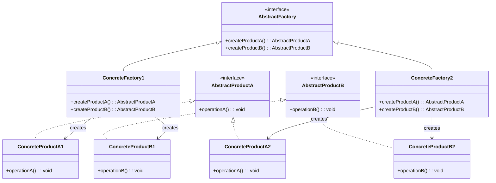

# 抽象工厂模式（Abstract Factory Pattern）

## 模式定义

抽象工厂模式提供一个创建一系列相关或相互依赖对象的接口，而无需指定它们具体的类。

## 原理详解

### 核心思想

抽象工厂模式的核心在于：
1. **产品族**：一组相关的产品（属于同一个产品等级）
2. **产品等级**：同一个产品不同实现
3. **工厂族**：一组相关的工厂
4. **一致性**：同一工厂生产的产品相互兼容

### UML 类图



### 结构

```
AbstractFactory (抽象工厂)
  + createProductA(): AbstractProductA
  + createProductB(): AbstractProductB

ConcreteFactory1 (具体工厂1)
  + createProductA(): AbstractProductA
  + createProductB(): AbstractProductB

AbstractProductA (抽象产品A)
  + operationA(): void

AbstractProductB (抽象产品B)
  + operationB(): void

ConcreteProductA1, ConcreteProductA2
ConcreteProductB1, ConcreteProductB2
```

### 产品族与产品等级

```
         产品等级 A              产品等级 B
        ┌──────────┐           ┌──────────┐
产品族1 │ ProductA1 │           │ ProductB1 │
        └──────────┘           └──────────┘
        ┌──────────┐           ┌──────────┐
产品族2 │ ProductA2 │           │ ProductB2 │
        └──────────┘           └──────────┘
```

---

## Java 实现

### 基础实现

```java
interface Button {
    void paint();
}

interface Checkbox {
    void paint();
}

class WindowsButton implements Button {
    @Override
    public void paint() {
        System.out.println("Windows Button");
    }
}

class MacButton implements Button {
    @Override
    public void paint() {
        System.out.println("Mac Button");
    }
}

class WindowsCheckbox implements Checkbox {
    @Override
    public void paint() {
        System.out.println("Windows Checkbox");
    }
}

class MacCheckbox implements Checkbox {
    @Override
    public void paint() {
        System.out.println("Mac Checkbox");
    }
}

interface GUIFactory {
    Button createButton();
    Checkbox createCheckbox();
}

class WindowsFactory implements GUIFactory {
    @Override
    public Button createButton() {
        return new WindowsButton();
    }

    @Override
    public Checkbox createCheckbox() {
        return new WindowsCheckbox();
    }
}

class MacFactory implements GUIFactory {
    @Override
    public Button createButton() {
        return new MacButton();
    }

    @Override
    public Checkbox createCheckbox() {
        return new MacCheckbox();
    }
}

public class Application {
    private Button button;
    private Checkbox checkbox;

    public Application(GUIFactory factory) {
        button = factory.createButton();
        checkbox = factory.createCheckbox();
    }

    public void paint() {
        button.paint();
        checkbox.paint();
    }

    public static void main(String[] args) {
        GUIFactory factory = new WindowsFactory();
        Application app = new Application(factory);
        app.paint();
    }
}
```

### 抽象工厂 + 工厂方法

```java
abstract class Creator {
    public abstract ProductA createProductA();
    public abstract ProductB createProductB();
}

interface ProductA {
    void operation();
}

interface ProductB {
    void operation();
}

class ConcreteProductA1 implements ProductA {
    @Override
    public void operation() {
        System.out.println("ProductA1 operation");
    }
}

class ConcreteProductA2 implements ProductA {
    @Override
    public void operation() {
        System.out.println("ProductA2 operation");
    }
}

class ConcreteProductB1 implements ProductB {
    @Override
    public void operation() {
        System.out.println("ProductB1 operation");
    }
}

class ConcreteProductB2 implements ProductB {
    @Override
    public void operation() {
        System.out.println("ProductB2 operation");
    }
}

class ConcreteFactory1 extends Creator {
    @Override
    public ProductA createProductA() {
        return new ConcreteProductA1();
    }

    @Override
    public ProductB createProductB() {
        return new ConcreteProductB1();
    }
}

class ConcreteFactory2 extends Creator {
    @Override
    public ProductA createProductA() {
        return new ConcreteProductA2();
    }

    @Override
    public ProductB createProductB() {
        return new ConcreteProductB2();
    }
}
```

---

## Python 实现

### 基础实现

```python
from abc import ABC, abstractmethod

class Button(ABC):
    @abstractmethod
    def paint(self):
        pass

class Checkbox(ABC):
    @abstractmethod
    def paint(self):
        pass

class WindowsButton(Button):
    def paint(self):
        print("Windows Button")

class MacButton(Button):
    def paint(self):
        print("Mac Button")

class WindowsCheckbox(Checkbox):
    def paint(self):
        print("Windows Checkbox")

class MacCheckbox(Checkbox):
    def paint(self):
        print("Mac Checkbox")

class GUIFactory(ABC):
    @abstractmethod
    def create_button(self) -> Button:
        pass

    @abstractmethod
    def create_checkbox(self) -> Checkbox:
        pass

class WindowsFactory(GUIFactory):
    def create_button(self) -> Button:
        return WindowsButton()

    def create_checkbox(self) -> Checkbox:
        return WindowsCheckbox()

class MacFactory(GUIFactory):
    def create_button(self) -> Button:
        return MacButton()

    def create_checkbox(self) -> Checkbox:
        return MacCheckbox()

class Application:
    def __init__(self, factory: GUIFactory):
        self.button = factory.create_button()
        self.checkbox = factory.create_checkbox()

    def paint(self):
        self.button.paint()
        self.checkbox.paint()

if __name__ == "__main__":
    factory = WindowsFactory()
    app = Application(factory)
    app.paint()
```

---

## C++ 实现

### 基础实现

```cpp
#include <iostream>
#include <memory>

class Button {
public:
    virtual ~Button() = default;
    virtual void paint() = 0;
};

class Checkbox {
public:
    virtual ~Checkbox() = default;
    virtual void paint() = 0;
};

class WindowsButton : public Button {
public:
    void paint() override {
        std::cout << "Windows Button" << std::endl;
    }
};

class MacButton : public Button {
public:
    void paint() override {
        std::cout << "Mac Button" << std::endl;
    }
};

class WindowsCheckbox : public Checkbox {
public:
    void paint() override {
        std::cout << "Windows Checkbox" << std::endl;
    }
};

class MacCheckbox : public Checkbox {
public:
    void paint() override {
        std::cout << "Mac Checkbox" << std::endl;
    }
};

class GUIFactory {
public:
    virtual ~GUIFactory() = default;
    virtual std::unique_ptr<Button> createButton() = 0;
    virtual std::unique_ptr<Checkbox> createCheckbox() = 0;
};

class WindowsFactory : public GUIFactory {
public:
    std::unique_ptr<Button> createButton() override {
        return std::make_unique<WindowsButton>();
    }

    std::unique_ptr<Checkbox> createCheckbox() override {
        return std::make_unique<WindowsCheckbox>();
    }
};

class MacFactory : public GUIFactory {
public:
    std::unique_ptr<Button> createButton() override {
        return std::make_unique<MacButton>();
    }

    std::unique_ptr<Checkbox> createCheckbox() override {
        return std::make_unique<MacCheckbox>();
    }
};

class Application {
private:
    std::unique_ptr<Button> button;
    std::unique_ptr<Checkbox> checkbox;

public:
    Application(std::unique_ptr<GUIFactory> factory) {
        button = factory->createButton();
        checkbox = factory->createCheckbox();
    }

    void paint() {
        button->paint();
        checkbox->paint();
    }
};

int main() {
    auto factory = std::make_unique<WindowsFactory>();
    Application app(std::move(factory));
    app.paint();
    return 0;
}
```

---

## 应用场景

### 1. 跨平台 UI 组件
Windows、Mac、Linux 平台的 UI 组件族。

### 2. 数据库访问
不同数据库（MySQL、PostgreSQL）的连接、命令、结果集等产品族。

### 3. 文档生成器
不同格式（PDF、Word、HTML）的文档组件族。

### 4. 皮肤/主题系统
深色/浅色皮肤下的一系列 UI 组件。

### 5. 游戏皮肤
不同游戏角色的装备、武器、技能等产品族。

---

## AI/机器学习/深度学习领域应用

### 1. 训练框架套件工厂（Training Framework Suite Factory）
为不同深度学习框架创建配套的组件：

```python
from abc import ABC, abstractmethod

class Optimizer(ABC):
    @abstractmethod
    def optimize(self, loss):
        pass

class LossFunction(ABC):
    @abstractmethod
    def compute(self, y_true, y_pred):
        pass

class Metric(ABC):
    @abstractmethod
    def calculate(self, y_true, y_pred):
        pass

class TensorFlowOptimizer(Optimizer):
    def optimize(self, loss):
        return f"TensorFlow optimizer applied to loss: {loss}"

class TensorFlowLoss(LossFunction):
    def compute(self, y_true, y_pred):
        return "TensorFlow CrossEntropyLoss"

class TensorFlowMetric(Metric):
    def calculate(self, y_true, y_pred):
        return "TensorFlow Accuracy"

class PyTorchOptimizer(Optimizer):
    def optimize(self, loss):
        return f"PyTorch optimizer applied to loss: {loss}"

class PyTorchLoss(LossFunction):
    def compute(self, y_true, y_pred):
        return "PyTorch CrossEntropyLoss"

class PyTorchMetric(Metric):
    def calculate(self, y_true, y_pred):
        return "PyTorch Accuracy"

class FrameworkFactory(ABC):
    @abstractmethod
    def create_optimizer(self) -> Optimizer:
        pass
    
    @abstractmethod
    def create_loss(self) -> LossFunction:
        pass
    
    @abstractmethod
    def create_metric(self) -> Metric:
        pass

class TensorFlowFactory(FrameworkFactory):
    def create_optimizer(self) -> Optimizer:
        return TensorFlowOptimizer()
    
    def create_loss(self) -> LossFunction:
        return TensorFlowLoss()
    
    def create_metric(self) -> Metric:
        return TensorFlowMetric()

class PyTorchFactory(FrameworkFactory):
    def create_optimizer(self) -> Optimizer:
        return PyTorchOptimizer()
    
    def create_loss(self) -> LossFunction:
        return PyTorchLoss()
    
    def create_metric(self) -> Metric:
        return PyTorchMetric()

# 使用示例
factory = TensorFlowFactory()
optimizer = factory.create_optimizer()
loss = factory.create_loss()
metric = factory.create_metric()
```

### 2. 数据预处理管道工厂（Data Preprocessing Pipeline Factory）
创建不同数据类型的预处理组件族：

```python
class TextProcessor(ABC):
    @abstractmethod
    def process(self, text):
        pass

class ImageProcessor(ABC):
    @abstractmethod
    def process(self, image):
        pass

class AudioProcessor(ABC):
    @abstractmethod
    def process(self, audio):
        pass

class NLPTextProcessor(TextProcessor):
    def process(self, text):
        return "Tokenized and embedded text"

class CVImageProcessor(ImageProcessor):
    def process(self, image):
        return "Resized and normalized image"

class SpeechAudioProcessor(AudioProcessor):
    def process(self, audio):
        return "MFCC features extracted"

class MultimodalTextProcessor(TextProcessor):
    def process(self, text):
        return "Multimodal text features"

class MultimodalImageProcessor(ImageProcessor):
    def process(self, image):
        return "Multimodal image features"

class MultimodalAudioProcessor(AudioProcessor):
    def process(self, audio):
        return "Multimodal audio features"

class DataPipelineFactory(ABC):
    @abstractmethod
    def create_text_processor(self) -> TextProcessor:
        pass
    
    @abstractmethod
    def create_image_processor(self) -> ImageProcessor:
        pass
    
    @abstractmethod
    def create_audio_processor(self) -> AudioProcessor:
        pass

class NLPPipelineFactory(DataPipelineFactory):
    def create_text_processor(self) -> TextProcessor:
        return NLPTextProcessor()
    
    def create_image_processor(self) -> ImageProcessor:
        return CVImageProcessor()
    
    def create_audio_processor(self) -> AudioProcessor:
        return SpeechAudioProcessor()

class MultimodalPipelineFactory(DataPipelineFactory):
    def create_text_processor(self) -> TextProcessor:
        return MultimodalTextProcessor()
    
    def create_image_processor(self) -> ImageProcessor:
        return MultimodalImageProcessor()
    
    def create_audio_processor(self) -> AudioProcessor:
        return MultimodalAudioProcessor()
```

### 3. 模型部署工厂（Model Deployment Factory）
创建不同部署环境的组件族：

```python
class ModelSaver(ABC):
    @abstractmethod
    def save(self, model, path):
        pass

class ModelLoader(ABC):
    @abstractmethod
    def load(self, path):
        pass

class ModelServer(ABC):
    @abstractmethod
    def serve(self, model):
        pass

class TensorFlowSaver(ModelSaver):
    def save(self, model, path):
        return f"Saved TensorFlow model to {path}"

class TensorFlowLoader(ModelLoader):
    def load(self, path):
        return f"Loaded TensorFlow model from {path}"

class TensorFlowServer(ModelServer):
    def serve(self, model):
        return "Serving TensorFlow model with TensorFlow Serving"

class ONNXSaver(ModelSaver):
    def save(self, model, path):
        return f"Saved ONNX model to {path}"

class ONNXLoader(ModelLoader):
    def load(self, path):
        return f"Loaded ONNX model from {path}"

class ONNXServer(ModelServer):
    def serve(self, model):
        return "Serving ONNX model with ONNX Runtime"

class DeploymentFactory(ABC):
    @abstractmethod
    def create_saver(self) -> ModelSaver:
        pass
    
    @abstractmethod
    def create_loader(self) -> ModelLoader:
        pass
    
    @abstractmethod
    def create_server(self) -> ModelServer:
        pass

class TensorFlowDeploymentFactory(DeploymentFactory):
    def create_saver(self) -> ModelSaver:
        return TensorFlowSaver()
    
    def create_loader(self) -> ModelLoader:
        return TensorFlowLoader()
    
    def create_server(self) -> ModelServer:
        return TensorFlowServer()

class ONNXDeploymentFactory(DeploymentFactory):
    def create_saver(self) -> ModelSaver:
        return ONNXSaver()
    
    def create_loader(self) -> ModelLoader:
        return ONNXLoader()
    
    def create_server(self) -> ModelServer:
        return ONNXServer()
```

### 4. 特征工程工厂（Feature Engineering Factory）
创建不同特征工程组件族：

```python
class Encoder(ABC):
    @abstractmethod
    def encode(self, data):
        pass

class Scaler(ABC):
    @abstractmethod
    def scale(self, data):
        pass

class Reducer(ABC):
    @abstractmethod
    def reduce(self, data):
        pass

class OneHotEncoder(Encoder):
    def encode(self, data):
        return "One-hot encoded data"

class StandardScaler(Scaler):
    def scale(self, data):
        return "Standardized data"

class PCAReducer(Reducer):
    def reduce(self, data):
        return "PCA reduced data"

class LabelEncoder(Encoder):
    def encode(self, data):
        return "Label encoded data"

class MinMaxScaler(Scaler):
    def scale(self, data):
        return "Min-max scaled data"

class TSNE(Reducer):
    def reduce(self, data):
        return "t-SNE reduced data"

class FeatureEngineeringFactory(ABC):
    @abstractmethod
    def create_encoder(self) -> Encoder:
        pass
    
    @abstractmethod
    def create_scaler(self) -> Scaler:
        pass
    
    @abstractmethod
    def create_reducer(self) -> Reducer:
        pass

class ClassificationFactory(FeatureEngineeringFactory):
    def create_encoder(self) -> Encoder:
        return OneHotEncoder()
    
    def create_scaler(self) -> Scaler:
        return StandardScaler()
    
    def create_reducer(self) -> Reducer:
        return PCAReducer()

class ClusteringFactory(FeatureEngineeringFactory):
    def create_encoder(self) -> Encoder:
        return LabelEncoder()
    
    def create_scaler(self) -> Scaler:
        return MinMaxScaler()
    
    def create_reducer(self) -> Reducer:
        return TSNE()
```

### 应用场景总结

| 应用场景 | AI/ML领域具体应用 | 技术要点 |
|----------|-------------------|----------|
| 训练框架 | TensorFlow/PyTorch组件族 | 优化器、损失、指标的配套创建 |
| 数据预处理 | NLP/CV/语音管道 | 文本、图像、音频处理器配套 |
| 模型部署 | TensorFlow/ONNX部署 | 保存、加载、服务组件配套 |
| 特征工程 | 分类/聚类特征处理 | 编码器、缩放器、降维器配套 |

---

## 优缺点分析

### 优点

1. **产品一致性**：同一工厂的产品相互兼容
2. **解耦**：客户端与具体产品解耦
3. **符合开闭原则**：新增产品族只需新增工厂
4. **单一职责**：每个工厂负责一个产品族

### 缺点

1. **扩展困难**：新增产品等级需要修改所有工厂
2. **类数量爆炸**：产品族和产品等级增加时，类数量快速增长
3. **复杂度高**：需要引入抽象层

---

## 模式对比

| 模式 | 特点 | 产品结构 |
|------|------|----------|
| 工厂方法 | 一个工厂 -> 一个产品 | 一个产品等级 |
| 抽象工厂 | 一个工厂 -> 多个产品 | 多个产品等级，一个产品族 |
| 简单工厂 | 一个工厂 -> 多个产品 | 多个产品等级 |
