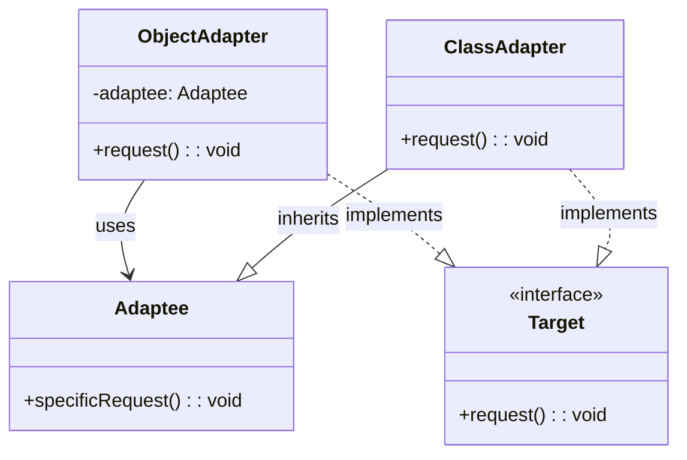

# 适配器模式（Adapter Pattern）

## 模式定义

适配器模式将一个类的接口转换成客户希望的另外一个接口。适配器模式使得原本由于接口不兼容而不能一起工作的那些类可以一起工作。

## 原理详解

### 核心思想

适配器模式的核心在于：
1. **接口转换**：将已有接口转换为客户期望的接口
2. **解耦**：使不兼容的接口能够协同工作
3. **复用**：复用已有的类，无需修改其源代码
4. **双向适配**：可以实现双向适配

### UML 类图



### 结构

```
Target (目标接口)
  + request(): void

Adaptee (被适配者)
  + specificRequest(): void

Adapter (适配器)
  - adaptee: Adaptee
  + request(): void
```

### 适配器类型

| 类型 | 特点 | 说明 |
|------|------|------|
| 类适配器 | 使用继承 | 通过继承被适配者类实现，需要多重继承支持 |
| 对象适配器 | 使用组合 | 通过组合被适配者对象实现，更灵活 |
| 双向适配器 | 双向转换 | 同时实现两个接口，可以互相转换 |

---

## Java 实现

### 类适配器

```java
interface Target {
    void request();
}

class Adaptee {
    public void specificRequest() {
        System.out.println("Adaptee specificRequest");
    }
}

class ClassAdapter extends Adaptee implements Target {
    @Override
    public void request() {
        specificRequest();
    }
}

public class AdapterDemo {
    public static void main(String[] args) {
        Target target = new ClassAdapter();
        target.request();
    }
}
```

### 对象适配器

```java
interface Target {
    void request();
}

class Adaptee {
    public void specificRequest() {
        System.out.println("Adaptee specificRequest");
    }
}

class ObjectAdapter implements Target {
    private Adaptee adaptee;

    public ObjectAdapter(Adaptee adaptee) {
        this.adaptee = adaptee;
    }

    @Override
    public void request() {
        adaptee.specificRequest();
    }
}

public class ObjectAdapterDemo {
    public static void main(String[] args) {
        Adaptee adaptee = new Adaptee();
        Target target = new ObjectAdapter(adaptee);
        target.request();
    }
}
```

### 双向适配器

```java
interface AdapteeInterface {
    void specificRequest();
}

interface TargetInterface {
    void request();
}

class Adaptee implements AdapteeInterface {
    @Override
    public void specificRequest() {
        System.out.println("Adaptee specificRequest");
    }
}

class Adapter implements AdapteeInterface, TargetInterface {
    private Adaptee adaptee = new Adaptee();

    @Override
    public void request() {
        adaptee.specificRequest();
    }

    @Override
    public void specificRequest() {
        System.out.println("Adapter specificRequest as Target");
    }
}

public class BidirectionalAdapterDemo {
    public static void main(String[] args) {
        TargetInterface target = new Adapter();
        target.request();

        AdapteeInterface adaptee = new Adapter();
        adaptee.specificRequest();
    }
}
```

### 实际应用：JSON/XML 适配

```java
interface DataFormat {
    String getData();
}

class JSONData {
    public String getJSON() {
        return "JSON data";
    }
}

class XMLData {
    public String getXML() {
        return "XML data";
    }
}

class JSONAdapter implements DataFormat {
    private JSONData jsonData;

    public JSONAdapter(JSONData jsonData) {
        this.jsonData = jsonData;
    }

    @Override
    public String getData() {
        return jsonData.getJSON();
    }
}

class XMLAdapter implements DataFormat {
    private XMLData xmlData;

    public XMLAdapter(XMLData xmlData) {
        this.xmlData = xmlData;
    }

    @Override
    public String getData() {
        return xmlData.getXML();
    }
}
```

---

## Python 实现

### 基础实现

```python
class Target:
    def request(self):
        return "Target: default behavior"

class Adaptee:
    def specific_request(self):
        return "Adaptee: specific behavior"

class ClassAdapter(Adaptee, Target):
    def request(self):
        return self.specific_request()

class ObjectAdapter(Target):
    def __init__(self, adaptee):
        self.adaptee = adaptee

    def request(self):
        return self.adaptee.specific_request()

if __name__ == "__main__":
    target = ClassAdapter()
    print(target.request())

    adaptee = Adaptee()
    target = ObjectAdapter(adaptee)
    print(target.request())
```

### 实际应用：日志适配

```python
class Logger:
    def log_info(self, message):
        print(f"INFO: {message}")

class LegacyLogger:
    def write(self, level, message):
        print(f"[{level}] {message}")

class LoggerAdapter:
    def __init__(self, legacy_logger):
        self.legacy_logger = legacy_logger

    def log_info(self, message):
        self.legacy_logger.write("INFO", message)

    def log_error(self, message):
        self.legacy_logger.write("ERROR", message)

if __name__ == "__main__":
    logger = LoggerAdapter(LegacyLogger())
    logger.log_info("This is an info message")
    logger.log_error("This is an error message")
```

---

## C++ 实现

### 类适配器

```cpp
#include <iostream>

class Target {
public:
    virtual ~Target() = default;
    virtual void request() {
        std::cout << "Target: default behavior" << std::endl;
    }
};

class Adaptee {
public:
    void specificRequest() {
        std::cout << "Adaptee: specific behavior" << std::endl;
    }
};

class ClassAdapter : public Adaptee, public Target {
public:
    void request() override {
        specificRequest();
    }
};

int main() {
    Target* target = new ClassAdapter();
    target->request();
    delete target;
    return 0;
}
```

### 对象适配器

```cpp
#include <iostream>
#include <memory>

class Target {
public:
    virtual ~Target() = default;
    virtual void request() {
        std::cout << "Target: default behavior" << std::endl;
    }
};

class Adaptee {
public:
    void specificRequest() {
        std::cout << "Adaptee: specific behavior" << std::endl;
    }
};

class ObjectAdapter : public Target {
public:
    ObjectAdapter(std::shared_ptr<Adaptee> adaptee) : adaptee_(adaptee) {}

    void request() override {
        adaptee_->specificRequest();
    }

private:
    std::shared_ptr<Adaptee> adaptee_;
};

int main() {
    auto adaptee = std::make_shared<Adaptee>();
    auto target = std::make_shared<ObjectAdapter>(adaptee);
    target->request();
    return 0;
}
```

### 双向适配器

```cpp
#include <iostream>
#include <memory>

class AdapteeInterface {
public:
    virtual ~AdapteeInterface() = default;
    virtual void specificRequest() = 0;
};

class TargetInterface {
public:
    virtual ~TargetInterface() = default;
    virtual void request() = 0;
};

class Adaptee : public AdapteeInterface {
public:
    void specificRequest() override {
        std::cout << "Adaptee: specificRequest" << std::endl;
    }
};

class Adapter : public AdapteeInterface, public TargetInterface {
public:
    void request() override {
        std::cout << "Adapter as Target" << std::endl;
    }

    void specificRequest() override {
        std::cout << "Adapter as Adaptee" << std::endl;
    }
};

int main() {
    std::unique_ptr<TargetInterface> target = std::make_unique<Adapter>();
    target->request();

    std::unique_ptr<AdapteeInterface> adaptee = std::make_unique<Adapter>();
    adaptee->specificRequest();

    return 0;
}
```

---

## 应用场景

### 1. 接口转换
旧接口与新接口之间的适配。

### 2. 数据格式转换
JSON、XML、CSV 等数据格式的互相转换。

### 3. 第三方库集成
将第三方库的接口适配为项目内部接口。

### 4. 插件系统
为应用程序提供统一的插件接口。

### 5. 遗留代码复用
让遗留代码适应新的接口需求。

---

## AI/机器学习/深度学习领域应用

### 1. 框架适配（Framework Adapter）
适配不同深度学习框架的接口：

```python
class ModelTrainer:
    def train(self, model, X, y):
        raise NotImplementedError

class TensorFlowTrainer:
    def fit(self, model, X_train, y_train, epochs=10):
        return f"TensorFlow training for {epochs} epochs"

class PyTorchTrainer:
    def train_epochs(self, model, dataloader, epochs=10):
        return f"PyTorch training for {epochs} epochs"

class TensorFlowAdapter(ModelTrainer):
    def __init__(self, trainer):
        self.trainer = trainer
    
    def train(self, model, X, y):
        return self.trainer.fit(model, X, y)

class PyTorchAdapter(ModelTrainer):
    def __init__(self, trainer):
        self.trainer = trainer
    
    def train(self, model, X, y):
        dataloader = self._create_dataloader(X, y)
        return self.trainer.train_epochs(model, dataloader)
    
    def _create_dataloader(self, X, y):
        return "dataloader"

# 统一接口调用
tf_trainer = TensorFlowAdapter(TensorFlowTrainer())
pt_trainer = PyTorchAdapter(PyTorchTrainer())

tf_trainer.train("model", "X", "y")
pt_trainer.train("model", "X", "y")
```

### 2. 数据加载器适配（Data Loader Adapter）
适配不同数据源：

```python
class DataLoader:
    def load(self, path):
        raise NotImplementedError

class CSVLoader:
    def read_csv(self, filepath):
        return f"CSV data from {filepath}"

class ParquetLoader:
    def load_parquet(self, filepath):
        return f"Parquet data from {filepath}"

class TFRecordLoader:
    def parse_tfrecord(self, filepath):
        return f"TFRecord data from {filepath}"

class CSVAdapter(DataLoader):
    def __init__(self, loader):
        self.loader = loader
    
    def load(self, path):
        return self.loader.read_csv(path)

class ParquetAdapter(DataLoader):
    def __init__(self, loader):
        self.loader = loader
    
    def load(self, path):
        return self.loader.load_parquet(path)

# 统一数据加载
loaders = {
    'csv': CSVAdapter(CSVLoader()),
    'parquet': ParquetAdapter(ParquetLoader())
}

data = loaders['csv'].load('data.csv')
```

### 3. 指标计算器适配（Metric Adapter）
适配不同的指标计算库：

```python
class MetricCalculator:
    def compute(self, y_true, y_pred):
        raise NotImplementedError

class ScikitLearnMetrics:
    def accuracy_score(self, y_true, y_pred):
        return 0.95

class TensorFlowMetrics:
    def calculate_accuracy(self, labels, predictions):
        return 0.92

class ScikitLearnAdapter(MetricCalculator):
    def __init__(self, metrics):
        self.metrics = metrics
    
    def compute(self, y_true, y_pred):
        return self.metrics.accuracy_score(y_true, y_pred)

class TensorFlowAdapter(MetricCalculator):
    def __init__(self, metrics):
        self.metrics = metrics
    
    def compute(self, y_true, y_pred):
        return self.metrics.calculate_accuracy(y_true, y_pred)

# 统一指标计算
sk_adapter = ScikitLearnAdapter(ScikitLearnMetrics())
tf_adapter = TensorFlowAdapter(TensorFlowMetrics())

accuracy = sk_adapter.compute([1, 0, 1], [1, 0, 0])
```

### 4. 模型格式适配（Model Format Adapter）
适配不同的模型格式：

```python
class ModelSaver:
    def save(self, model, path):
        raise NotImplementedError

class SavedModelFormat:
    def export_saved_model(self, model, export_dir):
        return f"SavedModel saved to {export_dir}"

class ONNXFormat:
    def save_onnx(self, model, filepath):
        return f"ONNX model saved to {filepath}"

class TorchScriptFormat:
    def save_torchscript(self, model, filepath):
        return f"TorchScript saved to {filepath}"

class SavedModelAdapter(ModelSaver):
    def __init__(self, saver):
        self.saver = saver
    
    def save(self, model, path):
        return self.saver.export_saved_model(model, path)

class ONNXAdapter(ModelSaver):
    def __init__(self, saver):
        self.saver = saver
    
    def save(self, model, path):
        return self.saver.save_onnx(model, path)

# 统一模型保存
savers = {
    'savedmodel': SavedModelAdapter(SavedModelFormat()),
    'onnx': ONNXAdapter(ONNXFormat())
}

savers['onnx'].save('model', 'model.onnx')
```

### 5. 超参数优化框架适配（Hyperparameter Tuning Adapter）
适配不同的超参数优化工具：

```python
class HyperparameterTuner:
    def tune(self, objective, search_space):
        raise NotImplementedError

class OptunaTuner:
    def optimize(self, objective_func, params, n_trials):
        return f"Optuna optimized with {n_trials} trials"

class RayTuneTuner:
    def run(self, trainable, config, num_samples):
        return f"Ray Tune ran {num_samples} samples"

class OptunaAdapter(HyperparameterTuner):
    def __init__(self, tuner):
        self.tuner = tuner
    
    def tune(self, objective, search_space):
        return self.tuner.optimize(objective, search_space, n_trials=100)

class RayTuneAdapter(HyperparameterTuner):
    def __init__(self, tuner):
        self.tuner = tuner
    
    def tune(self, objective, search_space):
        return self.tuner.run(objective, search_space, num_samples=50)

# 统一超参数调优
tuner = OptunaAdapter(OptunaTuner())
result = tuner.tune(lambda x: x, {'lr': [0.001, 0.01]})
```

### 应用场景总结

| 应用场景 | AI/ML领域具体应用 | 技术要点 |
|----------|-------------------|----------|
| 框架适配 | TensorFlow/PyTorch接口统一 | 训练API适配 |
| 数据加载 | CSV/Parquet/TFRecord统一 | 数据源抽象 |
| 指标计算 | 不同指标库统一接口 | 计算结果标准化 |
| 模型格式 | SavedModel/ONNX/TorchScript | 模型保存格式适配 |
| 超参数调优 | Optuna/Ray Tune统一 | 搜索接口适配 |

---

## 优缺点分析

### 优点

1. **解耦**：客户端与被适配者解耦
2. **复用**：可以复用已有的类
3. **灵活性**：支持类适配器和对象适配器两种方式
4. **开闭原则**：不修改原有代码即可扩展

### 缺点

1. **额外对象**：对象适配器需要创建额外的适配器对象
2. **复杂性增加**：增加了系统复杂度
3. **性能开销**：适配器会带来一定的性能开销
4. **调试困难**：增加了调用链的复杂性

---

## 模式对比

| 模式 | 特点 | 目的 |
|------|------|------|
| 适配器模式 | 接口转换 | 使不兼容的接口能协同 |
| 装饰器模式 | 动态增加职责 | 扩展对象功能 |
| 代理模式 | 间接访问 | 控制对对象的访问 |
| 外观模式 | 简化接口 | 提供统一的高层接口 |
