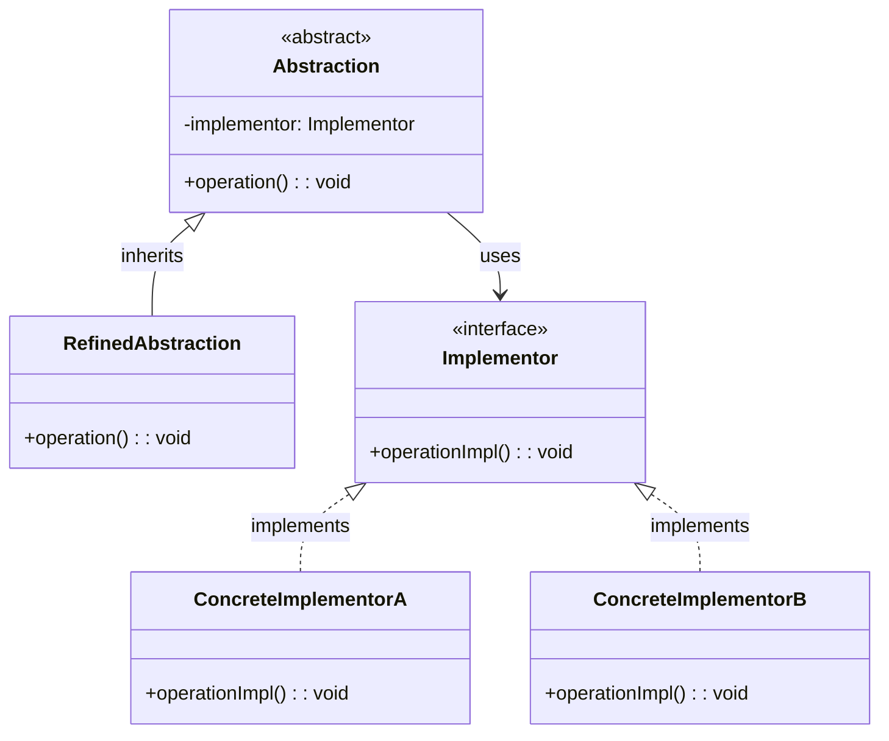

# 桥接模式（Bridge Pattern）

## 模式定义

桥接模式将抽象部分与它的实现部分分离，使它们都可以独立地变化。

## 原理详解

### 核心思想

桥接模式的核心在于：
1. **分离抽象与实现**：抽象和实现可以独立变化
2. **组合代替继承**：通过组合关系代替继承关系
3. **二维变化**：分别沿着两个维度变化
4. **减少耦合**：抽象和实现解耦

### UML 类图



### 结构

```
Abstraction (抽象化)
  - implementor: Implementor
  + operation(): void

RefinedAbstraction (修正抽象化)
  + operation(): void

Implementor (实现化)
  + operationImpl(): void

ConcreteImplementor (具体实现化)
  + operationImpl(): void
```

### 二维变化示意

```
                    抽象部分
    ┌─────────────────────────────────────┐
    │           Shape (形状)              │
    │   ┌───────────┐    ┌───────────┐    │
    │   │   Circle  │    │ Rectangle │    │
    └───────────────┴────┴───────────┴────┘
              │                │
              │ 桥接           │ 桥接
              ▼                ▼
    ┌─────────────────────────────────────┐
    │        Color (颜色) 实现部分         │
    │   ┌───────────┐    ┌───────────┐    │
    │   │    Red    │    │   Blue    │    │
    └───────────────┴────┴───────────┴────┘
```

---

## Java 实现

### 基础实现

```java
interface Color {
    String fill();
}

class Red implements Color {
    @Override
    public String fill() {
        return "Red";
    }
}

class Blue implements Color {
    @Override
    public String fill() {
        return "Blue";
    }
}

abstract class Shape {
    protected Color color;

    public Shape(Color color) {
        this.color = color;
    }

    public abstract void draw();
}

class Circle extends Shape {
    private double radius;

    public Circle(Color color, double radius) {
        super(color);
        this.radius = radius;
    }

    @Override
    public void draw() {
        System.out.println("Drawing " + color.fill() + " circle with radius " + radius);
    }
}

class Rectangle extends Shape {
    private double width;
    private double height;

    public Rectangle(Color color, double width, double height) {
        super(color);
        this.width = width;
        this.height = height;
    }

    @Override
    public void draw() {
        System.out.println("Drawing " + color.fill() + " rectangle " + width + "x" + height);
    }
}

public class BridgeDemo {
    public static void main(String[] args) {
        Shape redCircle = new Circle(new Red(), 5.0);
        Shape blueCircle = new Circle(new Blue(), 3.0);
        Shape redRectangle = new Rectangle(new Red(), 4.0, 5.0);
        Shape blueRectangle = new Rectangle(new Blue(), 6.0, 2.0);

        redCircle.draw();
        blueCircle.draw();
        redRectangle.draw();
        blueRectangle.draw();
    }
}
```

### 消息发送系统

```java
interface MessageSender {
    void send(String message);
}

class EmailSender implements MessageSender {
    @Override
    public void send(String message) {
        System.out.println("Email: " + message);
    }
}

class SMSSender implements MessageSender {
    @Override
    public void send(String message) {
        System.out.println("SMS: " + message);
    }
}

abstract class Message {
    protected MessageSender sender;

    public Message(MessageSender sender) {
        this.sender = sender;
    }

    public abstract void sendMessage(String message);
}

class SimpleMessage extends Message {
    public SimpleMessage(MessageSender sender) {
        super(sender);
    }

    @Override
    public void sendMessage(String message) {
        sender.send(message);
    }
}

class EncryptedMessage extends Message {
    public EncryptedMessage(MessageSender sender) {
        super(sender);
    }

    @Override
    public void sendMessage(String message) {
        String encrypted = "ENC(" + message + ")";
        sender.send(encrypted);
    }
}
```

---

## Python 实现

### 基础实现

```python
from abc import ABC, abstractmethod

class Color(ABC):
    @abstractmethod
    def fill(self):
        pass

class Red(Color):
    def fill(self):
        return "Red"

class Blue(Color):
    def fill(self):
        return "Blue"

class Shape(ABC):
    def __init__(self, color):
        self.color = color

    @abstractmethod
    def draw(self):
        pass

class Circle(Shape):
    def __init__(self, color, radius):
        super().__init__(color)
        self.radius = radius

    def draw(self):
        print(f"Drawing {self.color.fill()} circle with radius {self.radius}")

class Rectangle(Shape):
    def __init__(self, color, width, height):
        super().__init__(color)
        self.width = width
        self.height = height

    def draw(self):
        print(f"Drawing {self.color.fill()} rectangle {self.width}x{self.height}")

if __name__ == "__main__":
    shapes = [
        Circle(Red(), 5.0),
        Circle(Blue(), 3.0),
        Rectangle(Red(), 4.0, 5.0),
        Rectangle(Blue(), 6.0, 2.0)
    ]

    for shape in shapes:
        shape.draw()
```

---

## C++ 实现

### 基础实现

```cpp
#include <iostream>
#include <memory>
#include <string>

class Color {
public:
    virtual ~Color() = default;
    virtual std::string fill() const = 0;
};

class Red : public Color {
public:
    std::string fill() const override {
        return "Red";
    }
};

class Blue : public Color {
public:
    std::string fill() const override {
        return "Blue";
    }
};

class Shape {
protected:
    std::shared_ptr<Color> color;

public:
    Shape(std::shared_ptr<Color> color) : color(color) {}
    virtual ~Shape() = default;
    virtual void draw() const = 0;
};

class Circle : public Shape {
private:
    double radius;

public:
    Circle(std::shared_ptr<Color> color, double radius)
        : Shape(color), radius(radius) {}

    void draw() const override {
        std::cout << "Drawing " << color->fill()
                  << " circle with radius " << radius << std::endl;
    }
};

class Rectangle : public Shape {
private:
    double width;
    double height;

public:
    Rectangle(std::shared_ptr<Color> color, double width, double height)
        : Shape(color), width(width), height(height) {}

    void draw() const override {
        std::cout << "Drawing " << color->fill()
                  << " rectangle " << width << "x" << height << std::endl;
    }
};

int main() {
    auto shapes = {
        std::make_shared<Circle>(std::make_shared<Red>(), 5.0),
        std::make_shared<Circle>(std::make_shared<Blue>(), 3.0),
        std::make_shared<Rectangle>(std::make_shared<Red>(), 4.0, 5.0),
        std::make_shared<Rectangle>(std::make_shared<Blue>(), 6.0, 2.0)
    };

    for (const auto& shape : shapes) {
        shape->draw();
    }

    return 0;
}
```

---

## 应用场景

### 1. 跨平台应用
不同操作系统上的 GUI 组件。

### 2. 数据库驱动
不同数据库的 JDBC/ODBC 驱动。

### 3. 消息发送
不同发送方式的消息系统。

### 4. 设备驱动
不同硬件设备的驱动。

### 5. 日志系统
不同输出方式的日志系统。

---

## AI/机器学习/深度学习领域应用

### 1. 模型架构与训练策略分离（Model Architecture and Training Strategy）
将模型架构与训练策略分离：

```python
from abc import ABC, abstractmethod

class TrainingStrategy(ABC):
    @abstractmethod
    def train(self, model, data):
        pass

class SupervisedTraining(TrainingStrategy):
    def train(self, model, data):
        return f"Supervised training {model} on {data}"

class SelfSupervisedTraining(TrainingStrategy):
    def train(self, model, data):
        return f"Self-supervised training {model} on {data}"

class ReinforcementTraining(TrainingStrategy):
    def train(self, model, data):
        return f"Reinforcement training {model} on {data}"

class Model(ABC):
    def __init__(self, strategy):
        self.strategy = strategy
    
    @abstractmethod
    def build(self):
        pass
    
    def train(self, data):
        return self.strategy.train(self.build(), data)

class CNNModel(Model):
    def build(self):
        return "CNN Architecture"

class TransformerModel(Model):
    def build(self):
        return "Transformer Architecture"

class RNNModel(Model):
    def build(self):
        return "RNN Architecture"

# 组合不同的模型和训练策略
cnn_supervised = CNNModel(SupervisedTraining())
transformer_self = TransformerModel(SelfSupervisedTraining())
rnn_rl = RNNModel(ReinforcementTraining())

result1 = cnn_supervised.train("image_data")
result2 = transformer_self.train("text_data")
result3 = rnn_rl.train("sequence_data")
```

### 2. 模型与优化器分离（Model and Optimizer）
将模型与优化算法分离：

```python
class Optimizer(ABC):
    @abstractmethod
    def optimize(self, model, loss):
        pass

class SGD(Optimizer):
    def optimize(self, model, loss):
        return f"SGD optimizing {model}, loss={loss}"

class Adam(Optimizer):
    def optimize(self, model, loss):
        return f"Adam optimizing {model}, loss={loss}"

class RMSprop(Optimizer):
    def optimize(self, model, loss):
        return f"RMSprop optimizing {model}, loss={loss}"

class NeuralNetwork(ABC):
    def __init__(self, optimizer):
        self.optimizer = optimizer
    
    @abstractmethod
    def forward(self, x):
        pass
    
    def train_step(self, x, y):
        loss = self._compute_loss(x, y)
        return self.optimizer.optimize(self.__class__.__name__, loss)
    
    def _compute_loss(self, x, y):
        return 0.5

class ClassificationNN(NeuralNetwork):
    def forward(self, x):
        return f"Classification output for {x}"

class RegressionNN(NeuralNetwork):
    def forward(self, x):
        return f"Regression output for {x}"

# 组合模型与优化器
nn_adam = ClassificationNN(Adam())
nn_sgd = RegressionNN(SGD())

nn_adam.train_step("input", "label")
nn_sgd.train_step("input", "target")
```

### 3. 特征提取与分类器分离（Feature Extractor and Classifier）
将特征提取与分类算法分离：

```python
class FeatureExtractor(ABC):
    @abstractmethod
    def extract(self, data):
        pass

class CNNExtractor(FeatureExtractor):
    def extract(self, data):
        return f"CNN features from {data}"

class TransformerExtractor(FeatureExtractor):
    def extract(self, data):
        return f"Transformer features from {data}"

class Classifier(ABC):
    def __init__(self, extractor):
        self.extractor = extractor
    
    @abstractmethod
    def classify(self, data):
        pass

class SVMClassifier(Classifier):
    def classify(self, data):
        features = self.extractor.extract(data)
        return f"SVM classification using {features}"

class RandomForestClassifier(Classifier):
    def classify(self, data):
        features = self.extractor.extract(data)
        return f"Random Forest classification using {features}"

# 组合特征提取器与分类器
cnn_svm = SVMClassifier(CNNExtractor())
transformer_rf = RandomForestClassifier(TransformerExtractor())

cnn_svm.classify("image")
transformer_rf.classify("text")
```

### 4. 数据预处理与数据源分离（Preprocessing and Data Source）
将数据预处理与数据源分离：

```python
class DataSource(ABC):
    @abstractmethod
    def load(self):
        pass

class CSVSource(DataSource):
    def load(self):
        return "CSV raw data"

class ImageSource(DataSource):
    def load(self):
        return "Image raw data"

class DataLoader(ABC):
    def __init__(self, source):
        self.source = source
    
    @abstractmethod
    def process(self):
        pass

class ClassificationLoader(DataLoader):
    def process(self):
        raw = self.source.load()
        return f"Classification-ready data from {raw}"

class SegmentationLoader(DataLoader):
    def process(self):
        raw = self.source.load()
        return f"Segmentation-ready data from {raw}"

# 组合数据源与加载器
csv_classification = ClassificationLoader(CSVSource())
image_segmentation = SegmentationLoader(ImageSource())

csv_classification.process()
image_segmentation.process()
```

### 应用场景总结

| 应用场景 | AI/ML领域具体应用 | 技术要点 |
|----------|-------------------|----------|
| 模型与训练策略 | CNN+监督学习、Transformer+自监督 | 算法组合 |
| 模型与优化器 | Adam/SGD/RMSprop切换 | 优化策略解耦 |
| 特征提取与分类 | CNN+SVM、Transformer+RF | 流水线组合 |
| 数据处理与来源 | CSV/Image与处理逻辑 | 数据源抽象 |

---

## 优缺点分析

### 优点

1. **分离抽象与实现**：两者可以独立变化
2. **符合开闭原则**：扩展时不需要修改已有代码
3. **减少继承**：用组合代替继承
4. **单一职责**：每个类职责单一

### 缺点

1. **复杂度增加**：引入抽象和实现两个层次
2. **设计难度**：需要正确识别两个独立变化的维度
3. **理解成本**：增加了系统理解的难度

---

## 模式对比

| 模式 | 特点 | 适用场景 |
|------|------|----------|
| 桥接模式 | 分离抽象与实现 | 多维度变化 |
| 适配器模式 | 接口转换 | 接口不兼容 |
| 装饰器模式 | 动态增加职责 | 功能扩展 |
| 组合模式 | 整体-部分 | 对象树结构 |
