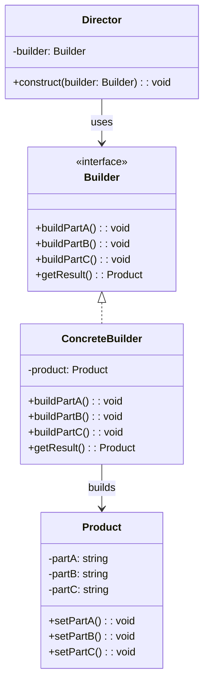

# 建造者模式（Builder Pattern）

## 模式定义

建造者模式将一个复杂对象的构建与它的表示分离，使得同样的构建过程可以创建不同的表示。

## 原理详解

### 核心思想

建造者模式的核心在于：
1. **分离构建与表示**：构建过程独立于产品的组成部分
2. **逐步构建**：通过一步一步构建复杂对象
3. **同一构建过程**：不同表示可以复用相同的构建过程
4. **指挥者**：控制构建过程，解耦客户端与具体构建器

### UML 类图



### 结构

```
Director (指挥者)
  - builder: Builder
  + construct(): void

Builder (抽象建造者)
  + buildPartA(): void
  + buildPartB(): void
  + getResult(): Product

ConcreteBuilder (具体建造者)
  + buildPartA(): void
  + buildPartB(): void
  + getResult(): Product

Product (产品)
  - partA: PartA
  - partB: PartB
```

### 与工厂模式对比

| 对比项 | 工厂模式 | 建造者模式 |
|--------|----------|------------|
| 关注点 | 生产产品 | 构建产品 |
| 产品复杂度 | 简单产品 | 复杂产品 |
| 构建过程 | 一步完成 | 分步完成 |
| 产品一致性 | 同类产品 | 不同表示 |

---

## Java 实现

### 基础实现

```java
class Product {
    private String partA;
    private String partB;
    private String partC;

    public void setPartA(String partA) {
        this.partA = partA;
    }

    public void setPartB(String partB) {
        this.partB = partB;
    }

    public void setPartC(String partC) {
        this.partC = partC;
    }

    @Override
    public String toString() {
        return "Product{" +
                "partA='" + partA + '\'' +
                ", partB='" + partB + '\'' +
                ", partC='" + partC + '\'' +
                '}';
    }
}

interface Builder {
    void buildPartA();
    void buildPartB();
    void buildPartC();
    Product getResult();
}

class ConcreteBuilder implements Builder {
    private Product product = new Product();

    @Override
    public void buildPartA() {
        product.setPartA("PartA built");
    }

    @Override
    public void buildPartB() {
        product.setPartB("PartB built");
    }

    @Override
    public void buildPartC() {
        product.setPartC("PartC built");
    }

    @Override
    public Product getResult() {
        return product;
    }
}

class Director {
    public void construct(Builder builder) {
        builder.buildPartA();
        builder.buildPartB();
        builder.buildPartC();
    }
}

public class BuilderDemo {
    public static void main(String[] args) {
        Director director = new Director();
        Builder builder = new ConcreteBuilder();

        director.construct(builder);
        Product product = builder.getResult();
        System.out.println(product);
    }
}
```

### 链式调用实现

```java
class Product {
    private String partA;
    private String partB;
    private String partC;

    public Product setPartA(String partA) {
        this.partA = partA;
        return this;
    }

    public Product setPartB(String partB) {
        this.partB = partB;
        return this;
    }

    public Product setPartC(String partC) {
        this.partC = partC;
        return this;
    }

    @Override
    public String toString() {
        return "Product{partA='" + partA + "', partB='" + partB + "', partC='" + partC + "'}";
    }
}

class Builder {
    private Product product = new Product();

    public Builder buildPartA(String value) {
        product.setPartA(value);
        return this;
    }

    public Builder buildPartB(String value) {
        product.setPartB(value);
        return this;
    }

    public Builder buildPartC(String value) {
        product.setPartC(value);
        return this;
    }

    public Product build() {
        return product;
    }
}

public class BuilderChainDemo {
    public static void main(String[] args) {
        Product product = new Builder()
                .buildPartA("A")
                .buildPartB("B")
                .buildPartC("C")
                .build();
        System.out.println(product);
    }
}
```

---

## Python 实现

### 基础实现

```python
class Product:
    def __init__(self):
        self.part_a = None
        self.part_b = None
        self.part_c = None

    def __str__(self):
        return f"Product(part_a={self.part_a}, part_b={self.part_b}, part_c={self.part_c})"

class Builder:
    def build_part_a(self):
        raise NotImplementedError

    def build_part_b(self):
        raise NotImplementedError

    def build_part_c(self):
        raise NotImplementedError

    def get_result(self):
        raise NotImplementedError

class ConcreteBuilder(Builder):
    def __init__(self):
        self.product = Product()

    def build_part_a(self):
        self.product.part_a = "PartA built"
        return self

    def build_part_b(self):
        self.product.part_b = "PartB built"
        return self

    def build_part_c(self):
        self.product.part_c = "PartC built"
        return self

    def get_result(self):
        return self.product

class Director:
    @staticmethod
    def construct(builder: Builder):
        builder.build_part_a()
        builder.build_part_b()
        builder.build_part_c()

if __name__ == "__main__":
    builder = ConcreteBuilder()
    Director.construct(builder)
    product = builder.get_result()
    print(product)
```

### 链式调用实现

```python
class Product:
    def __init__(self):
        self.part_a = None
        self.part_b = None
        self.part_c = None

    def set_part_a(self, value):
        self.part_a = value
        return self

    def set_part_b(self, value):
        self.part_b = value
        return self

    def set_part_c(self, value):
        self.part_c = value
        return self

    def __str__(self):
        return f"Product(part_a={self.part_a}, part_b={self.part_b}, part_c={self.part_c})"

class Builder:
    def __init__(self):
        self.product = Product()

    def build_part_a(self, value):
        self.product.set_part_a(value)
        return self

    def build_part_b(self, value):
        self.product.set_part_b(value)
        return self

    def build_part_c(self, value):
        self.product.set_part_c(value)
        return self

    def build(self):
        return self.product

if __name__ == "__main__":
    product = Builder() \
        .build_part_a("A") \
        .build_part_b("B") \
        .build_part_c("C") \
        .build()
    print(product)
```

---

## C++ 实现

### 基础实现

```cpp
#include <iostream>
#include <string>
#include <memory>

class Product {
public:
    void setPartA(const std::string& part) { partA_ = part; }
    void setPartB(const std::string& part) { partB_ = part; }
    void setPartC(const std::string& part) { partC_ = part; }

    void show() const {
        std::cout << "Product{A=" << partA_ << ", B=" << partB_ << ", C=" << partC_ << "}" << std::endl;
    }

private:
    std::string partA_;
    std::string partB_;
    std::string partC_;
};

class Builder {
public:
    virtual ~Builder() = default;
    virtual void buildPartA() = 0;
    virtual void buildPartB() = 0;
    virtual void buildPartC() = 0;
    virtual std::unique_ptr<Product> getResult() = 0;
};

class ConcreteBuilder : public Builder {
public:
    ConcreteBuilder() { product_ = std::make_unique<Product>(); }

    void buildPartA() override {
        product_->setPartA("PartA built");
    }

    void buildPartB() override {
        product_->setPartB("PartB built");
    }

    void buildPartC() override {
        product_->setPartC("PartC built");
    }

    std::unique_ptr<Product> getResult() override {
        return std::move(product_);
    }

private:
    std::unique_ptr<Product> product_;
};

class Director {
public:
    void construct(Builder& builder) {
        builder.buildPartA();
        builder.buildPartB();
        builder.buildPartC();
    }
};

int main() {
    Director director;
    ConcreteBuilder builder;

    director.construct(builder);
    auto product = builder.getResult();
    product->show();

    return 0;
}
```

### 链式调用实现

```cpp
#include <iostream>
#include <string>
#include <memory>

class Product {
public:
    Product& setPartA(const std::string& part) {
        partA_ = part;
        return *this;
    }

    Product& setPartB(const std::string& part) {
        partB_ = part;
        return *this;
    }

    Product& setPartC(const std::string& part) {
        partC_ = part;
        return *this;
    }

    void show() const {
        std::cout << "Product{A=" << partA_ << ", B=" << partB_ << ", C=" << partC_ << "}" << std::endl;
    }

private:
    std::string partA_;
    std::string partB_;
    std::string partC_;
};

class Builder {
public:
    Builder& buildPartA(const std::string& value) {
        product_.setPartA(value);
        return *this;
    }

    Builder& buildPartB(const std::string& value) {
        product_.setPartB(value);
        return *this;
    }

    Builder& buildPartC(const std::string& value) {
        product_.setPartC(value);
        return *this;
    }

    Product build() {
        return product_;
    }

private:
    Product product_;
};

int main() {
    Product product = Builder()
        .buildPartA("A")
        .buildPartB("B")
        .buildPartC("C")
        .build();

    product.show();
    return 0;
}
```

---

## 应用场景

### 1. StringBuilder
Java 的 `StringBuilder` 和 Python 的字符串拼接。

### 2. SQL Query Builder
构建复杂 SQL 查询语句。

### 3. HTTP Request Builder
构建复杂的 HTTP 请求。

### 4. Document Builder
构建 XML/JSON 文档。

### 5. 配置对象
构建复杂的配置对象，如游戏角色属性。

### 6. Meal Builder
餐厅点餐系统，汉堡 + 饮料 + 薯条的组合。

---

## AI/机器学习/深度学习领域应用

### 1. 神经网络模型构建器（Neural Network Builder）
构建复杂的神经网络架构：

```python
class NeuralNetwork:
    def __init__(self):
        self.layers = []
    
    def add_layer(self, layer):
        self.layers.append(layer)
    
    def __str__(self):
        return f"NeuralNetwork with {len(self.layers)} layers: {self.layers}"

class NetworkBuilder:
    def __init__(self):
        self.network = NeuralNetwork()
    
    def add_input_layer(self, input_shape):
        self.network.add_layer(f"InputLayer(shape={input_shape})")
        return self
    
    def add_dense_layer(self, units, activation='relu'):
        self.network.add_layer(f"Dense(units={units}, activation={activation})")
        return self
    
    def add_conv_layer(self, filters, kernel_size):
        self.network.add_layer(f"Conv2D(filters={filters}, kernel_size={kernel_size})")
        return self
    
    def add_pooling_layer(self, pool_size):
        self.network.add_layer(f"MaxPooling2D(pool_size={pool_size})")
        return self
    
    def add_output_layer(self, units, activation='softmax'):
        self.network.add_layer(f"OutputLayer(units={units}, activation={activation})")
        return self
    
    def build(self):
        return self.network

# 使用示例
builder = NetworkBuilder()
model = builder \
    .add_input_layer((28, 28, 1)) \
    .add_conv_layer(32, (3, 3)) \
    .add_pooling_layer((2, 2)) \
    .add_dense_layer(128) \
    .add_output_layer(10) \
    .build()
```

### 2. 训练配置构建器（Training Config Builder）
构建复杂的训练配置：

```python
class TrainingConfig:
    def __init__(self):
        self.optimizer = None
        self.loss = None
        self.metrics = []
        self.epochs = 10
        self.batch_size = 32
        self.callbacks = []

class TrainingConfigBuilder:
    def __init__(self):
        self.config = TrainingConfig()
    
    def set_optimizer(self, optimizer):
        self.config.optimizer = optimizer
        return self
    
    def set_loss(self, loss):
        self.config.loss = loss
        return self
    
    def add_metric(self, metric):
        self.config.metrics.append(metric)
        return self
    
    def set_epochs(self, epochs):
        self.config.epochs = epochs
        return self
    
    def set_batch_size(self, batch_size):
        self.config.batch_size = batch_size
        return self
    
    def add_callback(self, callback):
        self.config.callbacks.append(callback)
        return self
    
    def build(self):
        return self.config

# 使用示例
config = TrainingConfigBuilder() \
    .set_optimizer('adam') \
    .set_loss('categorical_crossentropy') \
    .add_metric('accuracy') \
    .add_metric('precision') \
    .set_epochs(50) \
    .set_batch_size(64) \
    .add_callback('EarlyStopping') \
    .add_callback('ModelCheckpoint') \
    .build()
```

### 3. 数据预处理管道构建器（Data Pipeline Builder）
构建复杂的数据预处理管道：

```python
class DataPipeline:
    def __init__(self):
        self.transformers = []
    
    def add_transformer(self, transformer):
        self.transformers.append(transformer)
    
    def apply(self, data):
        for transformer in self.transformers:
            data = transformer(data)
        return data

class PipelineBuilder:
    def __init__(self):
        self.pipeline = DataPipeline()
    
    def add_scaling(self, scaler_type='standard'):
        self.pipeline.add_transformer(lambda x: f"Scaled with {scaler_type}", x)
        return self
    
    def add_normalization(self):
        self.pipeline.add_transformer(lambda x: f"Normalized {x}")
        return self
    
    def add_feature_selection(self, n_features):
        self.pipeline.add_transformer(lambda x: f"Selected {n_features} features from {x}")
        return self
    
    def add_encoding(self, encoder_type='onehot'):
        self.pipeline.add_transformer(lambda x: f"Encoded with {encoder_type}")
        return self
    
    def build(self):
        return self.pipeline

# 使用示例
pipeline = PipelineBuilder() \
    .add_scaling('standard') \
    .add_normalization() \
    .add_feature_selection(100) \
    .add_encoding('onehot') \
    .build()
```

### 4. 超参数搜索空间构建器（Hyperparameter Search Space Builder）
构建超参数搜索空间：

```python
class HyperparameterSpace:
    def __init__(self):
        self.params = {}
    
    def add_param(self, name, values):
        self.params[name] = values
    
    def __str__(self):
        return f"HyperparameterSpace: {self.params}"

class HyperparameterBuilder:
    def __init__(self):
        self.space = HyperparameterSpace()
    
    def add_learning_rate(self, min_val=1e-5, max_val=1e-2, log=True):
        self.space.add_param('learning_rate', {'min': min_val, 'max': max_val, 'log': log})
        return self
    
    def add_batch_size(self, values=[32, 64, 128]):
        self.space.add_param('batch_size', values)
        return self
    
    def add_dropout_rate(self, min_val=0.0, max_val=0.5):
        self.space.add_param('dropout_rate', {'min': min_val, 'max': max_val})
        return self
    
    def add_units(self, min_val=32, max_val=512):
        self.space.add_param('units', {'min': min_val, 'max': max_val})
        return self
    
    def add_activation(self, values=['relu', 'tanh', 'sigmoid']):
        self.space.add_param('activation', values)
        return self
    
    def build(self):
        return self.space

# 使用示例
search_space = HyperparameterBuilder() \
    .add_learning_rate(1e-5, 1e-2) \
    .add_batch_size([32, 64, 128]) \
    .add_dropout_rate(0.0, 0.5) \
    .add_units(64, 256) \
    .add_activation(['relu', 'gelu']) \
    .build()
```

### 5. 模型评估报告构建器（Evaluation Report Builder）
构建详细的模型评估报告：

```python
class EvaluationReport:
    def __init__(self):
        self.metrics = {}
        self.confusion_matrix = None
        self.classification_report = None
        self.plots = []
    
    def __str__(self):
        return f"EvaluationReport(metrics={self.metrics}, plots={self.plots})"

class ReportBuilder:
    def __init__(self):
        self.report = EvaluationReport()
    
    def add_metric(self, name, value):
        self.report.metrics[name] = value
        return self
    
    def set_confusion_matrix(self, matrix):
        self.report.confusion_matrix = matrix
        return self
    
    def set_classification_report(self, report):
        self.report.classification_report = report
        return self
    
    def add_plot(self, plot_type):
        self.report.plots.append(plot_type)
        return self
    
    def build(self):
        return self.report

# 使用示例
report = ReportBuilder() \
    .add_metric('accuracy', 0.95) \
    .add_metric('precision', 0.94) \
    .add_metric('recall', 0.93) \
    .add_metric('f1', 0.935) \
    .add_plot('confusion_matrix') \
    .add_plot('roc_curve') \
    .add_plot('learning_curve') \
    .build()
```

### 应用场景总结

| 应用场景 | AI/ML领域具体应用 | 技术要点 |
|----------|-------------------|----------|
| 模型构建 | 神经网络层堆叠 | 链式调用构建复杂架构 |
| 训练配置 | 优化器、损失、回调等 | 灵活组合训练参数 |
| 数据管道 | 预处理变换链 | 顺序执行多个变换 |
| 超参数搜索 | 参数空间定义 | 配置搜索范围 |
| 评估报告 | 指标和可视化 | 多维度报告生成 |

---

## 优缺点分析

### 优点

1. **分离构建与表示**：客户端不需要知道产品内部细节
2. **精确控制构建过程**：可以分步控制构建过程
3. **复用构建逻辑**：同一构建过程可以创建不同表示
4. **单一职责**：每个 Builder 负责单一职责

### 缺点

1. **类数量增加**：需要创建多个 Builder 类
2. **复杂度增加**：比简单工厂模式更复杂
3. **依赖注入**：需要创建 Director 和 Builder

---

## 模式对比

| 模式 | 特点 | 适用场景 |
|------|------|----------|
| 工厂方法 | 一步创建 | 简单产品 |
| 抽象工厂 | 创建产品族 | 相关产品族 |
| 建造者模式 | 分步创建 | 复杂产品 |
| 原型模式 | 克隆复制 | 已存在对象 |
