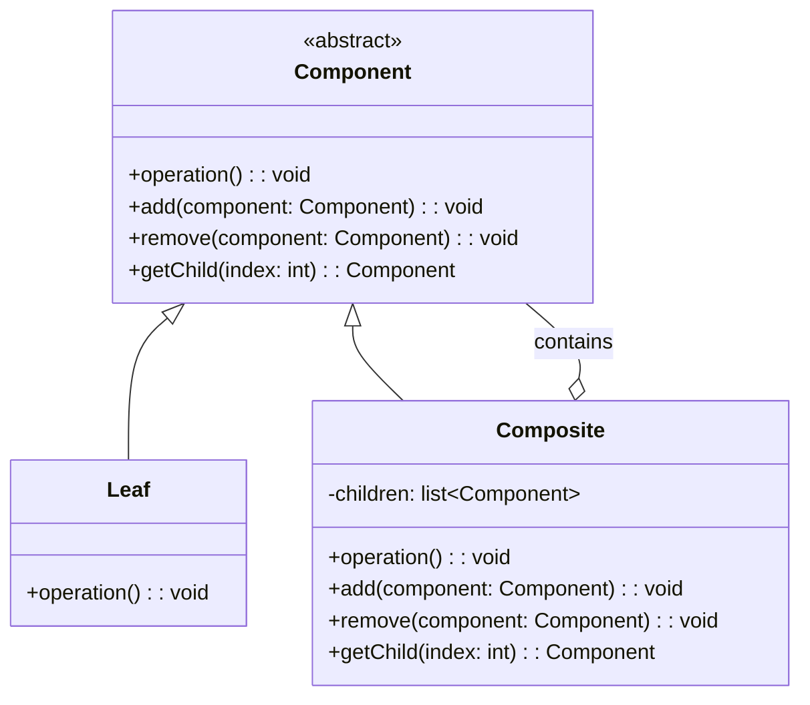

# 组合模式（Composite Pattern）

## 模式定义

组合模式将对象组合成树形结构以表示"部分-整体"的层次结构。组合模式使得用户对单个对象和组合对象的使用具有一致性。

## 原理详解

### 核心思想

组合模式的核心在于：
1. **统一接口**：叶子和容器实现相同接口，客户端无需区分
2. **树形结构**：构建对象的部分-整体层次结构
3. **一致性操作**：对单个对象和组合对象的操作保持一致
4. **递归组合**：容器可以包含叶子或另一个容器

### 结构

```
Component (抽象构件)
  + operation(): void
  + add(Component): void
  + remove(Component): void
  + getChild(int): Component

Leaf (叶子构件)
  + operation(): void

Composite (容器构件)
  + operation(): void
  + add(Component): void
  + remove(Component): void
  + getChild(int): Component
```

### UML 类图



---

## Java 实现

### 基础实现

```java
abstract class Component {
    protected String name;

    public Component(String name) {
        this.name = name;
    }

    public abstract void operation();
    public abstract void add(Component component);
    public abstract void remove(Component component);
    public abstract Component getChild(int index);
}

class Leaf extends Component {
    public Leaf(String name) {
        super(name);
    }

    @Override
    public void operation() {
        System.out.println("Leaf " + name + " operation");
    }

    @Override
    public void add(Component component) {
        throw new UnsupportedOperationException();
    }

    @Override
    public void remove(Component component) {
        throw new UnsupportedOperationException();
    }

    @Override
    public Component getChild(int index) {
        throw new UnsupportedOperationException();
    }
}

class Composite extends Component {
    private List<Component> children = new ArrayList<>();

    public Composite(String name) {
        super(name);
    }

    @Override
    public void operation() {
        System.out.println("Composite " + name + " operation");
        for (Component child : children) {
            child.operation();
        }
    }

    @Override
    public void add(Component component) {
        children.add(component);
    }

    @Override
    public void remove(Component component) {
        children.remove(component);
    }

    @Override
    public Component getChild(int index) {
        return children.get(index);
    }
}

public class CompositeDemo {
    public static void main(String[] args) {
        Composite root = new Composite("Root");
        Composite branch1 = new Composite("Branch1");
        Composite branch2 = new Composite("Branch2");

        Leaf leaf1 = new Leaf("Leaf1");
        Leaf leaf2 = new Leaf("Leaf2");
        Leaf leaf3 = new Leaf("Leaf3");

        root.add(branch1);
        root.add(branch2);
        branch1.add(leaf1);
        branch1.add(leaf2);
        branch2.add(leaf3);

        root.operation();
    }
}
```

### 安全组合模式（更常见）

```java
abstract class Component {
    protected String name;

    public Component(String name) {
        this.name = name;
    }

    public abstract void operation();

    public void add(Component component) {
        throw new UnsupportedOperationException();
    }

    public void remove(Component component) {
        throw new UnsupportedOperationException();
    }

    public Component getChild(int index) {
        throw new UnsupportedOperationException();
    }
}

class Leaf extends Component {
    public Leaf(String name) {
        super(name);
    }

    @Override
    public void operation() {
        System.out.println("Leaf " + name + " operation");
    }
}

class Composite extends Component {
    private List<Component> children = new ArrayList<>();

    public Composite(String name) {
        super(name);
    }

    @Override
    public void operation() {
        System.out.println("Composite " + name + " operation");
        for (Component child : children) {
            child.operation();
        }
    }

    public void add(Component component) {
        children.add(component);
    }

    public void remove(Component component) {
        children.remove(component);
    }

    public Component getChild(int index) {
        return children.get(index);
    }

    public List<Component> getChildren() {
        return children;
    }
}
```

### 文件系统示例

```java
class File extends Component {
    private long size;

    public File(String name, long size) {
        super(name);
        this.size = size;
    }

    @Override
    public long getSize() {
        return size;
    }

    @Override
    public void print(String prefix) {
        System.out.println(prefix + name + " (" + size + " bytes)");
    }
}

class Folder extends Component {
    private List<Component> children = new ArrayList<>();

    public Folder(String name) {
        super(name);
    }

    @Override
    public long getSize() {
        long total = 0;
        for (Component child : children) {
            total += child.getSize();
        }
        return total;
    }

    @Override
    public void add(Component component) {
        children.add(component);
    }

    @Override
    public void remove(Component component) {
        children.remove(component);
    }

    @Override
    public void print(String prefix) {
        System.out.println(prefix + name + " (folder)");
        for (Component child : children) {
            child.print(prefix + "  ");
        }
    }
}
```

---

## Python 实现

### 基础实现

```python
from abc import ABC, abstractmethod

class Component(ABC):
    def __init__(self, name):
        self.name = name

    @abstractmethod
    def operation(self):
        pass

    def add(self, component):
        raise NotImplementedError

    def remove(self, component):
        raise NotImplementedError

    def get_child(self, index):
        raise NotImplementedError

class Leaf(Component):
    def operation(self):
        print(f"Leaf {self.name} operation")

class Composite(Component):
    def __init__(self, name):
        super().__init__(name)
        self._children = []

    def operation(self):
        print(f"Composite {self.name} operation")
        for child in self._children:
            child.operation()

    def add(self, component):
        self._children.append(component)

    def remove(self, component):
        self._children.remove(component)

    def get_child(self, index):
        return self._children[index]

if __name__ == "__main__":
    root = Composite("Root")
    branch1 = Composite("Branch1")
    branch2 = Composite("Branch2")
    leaf1 = Leaf("Leaf1")
    leaf2 = Leaf("Leaf2")
    leaf3 = Leaf("Leaf3")

    root.add(branch1)
    root.add(branch2)
    branch1.add(leaf1)
    branch1.add(leaf2)
    branch2.add(leaf3)

    root.operation()
```

### 文件系统示例

```python
from abc import ABC, abstractmethod

class FileSystemComponent(ABC):
    def __init__(self, name):
        self.name = name

    @abstractmethod
    def get_size(self):
        pass

    @abstractmethod
    def print(self, prefix=""):
        pass

class File(FileSystemComponent):
    def __init__(self, name, size):
        super().__init__(name)
        self._size = size

    def get_size(self):
        return self._size

    def print(self, prefix=""):
        print(f"{prefix}{self.name} ({self._size} bytes)")

class Folder(FileSystemComponent):
    def __init__(self, name):
        super().__init__(name)
        self._children = []

    def add(self, component):
        self._children.append(component)

    def get_size(self):
        return sum(child.get_size() for child in self._children)

    def print(self, prefix=""):
        print(f"{prefix}{self.name}/")
        for child in self._children:
            child.print(prefix + "  ")

if __name__ == "__main__":
    root = Folder("root")
    docs = Folder("documents")
    pics = Folder("pictures")

    root.add(docs)
    root.add(pics)

    docs.add(File("resume.pdf", 1024))
    docs.add(File("notes.txt", 512))

    pics.add(File("photo.jpg", 2048))

    root.print()
    print(f"\nTotal size: {root.get_size()} bytes")
```

---

## C++ 实现

### 基础实现

```cpp
#include <iostream>
#include <vector>
#include <string>
#include <memory>

class Component {
public:
    Component(const std::string& name) : name(name) {}
    virtual ~Component() = default;

    virtual void operation() = 0;
    virtual void add(std::shared_ptr<Component>) {
        throw std::runtime_error("Not supported");
    }
    virtual void remove(std::shared_ptr<Component>) {
        throw std::runtime_error("Not supported");
    }
    virtual std::shared_ptr<Component> getChild(int) {
        throw std::runtime_error("Not supported");
    }

protected:
    std::string name;
};

class Leaf : public Component {
public:
    using Component::Component;

    void operation() override {
        std::cout << "Leaf " << name << " operation" << std::endl;
    }
};

class Composite : public Component {
public:
    using Component::Component;

    void operation() override {
        std::cout << "Composite " << name << " operation" << std::endl;
        for (const auto& child : children) {
            child->operation();
        }
    }

    void add(std::shared_ptr<Component> component) override {
        children.push_back(component);
    }

    void remove(std::shared_ptr<Component> component) {
        children.erase(
            std::remove(children.begin(), children.end(), component),
            children.end()
        );
    }

    std::shared_ptr<Component> getChild(int index) override {
        return children.at(index);
    }

private:
    std::vector<std::shared_ptr<Component>> children;
};

int main() {
    auto root = std::make_shared<Composite>("Root");
    auto branch1 = std::make_shared<Composite>("Branch1");
    auto branch2 = std::make_shared<Composite>("Branch2");
    auto leaf1 = std::make_shared<Leaf>("Leaf1");
    auto leaf2 = std::make_shared<Leaf>("Leaf2");
    auto leaf3 = std::make_shared<Leaf>("Leaf3");

    root->add(branch1);
    root->add(branch2);
    branch1->add(leaf1);
    branch1->add(leaf2);
    branch2->add(leaf3);

    root->operation();

    return 0;
}
```

### 文件系统示例

```cpp
#include <iostream>
#include <vector>
#include <string>
#include <memory>

class FileSystemComponent {
public:
    FileSystemComponent(const std::string& name) : name(name) {}
    virtual ~FileSystemComponent() = default;

    virtual long getSize() const = 0;
    virtual void print(const std::string& prefix) const = 0;

protected:
    std::string name;
};

class File : public FileSystemComponent {
public:
    File(const std::string& name, long size)
        : FileSystemComponent(name), size_(size) {}

    long getSize() const override {
        return size_;
    }

    void print(const std::string& prefix) const override {
        std::cout << prefix << name << " (" << size_ << " bytes)" << std::endl;
    }

private:
    long size_;
};

class Folder : public FileSystemComponent {
public:
    using FileSystemComponent::FileSystemComponent;

    void add(std::shared_ptr<FileSystemComponent> component) {
        children.push_back(component);
    }

    long getSize() const override {
        long total = 0;
        for (const auto& child : children) {
            total += child->getSize();
        }
        return total;
    }

    void print(const std::string& prefix) const override {
        std::cout << prefix << name << "/" << std::endl;
        for (const auto& child : children) {
            child->print(prefix + "  ");
        }
    }

private:
    std::vector<std::shared_ptr<FileSystemComponent>> children;
};

int main() {
    auto root = std::make_shared<Folder>("root");
    auto docs = std::make_shared<Folder>("documents");
    auto pics = std::make_shared<Folder>("pictures");

    root->add(docs);
    root->add(pics);

    docs->add(std::make_shared<File>("resume.pdf", 1024));
    docs->add(std::make_shared<File>("notes.txt", 512));
    pics->add(std::make_shared<File>("photo.jpg", 2048));

    root->print("");
    std::cout << "\nTotal size: " << root->getSize() << " bytes" << std::endl;

    return 0;
}
```

---

## 应用场景

### 1. 文件系统
文件和文件夹的树形结构。

### 2. 组织架构
公司、部门、员工的层级结构。

### 3. GUI 组件
窗口、面板、按钮等容器-组件结构。

### 4. 菜单系统
菜单和菜单项的嵌套结构。

### 5. 目录结构
硬盘分区、文件夹、文件的层级。

### 6. XML/HTML DOM 树
文档对象模型的树形结构。

### 7. 图形绘制
图形、组、层的嵌套。

---

## AI/机器学习/深度学习领域应用

### 1. 神经网络层组合（Neural Network Layer Composition）
组合模式用于构建神经网络的层次结构：

```python
from abc import ABC, abstractmethod

class LayerComponent(ABC):
    @abstractmethod
    def forward(self, x):
        pass
    
    def add(self, layer):
        raise NotImplementedError
    
    def get_layers(self):
        return []

class LeafLayer(LayerComponent):
    def __init__(self, layer_name):
        self.layer_name = layer_name
    
    def forward(self, x):
        return f"{self.layer_name} processed: {x}"

class Sequential(LayerComponent):
    def __init__(self):
        self._layers = []
    
    def add(self, layer):
        self._layers.append(layer)
    
    def forward(self, x):
        for layer in self._layers:
            x = layer.forward(x)
        return x
    
    def get_layers(self):
        return self._layers

class Parallel(LayerComponent):
    def __init__(self):
        self._branches = []
    
    def add(self, branch):
        self._branches.append(branch)
    
    def forward(self, x):
        outputs = [branch.forward(x) for branch in self._branches]
        return f"Concatenated: {outputs}"

# 构建复杂网络结构
input_layer = LeafLayer("Input")
conv1 = LeafLayer("Conv2D(32)")
conv2 = LeafLayer("Conv2D(64)")
pool = LeafLayer("MaxPooling")
fc = LeafLayer("Dense(10)")

# 主干分支
main_branch = Sequential()
main_branch.add(conv1)
main_branch.add(pool)
main_branch.add(conv2)
main_branch.add(pool)

# 残差分支
residual = Sequential()
residual.add(conv1)

# 并行结构
parallel = Parallel()
parallel.add(main_branch)
parallel.add(residual)

# 完整网络
network = Sequential()
network.add(input_layer)
network.add(parallel)
network.add(fc)

result = network.forward("input_data")
```

### 2. 特征提取器组合（Feature Extractor Composition）
组合多个特征提取器：

```python
class FeatureExtractor(ABC):
    @abstractmethod
    def extract(self, data):
        pass

class RawFeature(FeatureExtractor):
    def extract(self, data):
        return {"raw": data}

class TFIDFExtractor(FeatureExtractor):
    def extract(self, data):
        return {"tfidf": f"TFIDF features from {data}"}

class Word2VecExtractor(FeatureExtractor):
    def extract(self, data):
        return {"word2vec": f"Word2Vec features from {data}"}

class FeatureEnsemble(FeatureExtractor):
    def __init__(self):
        self._extractors = []
    
    def add(self, extractor):
        self._extractors.append(extractor)
    
    def extract(self, data):
        features = {}
        for extractor in self._extractors:
            features.update(extractor.extract(data))
        return features

# 组合多个特征提取器
ensemble = FeatureEnsemble()
ensemble.add(RawFeature())
ensemble.add(TFIDFExtractor())
ensemble.add(Word2VecExtractor())

features = ensemble.extract("text data")
```

### 3. 模型集成（Model Ensemble）
组合多个模型形成集成：

```python
class Model(ABC):
    @abstractmethod
    def predict(self, x):
        pass

class RandomForestModel(Model):
    def predict(self, x):
        return f"RF prediction for {x}"

class XGBoostModel(Model):
    def predict(self, x):
        return f"XGB prediction for {x}"

class NeuralNetworkModel(Model):
    def predict(self, x):
        return f"NN prediction for {x}"

class EnsembleModel(Model):
    def __init__(self):
        self._models = []
    
    def add(self, model):
        self._models.append(model)
    
    def predict(self, x):
        predictions = [model.predict(x) for model in self._models]
        return f"Ensemble result from: {predictions}"

# 创建模型集成
ensemble = EnsembleModel()
ensemble.add(RandomForestModel())
ensemble.add(XGBoostModel())
ensemble.add(NeuralNetworkModel())

result = ensemble.predict("input")
```

### 4. 数据预处理管道组合（Preprocessing Pipeline）
组合多个预处理步骤：

```python
class Preprocessor(ABC):
    @abstractmethod
    def process(self, data):
        pass

class Scaler(Preprocessor):
    def process(self, data):
        return f"Scaled: {data}"

class Encoder(Preprocessor):
    def process(self, data):
        return f"Encoded: {data}"

class Normalizer(Preprocessor):
    def process(self, data):
        return f"Normalized: {data}"

class Pipeline(Preprocessor):
    def __init__(self):
        self._steps = []
    
    def add(self, step):
        self._steps.append(step)
    
    def process(self, data):
        for step in self._steps:
            data = step.process(data)
        return data

# 构建预处理管道
pipeline = Pipeline()
pipeline.add(Scaler())
pipeline.add(Encoder())
pipeline.add(Normalizer())

processed = pipeline.process("raw_data")
```

### 5. 决策树模型（Decision Tree）
决策树的内部节点和叶子节点：

```python
class DecisionNode(ABC):
    @abstractmethod
    def predict(self, features):
        pass

class LeafNode(DecisionNode):
    def __init__(self, label):
        self._label = label
    
    def predict(self, features):
        return self._label

class InternalNode(DecisionNode):
    def __init__(self, feature_idx, threshold):
        self._feature_idx = feature_idx
        self._threshold = threshold
        self._left = None
        self._right = None
    
    def add_left(self, node):
        self._left = node
    
    def add_right(self, node):
        self._right = node
    
    def predict(self, features):
        if features[self._feature_idx] <= self._threshold:
            return self._left.predict(features)
        else:
            return self._right.predict(features)

# 构建决策树
root = InternalNode(0, 5.0)
root.add_left(LeafNode("Class A"))
root.add_right(InternalNode(1, 3.0))
root._right.add_left(LeafNode("Class B"))
root._right.add_right(LeafNode("Class C"))

prediction = root.predict([3.0, 2.0])
```

### 应用场景总结

| 应用场景 | AI/ML领域具体应用 | 技术要点 |
|----------|-------------------|----------|
| 神经网络 | 层的组合、残差连接、并行分支 | 树形结构构建 |
| 特征提取 | 多特征融合、特征工程管道 | 统一接口提取 |
| 模型集成 | 集成学习、Stacking、Blending | 组合预测结果 |
| 预处理 | 数据变换管道 | 顺序处理步骤 |
| 决策树 | 树形决策模型 | 递归结构 |

---

## 优缺点分析

### 优点

1. **一致性**：客户端可以统一处理叶子对象和容器对象
2. **扩展性**：容易添加新的组件类型
3. **简化客户端**：客户端不需要知道是叶子还是容器
4. **符合开闭原则**：新增组件不需要修改已有代码

### 缺点

1. **设计复杂度**：需要抽象出公共接口
2. **限制类型**：有时需要限制可以添加到容器的组件类型
3. **透明性 vs 安全性**：需要在透明性（所有类相同接口）和安全性之间权衡
4. **遍历开销**：某些操作可能需要遍历整个树

---

## 模式对比

| 对比项 | 透明组合模式 | 安全组合模式 |
|--------|--------------|--------------|
| 接口 | 所有类相同接口 | 只有容器有组合接口 |
| 安全性 | 较低 | 较高 |
| 透明性 | 较高 | 较低 |
| 实现 | 叶子也要实现无意义操作 | 更简洁 |

### 组合模式 vs 装饰器模式

| 对比项 | 组合模式 | 装饰器模式 |
|--------|----------|------------|
| 目的 | 结构复用 | 动态增加职责 |
| 结构 | 树形层级 | 链式包装 |
| 重点 | 整体-部分 | 功能扩展 |
