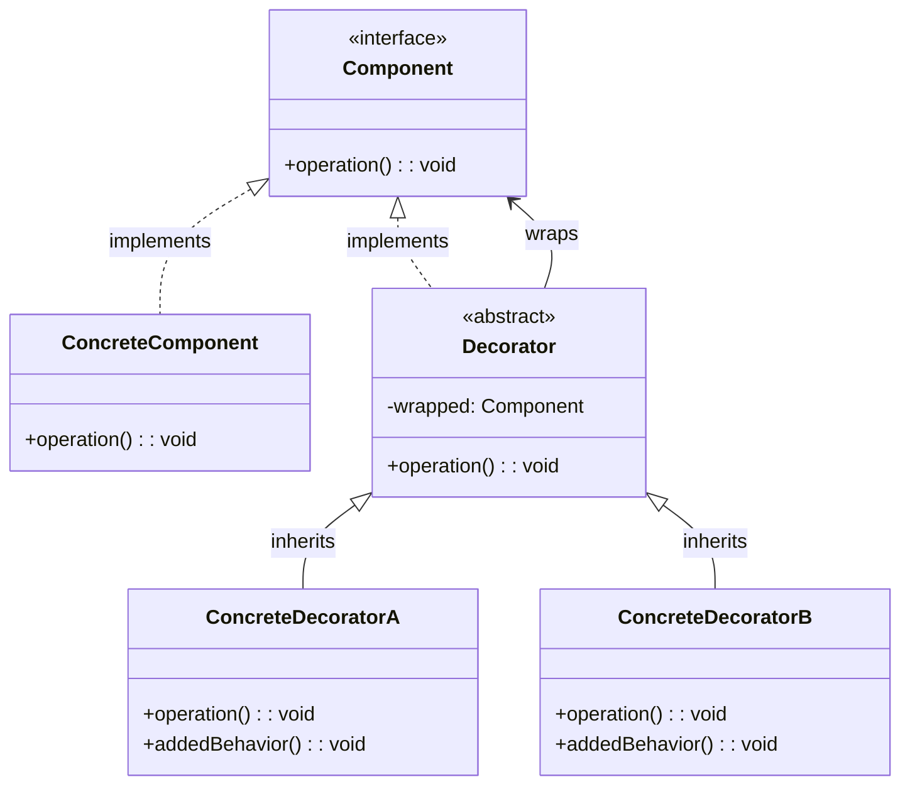

# 装饰器模式（Decorator Pattern）

## 模式定义

装饰器模式动态地给一个对象添加一些额外的职责。就增加功能来说，装饰器模式相比生成子类更为灵活。

## 原理详解

### 核心思想

装饰器模式的核心在于：
1. **动态增强**：运行时动态地为对象添加功能
2. **包装**：将对象包装在装饰器中以增强其行为
3. **透明性**：装饰后的对象对用户透明，用户可以像使用原对象一样使用
4. **单一职责**：每个装饰器只负责一项功能

### UML 类图



### 结构

```
Component (抽象构件)
  + operation(): void

ConcreteComponent (具体构件)
  + operation(): void

Decorator (抽象装饰器)
  - wrapped: Component
  + operation(): void

ConcreteDecorator (具体装饰器)
  + operation(): void
  + addedBehavior(): void
```

### 与继承对比

| 对比项 | 继承 | 装饰器模式 |
|--------|------|------------|
| 扩展方式 | 编译时 | 运行时 |
| 灵活性 | 低 | 高 |
| 类数量 | 指数增长 | 线性增长 |
| 运行时修改 | 不支持 | 支持 |
| 职责组合 | 静态 | 动态 |

---

## Java 实现

### 基础实现

```java
interface Component {
    void operation();
}

class ConcreteComponent implements Component {
    @Override
    public void operation() {
        System.out.println("ConcreteComponent operation");
    }
}

abstract class Decorator implements Component {
    protected Component wrapped;

    public Decorator(Component wrapped) {
        this.wrapped = wrapped;
    }

    @Override
    public void operation() {
        wrapped.operation();
    }
}

class ConcreteDecoratorA extends Decorator {
    public ConcreteDecoratorA(Component wrapped) {
        super(wrapped);
    }

    @Override
    public void operation() {
        super.operation();
        addedBehavior();
    }

    private void addedBehavior() {
        System.out.println("ConcreteDecoratorA added behavior");
    }
}

class ConcreteDecoratorB extends Decorator {
    public ConcreteDecoratorB(Component wrapped) {
        super(wrapped);
    }

    @Override
    public void operation() {
        super.operation();
        addedBehavior();
    }

    private void addedBehavior() {
        System.out.println("ConcreteDecoratorB added behavior");
    }
}

public class DecoratorDemo {
    public static void main(String[] args) {
        Component component = new ConcreteComponent();
        Component decorated = new ConcreteDecoratorA(component);
        Component doubleDecorated = new ConcreteDecoratorB(decorated);

        System.out.println("--- Single decorated ---");
        decorated.operation();

        System.out.println("\n--- Double decorated ---");
        doubleDecorated.operation();
    }
}
```

### IO 流示例

```java
import java.io.*;

class FileDataReader implements AutoCloseable {
    private Reader reader;

    public FileDataReader(String filename) throws FileNotFoundException {
        reader = new BufferedReader(new FileReader(filename));
    }

    public String readLine() throws IOException {
        return ((BufferedReader) reader).readLine();
    }

    @Override
    public void close() throws IOException {
        reader.close();
    }
}
```

### 咖啡订单系统

```java
interface Coffee {
    String getDescription();
    double getCost();
}

class SimpleCoffee implements Coffee {
    @Override
    public String getDescription() {
        return "Simple Coffee";
    }

    @Override
    public double getCost() {
        return 2.0;
    }
}

class CoffeeDecorator implements Coffee {
    protected Coffee coffee;

    public CoffeeDecorator(Coffee coffee) {
        this.coffee = coffee;
    }

    @Override
    public String getDescription() {
        return coffee.getDescription();
    }

    @Override
    public double getCost() {
        return coffee.getCost();
    }
}

class MilkDecorator extends CoffeeDecorator {
    public MilkDecorator(Coffee coffee) {
        super(coffee);
    }

    @Override
    public String getDescription() {
        return super.getDescription() + ", Milk";
    }

    @Override
    public double getCost() {
        return super.getCost() + 0.5;
    }
}

class SugarDecorator extends CoffeeDecorator {
    public SugarDecorator(Coffee coffee) {
        super(coffee);
    }

    @Override
    public String getDescription() {
        return super.getDescription() + ", Sugar";
    }

    @Override
    public double getCost() {
        return super.getCost() + 0.2;
    }
}

public class CoffeeDemo {
    public static void main(String[] args) {
        Coffee coffee = new SimpleCoffee();
        System.out.println(coffee.getDescription() + " = $" + coffee.getCost());

        coffee = new MilkDecorator(coffee);
        System.out.println(coffee.getDescription() + " = $" + coffee.getCost());

        coffee = new SugarDecorator(coffee);
        System.out.println(coffee.getDescription() + " = $" + coffee.getCost());
    }
}
```

---

## Python 实现

### 基础实现

```python
from abc import ABC, abstractmethod

class Component(ABC):
    @abstractmethod
    def operation(self):
        pass

class ConcreteComponent(Component):
    def operation(self):
        print("ConcreteComponent operation")

class Decorator(Component):
    def __init__(self, wrapped):
        self.wrapped = wrapped

    def operation(self):
        self.wrapped.operation()

class ConcreteDecoratorA(Decorator):
    def operation(self):
        super().operation()
        self.added_behavior()

    def added_behavior(self):
        print("ConcreteDecoratorA added behavior")

class ConcreteDecoratorB(Decorator):
    def operation(self):
        super().operation()
        self.added_behavior()

    def added_behavior(self):
        print("ConcreteDecoratorB added behavior")

if __name__ == "__main__":
    component = ConcreteComponent()
    decorated = ConcreteDecoratorA(component)
    double_decorated = ConcreteDecoratorB(decorated)

    print("--- Single decorated ---")
    decorated.operation()

    print("\n--- Double decorated ---")
    double_decorated.operation()
```

### 装饰器语法糖

```python
def log_calls(func):
    def wrapper(*args, **kwargs):
        print(f"Calling {func.__name__}")
        result = func(*args, **kwargs)
        print(f"Called {func.__name__}")
        return result
    return wrapper

def timing(func):
    def wrapper(*args, **kwargs):
        import time
        start = time.time()
        result = func(*args, **kwargs)
        print(f"{func.__name__} took {time.time() - start:.2f}s")
        return result
    return wrapper

@log_calls
@timing
def slow_function():
    import time
    time.sleep(1)
    print("Function executed")

slow_function()
```

### 咖啡订单系统

```python
from abc import ABC, abstractmethod

class Coffee(ABC):
    @abstractmethod
    def get_description(self):
        pass

    @abstractmethod
    def get_cost(self):
        pass

class SimpleCoffee(Coffee):
    def get_description(self):
        return "Simple Coffee"

    def get_cost(self):
        return 2.0

class CoffeeDecorator(Coffee):
    def __init__(self, coffee):
        self.coffee = coffee

    def get_description(self):
        return self.coffee.get_description()

    def get_cost(self):
        return self.coffee.get_cost()

class MilkDecorator(CoffeeDecorator):
    def get_description(self):
        return super().get_description() + ", Milk"

    def get_cost(self):
        return super().get_cost() + 0.5

class SugarDecorator(CoffeeDecorator):
    def get_description(self):
        return super().get_description() + ", Sugar"

    def get_cost(self):
        return super().get_cost() + 0.2

if __name__ == "__main__":
    coffee = SimpleCoffee()
    print(f"{coffee.get_description()} = ${coffee.get_cost()}")

    coffee = MilkDecorator(coffee)
    print(f"{coffee.get_description()} = ${coffee.get_cost()}")

    coffee = SugarDecorator(coffee)
    print(f"{coffee.get_description()} = ${coffee.get_cost()}")
```

---

## C++ 实现

### 基础实现

```cpp
#include <iostream>
#include <memory>

class Component {
public:
    virtual ~Component() = default;
    virtual void operation() = 0;
};

class ConcreteComponent : public Component {
public:
    void operation() override {
        std::cout << "ConcreteComponent operation" << std::endl;
    }
};

class Decorator : public Component {
protected:
    std::shared_ptr<Component> wrapped;

public:
    Decorator(std::shared_ptr<Component> wrapped) : wrapped(wrapped) {}

    void operation() override {
        wrapped->operation();
    }
};

class ConcreteDecoratorA : public Decorator {
public:
    using Decorator::Decorator;

    void operation() override {
        Decorator::operation();
        addedBehavior();
    }

    void addedBehavior() {
        std::cout << "ConcreteDecoratorA added behavior" << std::endl;
    }
};

class ConcreteDecoratorB : public Decorator {
public:
    using Decorator::Decorator;

    void operation() override {
        Decorator::operation();
        addedBehavior();
    }

    void addedBehavior() {
        std::cout << "ConcreteDecoratorB added behavior" << std::endl;
    }
};

int main() {
    auto component = std::make_shared<ConcreteComponent>();
    auto decorated = std::make_shared<ConcreteDecoratorA>(component);
    auto doubleDecorated = std::make_shared<ConcreteDecoratorB>(decorated);

    std::cout << "--- Single decorated ---" << std::endl;
    decorated->operation();

    std::cout << "\n--- Double decorated ---" << std::endl;
    doubleDecorated->operation();

    return 0;
}
```

### 咖啡订单系统

```cpp
#include <iostream>
#include <memory>
#include <string>

class Coffee {
public:
    virtual ~Coffee() = default;
    virtual std::string getDescription() const = 0;
    virtual double getCost() const = 0;
};

class SimpleCoffee : public Coffee {
public:
    std::string getDescription() const override {
        return "Simple Coffee";
    }

    double getCost() const override {
        return 2.0;
    }
};

class CoffeeDecorator : public Coffee {
protected:
    std::shared_ptr<Coffee> coffee;

public:
    CoffeeDecorator(std::shared_ptr<Coffee> coffee) : coffee(coffee) {}

    std::string getDescription() const override {
        return coffee->getDescription();
    }

    double getCost() const override {
        return coffee->getCost();
    }
};

class MilkDecorator : public CoffeeDecorator {
public:
    using CoffeeDecorator::CoffeeDecorator;

    std::string getDescription() const override {
        return coffee->getDescription() + ", Milk";
    }

    double getCost() const override {
        return coffee->getCost() + 0.5;
    }
};

class SugarDecorator : public CoffeeDecorator {
public:
    using CoffeeDecorator::CoffeeDecorator;

    std::string getDescription() const override {
        return coffee->getDescription() + ", Sugar";
    }

    double getCost() const override {
        return coffee->getCost() + 0.2;
    }
};

int main() {
    auto coffee = std::make_shared<SimpleCoffee>();
    std::cout << coffee->getDescription() << " = $" << coffee->getCost() << std::endl;

    coffee = std::make_shared<MilkDecorator>(coffee);
    std::cout << coffee->getDescription() << " = $" << coffee->getCost() << std::endl;

    coffee = std::make_shared<SugarDecorator>(coffee);
    std::cout << coffee->getDescription() << " = $" << coffee->getCost() << std::endl;

    return 0;
}
```

---

## 应用场景

### 1. IO 流
Java IO 流的 `BufferedInputStream`、`DataInputStream` 等。

### 2. GUI 组件
为组件动态添加边框、滚动条等功能。

### 3. 日志系统
为方法添加日志记录、性能监控等功能。

### 4. 缓存
为数据获取添加缓存功能。

### 5. 验证
为数据处理添加验证逻辑。

---

## AI/机器学习/深度学习领域应用

### 1. 模型增强装饰器（Model Enhancement Decorator）
为模型动态添加功能：

```python
from abc import ABC, abstractmethod

class Model(ABC):
    @abstractmethod
    def predict(self, x):
        pass

class BaseModel(Model):
    def predict(self, x):
        return f"Base prediction for {x}"

class ModelDecorator(Model):
    def __init__(self, model):
        self.model = model
    
    def predict(self, x):
        return self.model.predict(x)

class DropoutDecorator(ModelDecorator):
    def __init__(self, model, rate=0.5):
        super().__init__(model)
        self.rate = rate
    
    def predict(self, x):
        print(f"Applying dropout with rate {self.rate}")
        return self.model.predict(x)

class BatchNormDecorator(ModelDecorator):
    def predict(self, x):
        print("Applying batch normalization")
        return self.model.predict(x)

class RegularizationDecorator(ModelDecorator):
    def __init__(self, model, l2_lambda=0.01):
        super().__init__(model)
        self.l2_lambda = l2_lambda
    
    def predict(self, x):
        result = self.model.predict(x)
        print(f"Applying L2 regularization (λ={self.l2_lambda})")
        return result

# 使用装饰器增强模型
model = BaseModel()
model = DropoutDecorator(model, rate=0.3)
model = BatchNormDecorator(model)
model = RegularizationDecorator(model, l2_lambda=0.001)

prediction = model.predict("input")
```

### 2. 数据预处理装饰器（Data Preprocessing Decorator）
动态组合数据预处理步骤：

```python
class DataProcessor(ABC):
    @abstractmethod
    def process(self, data):
        pass

class RawDataProcessor(DataProcessor):
    def process(self, data):
        return f"Raw data: {data}"

class ProcessorDecorator(DataProcessor):
    def __init__(self, processor):
        self.processor = processor
    
    def process(self, data):
        return self.processor.process(data)

class NormalizeDecorator(ProcessorDecorator):
    def process(self, data):
        processed = self.processor.process(data)
        return f"Normalized({processed})"

class StandardizeDecorator(ProcessorDecorator):
    def process(self, data):
        processed = self.processor.process(data)
        return f"Standardized({processed})"

class AugmentDecorator(ProcessorDecorator):
    def __init__(self, processor, flip=True, rotate=True):
        super().__init__(processor)
        self.flip = flip
        self.rotate = rotate
    
    def process(self, data):
        processed = self.processor.process(data)
        augments = []
        if self.flip:
            augments.append("flip")
        if self.rotate:
            augments.append("rotate")
        return f"Augmented({processed}, ops={augments})"

# 组合预处理步骤
processor = RawDataProcessor()
processor = NormalizeDecorator(processor)
processor = StandardizeDecorator(processor)
processor = AugmentDecorator(processor, flip=True, rotate=False)

result = processor.process("image_data")
```

### 3. 训练过程装饰器（Training Process Decorator）
为训练过程添加日志、监控等功能：

```python
class Trainer(ABC):
    @abstractmethod
    def train(self, epochs):
        pass

class SimpleTrainer(Trainer):
    def train(self, epochs):
        return f"Training for {epochs} epochs"

class TrainerDecorator(Trainer):
    def __init__(self, trainer):
        self.trainer = trainer
    
    def train(self, epochs):
        return self.trainer.train(epochs)

class LoggingDecorator(TrainerDecorator):
    def train(self, epochs):
        print("=== Training started ===")
        result = self.trainer.train(epochs)
        print("=== Training finished ===")
        return result

class MetricsDecorator(TrainerDecorator):
    def train(self, epochs):
        result = self.trainer.train(epochs)
        print("Recording metrics: accuracy, loss, precision")
        return result

class EarlyStoppingDecorator(TrainerDecorator):
    def __init__(self, trainer, patience=5):
        super().__init__(trainer)
        self.patience = patience
    
    def train(self, epochs):
        print(f"Early stopping enabled with patience={self.patience}")
        result = self.trainer.train(epochs)
        return result

class TensorBoardDecorator(TrainerDecorator):
    def __init__(self, trainer, log_dir="logs"):
        super().__init__(trainer)
        self.log_dir = log_dir
    
    def train(self, epochs):
        print(f"Logging to TensorBoard: {self.log_dir}")
        result = self.trainer.train(epochs)
        return result

# 构建增强的训练器
trainer = SimpleTrainer()
trainer = LoggingDecorator(trainer)
trainer = MetricsDecorator(trainer)
trainer = EarlyStoppingDecorator(trainer, patience=3)
trainer = TensorBoardDecorator(trainer, log_dir="exp1")

trainer.train(10)
```

### 4. 特征工程装饰器（Feature Engineering Decorator）
动态组合特征工程步骤：

```python
class FeatureEngineer(ABC):
    @abstractmethod
    def transform(self, data):
        pass

class BaseEngineer(FeatureEngineer):
    def transform(self, data):
        return f"Features from {data}"

class EngineerDecorator(FeatureEngineer):
    def __init__(self, engineer):
        self.engineer = engineer
    
    def transform(self, data):
        return self.engineer.transform(data)

class PCADecorator(EngineerDecorator):
    def __init__(self, engineer, n_components=10):
        super().__init__(engineer)
        self.n_components = n_components
    
    def transform(self, data):
        features = self.engineer.transform(data)
        return f"PCA({features}, n={self.n_components})"

class PolynomialDecorator(EngineerDecorator):
    def __init__(self, engineer, degree=2):
        super().__init__(engineer)
        self.degree = degree
    
    def transform(self, data):
        features = self.engineer.transform(data)
        return f"Polynomial({features}, degree={self.degree})"

class FeatureSelectionDecorator(EngineerDecorator):
    def __init__(self, engineer, method="f_classif"):
        super().__init__(engineer)
        self.method = method
    
    def transform(self, data):
        features = self.engineer.transform(data)
        return f"FeatureSelection({features}, method={self.method})"

# 组合特征工程
engineer = BaseEngineer()
engineer = PCADecorator(engineer, n_components=5)
engineer = PolynomialDecorator(engineer, degree=3)
engineer = FeatureSelectionDecorator(engineer, method="mutual_info")

features = engineer.transform("raw_data")
```

### 应用场景总结

| 应用场景 | AI/ML领域具体应用 | 技术要点 |
|----------|-------------------|----------|
| 模型增强 | Dropout、BN、正则化动态添加 | 运行时功能增强 |
| 数据预处理 | 归一化、标准化、数据增强 | 步骤组合 |
| 训练过程 | 日志、监控、早停、TensorBoard | 训练流程增强 |
| 特征工程 | PCA、多项式、特征选择 | 特征变换链 |

---

## 优缺点分析

### 优点

1. **动态增强**：运行时动态添加功能
2. **灵活组合**：可以任意组合装饰器
3. **单一职责**：每个装饰器只负责一项功能
4. **符合开闭原则**：无需修改原有类即可扩展

### 缺点

1. **复杂性**：多层装饰增加系统复杂度
2. **调试困难**：调用链较长，调试困难
3. **顺序敏感**：装饰器顺序影响结果
4. **类型检查**：需要关注类型检查问题

---

## 模式对比

| 模式 | 特点 | 目的 |
|------|------|------|
| 装饰器模式 | 动态增加职责 | 扩展对象功能 |
| 适配器模式 | 接口转换 | 使不兼容的接口能协同 |
| 代理模式 | 间接访问 | 控制对对象的访问 |
| 组合模式 | 整体-部分 | 构建对象树结构 |
