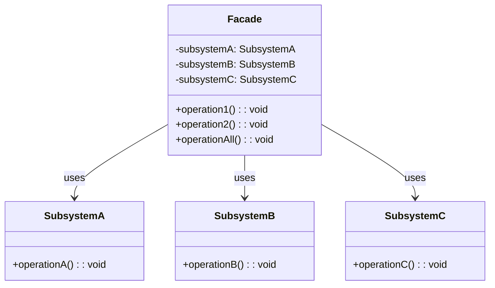

# 外观模式（Facade Pattern）

## 模式定义

外观模式为子系统中的一组接口提供一个一致的界面，外观模式定义了一个高层接口，这个接口使得这一子系统更加容易使用。

## 原理详解

### 核心思想

外观模式的核心在于：
1. **简化接口**：为复杂的子系统提供一个简单的接口
2. **解耦**：客户端与子系统解耦
3. **层次化**：将系统划分为外观和子系统
4. **双向依赖**：外观可以调用子系统，子系统也可以有独立接口

### UML 类图



### 结构

```
Facade (外观)
  + operation(): void

SubsystemClassA
  + operationA(): void

SubsystemClassB
  + operationB(): void

SubsystemClassC
  + operationC(): void
```

### 与适配器模式对比

| 对比项 | 外观模式 | 适配器模式 |
|--------|----------|------------|
| 目的 | 简化接口 | 转换接口 |
| 方向 | 单向（子系统→统一接口） | 双向 |
| 关注点 | 简化使用 | 接口兼容 |

---

## Java 实现

### 基础实现

```java
class SubsystemA {
    public void operationA() {
        System.out.println("SubsystemA operation");
    }
}

class SubsystemB {
    public void operationB() {
        System.out.println("SubsystemB operation");
    }
}

class SubsystemC {
    public void operationC() {
        System.out.println("SubsystemC operation");
    }
}

class Facade {
    private SubsystemA subsystemA;
    private SubsystemB subsystemB;
    private SubsystemC subsystemC;

    public Facade() {
        this.subsystemA = new SubsystemA();
        this.subsystemB = new SubsystemB();
        this.subsystemC = new SubsystemC();
    }

    public void operation1() {
        System.out.println("Facade operation1:");
        subsystemA.operationA();
        subsystemB.operationB();
    }

    public void operation2() {
        System.out.println("Facade operation2:");
        subsystemB.operationB();
        subsystemC.operationC();
    }

    public void operationAll() {
        System.out.println("Facade operationAll:");
        subsystemA.operationA();
        subsystemB.operationB();
        subsystemC.operationC();
    }
}

public class FacadeDemo {
    public static void main(String[] args) {
        Facade facade = new Facade();
        facade.operationAll();
    }
}
```

### 订单处理系统

```java
class InventoryService {
    public boolean checkStock(String productId, int quantity) {
        System.out.println("Checking stock for " + productId);
        return true;
    }
}

class PaymentService {
    public boolean processPayment(String userId, double amount) {
        System.out.println("Processing payment $" + amount);
        return true;
    }
}

class ShippingService {
    public String shipOrder(String productId, String address) {
        System.out.println("Shipping " + productId + " to " + address);
        return "TRACKING123";
    }
}

class OrderFacade {
    private InventoryService inventory;
    private PaymentService payment;
    private ShippingService shipping;

    public OrderFacade() {
        this.inventory = new InventoryService();
        this.payment = new PaymentService();
        this.shipping = new ShippingService();
    }

    public String placeOrder(String userId, String productId, int quantity, String address, double amount) {
        if (!inventory.checkStock(productId, quantity)) {
            return "Out of stock";
        }

        if (!payment.processPayment(userId, amount)) {
            return "Payment failed";
        }

        String trackingNumber = shipping.shipOrder(productId, address);
        return "Order placed. Tracking: " + trackingNumber;
    }
}
```

---

## Python 实现

### 基础实现

```python
class SubsystemA:
    def operation_a(self):
        print("SubsystemA operation")

class SubsystemB:
    def operation_b(self):
        print("SubsystemB operation")

class SubsystemC:
    def operation_c(self):
        print("SubsystemC operation")

class Facade:
    def __init__(self):
        self.subsystem_a = SubsystemA()
        self.subsystem_b = SubsystemB()
        self.subsystem_c = SubsystemC()

    def operation_all(self):
        print("Facade operationAll:")
        self.subsystem_a.operation_a()
        self.subsystem_b.operation_b()
        self.subsystem_c.operation_c()

if __name__ == "__main__":
    facade = Facade()
    facade.operation_all()
```

### 订单处理系统

```python
class InventoryService:
    def check_stock(self, product_id, quantity):
        print(f"Checking stock for {product_id}")
        return True

class PaymentService:
    def process_payment(self, user_id, amount):
        print(f"Processing payment ${amount}")
        return True

class ShippingService:
    def ship_order(self, product_id, address):
        print(f"Shipping {product_id} to {address}")
        return "TRACKING123"

class OrderFacade:
    def __init__(self):
        self.inventory = InventoryService()
        self.payment = PaymentService()
        self.shipping = ShippingService()

    def place_order(self, user_id, product_id, quantity, address, amount):
        if not self.inventory.check_stock(product_id, quantity):
            return "Out of stock"

        if not self.payment.process_payment(user_id, amount):
            return "Payment failed"

        tracking = self.shipping.ship_order(product_id, address)
        return f"Order placed. Tracking: {tracking}"

if __name__ == "__main__":
    facade = OrderFacade()
    print(facade.place_order("user1", "PROD123", 2, "123 Main St", 99.99))
```

---

## C++ 实现

### 基础实现

```cpp
#include <iostream>

class SubsystemA {
public:
    void operationA() {
        std::cout << "SubsystemA operation" << std::endl;
    }
};

class SubsystemB {
public:
    void operationB() {
        std::cout << "SubsystemB operation" << std::endl;
    }
};

class SubsystemC {
public:
    void operationC() {
        std::cout << "SubsystemC operation" << std::endl;
    }
};

class Facade {
private:
    SubsystemA subsystemA;
    SubsystemB subsystemB;
    SubsystemC subsystemC;

public:
    void operationAll() {
        std::cout << "Facade operationAll:" << std::endl;
        subsystemA.operationA();
        subsystemB.operationB();
        subsystemC.operationC();
    }
};

int main() {
    Facade facade;
    facade.operationAll();
    return 0;
}
```

---

## 应用场景

### 1. 编译系统
源代码 → 词法分析 → 语法分析 → 语义分析 → 代码生成。

### 2. 订单处理
库存检查 → 支付 → 物流。

### 3. 银行系统
账户管理 → 风险管理 → 交易处理。

### 4. 图形界面
底层绘制 → 窗口管理 → 事件处理。

### 5. 建筑智能化
照明 → 空调 → 安防 → 能源管理。

---

## AI/机器学习/深度学习领域应用

### 1. 模型训练外观（Model Training Facade）
提供统一的训练接口：

```python
class DataLoader:
    def load_data(self, path):
        return f"Loaded data from {path}"

class Preprocessor:
    def preprocess(self, data):
        return f"Preprocessed: {data}"

class ModelBuilder:
    def build(self, architecture):
        return f"Built {architecture} model"

class Trainer:
    def train(self, model, data, epochs=10):
        return f"Training {model} on {data} for {epochs} epochs"

class Evaluator:
    def evaluate(self, model, test_data):
        return f"Evaluated {model}: accuracy=95%"

class MLTrainingFacade:
    def __init__(self):
        self.data_loader = DataLoader()
        self.preprocessor = Preprocessor()
        self.model_builder = ModelBuilder()
        self.trainer = Trainer()
        self.evaluator = Evaluator()
    
    def train_model(self, data_path, architecture, epochs=10):
        data = self.data_loader.load_data(data_path)
        processed_data = self.preprocessor.preprocess(data)
        model = self.model_builder.build(architecture)
        training_result = self.trainer.train(model, processed_data, epochs)
        evaluation = self.evaluator.evaluate(model, processed_data)
        return {
            'training': training_result,
            'evaluation': evaluation
        }

# 使用外观简化训练流程
facade = MLTrainingFacade()
result = facade.train_model("data.csv", "CNN", epochs=5)
```

### 2. 模型部署外观（Model Deployment Facade）
提供统一的模型部署接口：

```python
class ModelSaver:
    def save(self, model, path):
        return f"Saved model to {path}"

class Optimizer:
    def optimize(self, model):
        return f"Optimized {model} for inference"

class Converter:
    def convert(self, model, format):
        return f"Converted {model} to {format} format"

class Deployer:
    def deploy(self, model, platform):
        return f"Deployed {model} to {platform}"

class DeploymentFacade:
    def __init__(self):
        self.saver = ModelSaver()
        self.optimizer = Optimizer()
        self.converter = Converter()
        self.deployer = Deployer()
    
    def deploy_model(self, model, output_path, target_platform="cloud"):
        optimized = self.optimizer.optimize(model)
        converted = self.converter.convert(optimized, "ONNX")
        saved = self.saver.save(converted, output_path)
        deployed = self.deployer.deploy(saved, target_platform)
        return deployed

# 使用外观简化部署流程
deploy_facade = DeploymentFacade()
deploy_facade.deploy_model("my_model", "./models/", "edge")
```

### 3. 数据处理外观（Data Processing Facade）
提供统一的数据处理接口：

```python
class DataDownloader:
    def download(self, url):
        return f"Downloaded data from {url}"

class DataExtractor:
    def extract(self, compressed_file):
        return f"Extracted {compressed_file}"

class DataCleaner:
    def clean(self, raw_data):
        return f"Cleaned {raw_data}"

class DataSplitter:
    def split(self, data, train_ratio=0.8):
        return f"Split into train/test with ratio {train_ratio}"

class DataPipelineFacade:
    def __init__(self):
        self.downloader = DataDownloader()
        self.extractor = DataExtractor()
        self.cleaner = DataCleaner()
        self.splitter = DataSplitter()
    
    def process_data(self, url):
        downloaded = self.downloader.download(url)
        extracted = self.extractor.extract(downloaded)
        cleaned = self.cleaner.clean(extracted)
        split = self.splitter.split(cleaned)
        return split

# 使用外观简化数据处理流程
data_facade = DataPipelineFacade()
processed = data_facade.process_data("https://dataset.com/data.zip")
```

### 4. 超参数调优外观（Hyperparameter Tuning Facade）
提供统一的超参数搜索接口：

```python
class SearchSpaceBuilder:
    def build(self, params):
        return f"Search space: {params}"

class Tuner:
    def tune(self, model, search_space, n_trials):
        return f"Tuned {model} with {n_trials} trials"

class ResultAnalyzer:
    def analyze(self, results):
        return f"Best params: {results}"

class HyperparameterTuningFacade:
    def __init__(self):
        self.space_builder = SearchSpaceBuilder()
        self.tuner = Tuner()
        self.analyzer = ResultAnalyzer()
    
    def tune_model(self, model, params, n_trials=50):
        search_space = self.space_builder.build(params)
        results = self.tuner.tune(model, search_space, n_trials)
        analysis = self.analyzer.analyze(results)
        return analysis

# 使用外观简化超参数调优
tuning_facade = HyperparameterTuningFacade()
best_params = tuning_facade.tune_model(
    "CNN",
    {"lr": [0.001, 0.01], "batch_size": [32, 64]},
    n_trials=30
)
```

### 应用场景总结

| 应用场景 | AI/ML领域具体应用 | 技术要点 |
|----------|-------------------|----------|
| 模型训练 | 数据加载→预处理→训练→评估 | 端到端训练流程 |
| 模型部署 | 优化→转换→保存→部署 | 部署流水线 |
| 数据处理 | 下载→解压→清洗→分割 | 数据预处理 |
| 超参数调优 | 搜索空间→调优→分析 | 参数优化流程 |

---

## 优缺点分析

### 优点

1. **简化接口**：为复杂的子系统提供简单接口
2. **解耦**：客户端与子系统解耦
3. **层次化**：使系统层次清晰
4. **松耦合**：子系统可以独立变化

### 缺点

1. **限制功能**：可能无法直接使用子系统的所有功能
2. **过度使用**：过度使用外观模式可能导致外观类过于庞大
3. **不符合开闭原则**：新增子系统可能需要修改外观类

---

## 模式对比

| 模式 | 特点 | 目的 |
|------|------|------|
| 外观模式 | 简化接口 | 提供统一的高层接口 |
| 适配器模式 | 接口转换 | 使不兼容的接口能协同 |
| 装饰器模式 | 动态增加职责 | 扩展对象功能 |
| 代理模式 | 间接访问 | 控制对对象的访问 |
