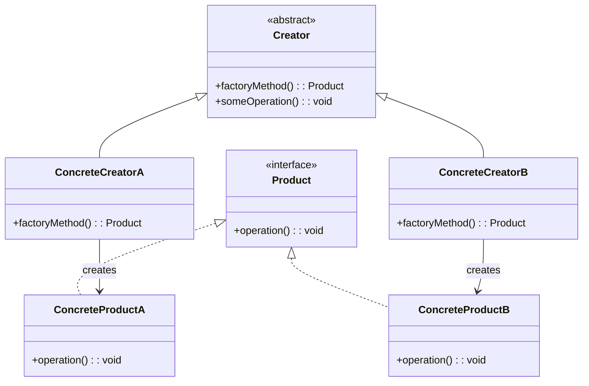

# 工厂方法模式（Factory Method Pattern）

## 模式定义

工厂方法模式定义了一个创建对象的接口，但由子类决定要实例化哪个类。工厂方法使一个类的实例化延迟到其子类。

## 原理详解

### 核心思想

工厂方法模式的核心在于：
1. **将对象的创建抽象化**：定义创建对象的接口，但由子类决定具体创建哪个类
2. **依赖倒置原则**：高层模块依赖抽象，具体创建过程由子类实现
3. **延迟到子类**：父类不知道具体要创建哪个子类对象

### UML 类图



### 结构

```
Creator (抽象创建者)
  + factoryMethod(): Product
  + someOperation(): void

ConcreteCreator (具体创建者)
  + factoryMethod(): Product

Product (抽象产品)
  + operation(): void

ConcreteProduct (具体产品)
  + operation(): void
```

### 与简单工厂对比

| 对比项 | 简单工厂 | 工厂方法 |
|--------|----------|----------|
| 工厂类 | 一个工厂类 | 抽象工厂 + 具体工厂 |
| 扩展性 | 违反开闭原则 | 符合开闭原则 |
| 复杂性 | 简单 | 相对复杂 |
| 适用场景 | 产品种类少 | 产品种类多 |

---

## Java 实现

### 基础实现

```java
// 抽象产品
interface Product {
    void operation();
}

// 具体产品 A
class ConcreteProductA implements Product {
    @Override
    public void operation() {
        System.out.println("ConcreteProductA operation");
    }
}

// 具体产品 B
class ConcreteProductB implements Product {
    @Override
    public void operation() {
        System.out.println("ConcreteProductB operation");
    }
}

// 抽象创建者
abstract class Creator {
    public abstract Product createProduct();

    public void someOperation() {
        Product product = createProduct();
        product.operation();
    }
}

// 具体创建者 A
class ConcreteCreatorA extends Creator {
    @Override
    public Product createProduct() {
        return new ConcreteProductA();
    }
}

// 具体创建者 B
class ConcreteCreatorB extends Creator {
    @Override
    public Product createProduct() {
        return new ConcreteProductB();
    }
}

// 客户端代码
public class FactoryMethodDemo {
    public static void main(String[] args) {
        Creator creatorA = new ConcreteCreatorA();
        creatorA.someOperation();

        Creator creatorB = new ConcreteCreatorB();
        creatorB.someOperation();
    }
}
```

### 参数化工厂方法

```java
abstract class Creator {
    public abstract Product createProduct(String type);

    public Product createProduct() {
        return createProduct("default");
    }
}

class ConcreteCreator extends Creator {
    @Override
    public Product createProduct(String type) {
        if ("A".equals(type)) {
            return new ConcreteProductA();
        } else if ("B".equals(type)) {
            return new ConcreteProductB();
        }
        throw new IllegalArgumentException("Unknown product type: " + type);
    }
}
```

---

## Python 实现

### 基础实现

```python
from abc import ABC, abstractmethod

class Product(ABC):
    @abstractmethod
    def operation(self):
        pass

class ConcreteProductA(Product):
    def operation(self):
        print("ConcreteProductA operation")

class ConcreteProductB(Product):
    def operation(self):
        print("ConcreteProductB operation")

class Creator(ABC):
    @abstractmethod
    def create_product(self) -> Product:
        pass

    def some_operation(self):
        product = self.create_product()
        product.operation()

class ConcreteCreatorA(Creator):
    def create_product(self) -> Product:
        return ConcreteProductA()

class ConcreteCreatorB(Creator):
    def create_product(self) -> Product:
        return ConcreteProductB()

# 客户端代码
if __name__ == "__main__":
    creator_a = ConcreteCreatorA()
    creator_a.some_operation()

    creator_b = ConcreteCreatorB()
    creator_b.some_operation()
```

### 使用字典映射（简化版）

```python
class Product:
    pass

class ProductA(Product):
    def operation(self):
        return "ProductA"

class ProductB(Product):
    def operation(self):
        return "ProductB"

class Creator:
    def create_product(self, product_type):
        products = {
            'A': ProductA,
            'B': ProductB
        }
        if product_type not in products:
            raise ValueError(f"Unknown product type: {product_type}")
        return products[product_type]()

factory = Creator()
product_a = factory.create_product('A')
print(product_a.operation())
```

---

## C++ 实现

### 基础实现

```cpp
#include <iostream>
#include <memory>

// 抽象产品
class Product {
public:
    virtual ~Product() = default;
    virtual void operation() = 0;
};

// 具体产品 A
class ConcreteProductA : public Product {
public:
    void operation() override {
        std::cout << "ConcreteProductA operation" << std::endl;
    }
};

// 具体产品 B
class ConcreteProductB : public Product {
public:
    void operation() override {
        std::cout << "ConcreteProductB operation" << std::endl;
    }
};

// 抽象创建者
class Creator {
public:
    virtual ~Creator() = default;
    virtual std::unique_ptr<Product> createProduct() = 0;

    void someOperation() {
        auto product = createProduct();
        product->operation();
    }
};

// 具体创建者 A
class ConcreteCreatorA : public Creator {
public:
    std::unique_ptr<Product> createProduct() override {
        return std::make_unique<ConcreteProductA>();
    }
};

// 具体创建者 B
class ConcreteCreatorB : public Creator {
public:
    std::unique_ptr<Product> createProduct() override {
        return std::make_unique<ConcreteProductB>();
    }
};

// 客户端代码
int main() {
    std::unique_ptr<Creator> creatorA = std::make_unique<ConcreteCreatorA>();
    creatorA->someOperation();

    std::unique_ptr<Creator> creatorB = std::make_unique<ConcreteCreatorB>();
    creatorB->someOperation();

    return 0;
}
```

### 模板实现（简化版）

```cpp
#include <iostream>
#include <memory>

template<typename T>
class Creator {
public:
    std::unique_ptr<T> createProduct() {
        return std::make_unique<T>();
    }
};

class Product {
public:
    virtual void operation() = 0;
    virtual ~Product() = default;
};

class ConcreteProductA : public Product {
public:
    void operation() override {
        std::cout << "ConcreteProductA operation" << std::endl;
    }
};

int main() {
    Creator<ConcreteProductA> creator;
    auto product = creator.createProduct();
    product->operation();
    return 0;
}
```

---

## 应用场景

### 1. 日志记录器
不同环境（文件、控制台、数据库）使用不同的日志记录器。

### 2. 数据库连接
根据配置创建 MySQL、PostgreSQL、Oracle 等不同数据库连接。

### 3. UI 组件
不同平台（Windows、Mac、Linux）创建对应的 UI 组件。

### 4. 文档导出
不同格式（PDF、Word、Excel）的文档导出器。

### 5. 支付渠道
不同支付方式（支付宝、微信、PayPal）的支付处理器。

---

## AI/机器学习/深度学习领域应用

### 1. 模型架构工厂（Model Architecture Factory）
根据任务类型创建不同的神经网络架构：

```python
from abc import ABC, abstractmethod
import tensorflow as tf

class Model(ABC):
    @abstractmethod
    def build(self):
        pass

class CNNModel(Model):
    def build(self):
        model = tf.keras.Sequential([
            tf.keras.layers.Conv2D(32, (3, 3), activation='relu'),
            tf.keras.layers.MaxPooling2D(),
            tf.keras.layers.Flatten(),
            tf.keras.layers.Dense(10, activation='softmax')
        ])
        return model

class TransformerModel(Model):
    def build(self):
        inputs = tf.keras.Input(shape=(None,))
        x = tf.keras.layers.Embedding(10000, 64)(inputs)
        x = tf.keras.layers.TransformerBlock(64, 4)(x)
        outputs = tf.keras.layers.Dense(10, activation='softmax')(x)
        return tf.keras.Model(inputs, outputs)

class ModelFactory(ABC):
    @abstractmethod
    def create_model(self) -> Model:
        pass

class CNNFactory(ModelFactory):
    def create_model(self) -> Model:
        return CNNModel()

class TransformerFactory(ModelFactory):
    def create_model(self) -> Model:
        return TransformerModel()

# 使用示例
factory = CNNFactory()
model = factory.create_model().build()
```

### 2. 优化器工厂（Optimizer Factory）
创建不同类型的优化器：

```python
class OptimizerFactory(ABC):
    @abstractmethod
    def create_optimizer(self, learning_rate: float):
        pass

class AdamFactory(OptimizerFactory):
    def create_optimizer(self, learning_rate: float):
        return tf.keras.optimizers.Adam(learning_rate=learning_rate)

class SGDFactory(OptimizerFactory):
    def create_optimizer(self, learning_rate: float):
        return tf.keras.optimizers.SGD(learning_rate=learning_rate)

class RMSpropFactory(OptimizerFactory):
    def create_optimizer(self, learning_rate: float):
        return tf.keras.optimizers.RMSprop(learning_rate=learning_rate)
```

### 3. 损失函数工厂（Loss Function Factory）
创建不同的损失函数：

```python
class LossFactory(ABC):
    @abstractmethod
    def create_loss(self):
        pass

class CrossEntropyFactory(LossFactory):
    def create_loss(self):
        return tf.keras.losses.SparseCategoricalCrossentropy()

class MSEFactory(LossFactory):
    def create_loss(self):
        return tf.keras.losses.MeanSquaredError()

class HuberFactory(LossFactory):
    def create_loss(self):
        return tf.keras.losses.Huber()
```

### 4. 数据加载器工厂（Data Loader Factory）
根据数据源类型创建不同的数据加载器：

```python
class DataLoader(ABC):
    @abstractmethod
    def load(self, path):
        pass

class CSVLoader(DataLoader):
    def load(self, path):
        return pd.read_csv(path)

class ParquetLoader(DataLoader):
    def load(self, path):
        return pd.read_parquet(path)

class TFRecordLoader(DataLoader):
    def load(self, path):
        return tf.data.TFRecordDataset(path)

class DataLoaderFactory(ABC):
    @abstractmethod
    def create_loader(self) -> DataLoader:
        pass

class CSVLoaderFactory(DataLoaderFactory):
    def create_loader(self) -> DataLoader:
        return CSVLoader()

class ParquetLoaderFactory(DataLoaderFactory):
    def create_loader(self) -> DataLoader:
        return ParquetLoader()
```

### 5. 特征提取器工厂（Feature Extractor Factory）
创建不同类型的特征提取器：

```python
class FeatureExtractor(ABC):
    @abstractmethod
    def extract(self, data):
        pass

class TFIDFExtractor(FeatureExtractor):
    def extract(self, data):
        vectorizer = TfidfVectorizer()
        return vectorizer.fit_transform(data)

class Word2VecExtractor(FeatureExtractor):
    def extract(self, data):
        model = Word2Vec(data, vector_size=100, window=5, min_count=1)
        return model.wv.vectors

class BERTFeatureExtractor(FeatureExtractor):
    def extract(self, data):
        tokenizer = BertTokenizer.from_pretrained('bert-base-uncased')
        model = BertModel.from_pretrained('bert-base-uncased')
        inputs = tokenizer(data, return_tensors='pt', padding=True, truncation=True)
        outputs = model(**inputs)
        return outputs.last_hidden_state[:, 0, :].detach().numpy()

class FeatureExtractorFactory(ABC):
    @abstractmethod
    def create_extractor(self) -> FeatureExtractor:
        pass

class TFIDFFactory(FeatureExtractorFactory):
    def create_extractor(self) -> FeatureExtractor:
        return TFIDFExtractor()

class BERTFactory(FeatureExtractorFactory):
    def create_extractor(self) -> FeatureExtractor:
        return BERTFeatureExtractor()
```

### 6. 评估指标工厂（Metric Factory）
创建不同的评估指标计算器：

```python
class Metric(ABC):
    @abstractmethod
    def compute(self, y_true, y_pred):
        pass

class AccuracyMetric(Metric):
    def compute(self, y_true, y_pred):
        return np.mean(y_true == y_pred)

class F1ScoreMetric(Metric):
    def compute(self, y_true, y_pred):
        return f1_score(y_true, y_pred, average='weighted')

class MAEMetric(Metric):
    def compute(self, y_true, y_pred):
        return mean_absolute_error(y_true, y_pred)

class MetricFactory(ABC):
    @abstractmethod
    def create_metric(self) -> Metric:
        pass

class AccuracyFactory(MetricFactory):
    def create_metric(self) -> Metric:
        return AccuracyMetric()
```

### 应用场景总结

| 应用场景 | AI/ML领域具体应用 | 技术要点 |
|----------|-------------------|----------|
| 模型架构 | CNN、Transformer、RNN等 | 动态创建不同网络结构 |
| 优化器 | Adam、SGD、RMSprop等 | 根据任务选择优化策略 |
| 损失函数 | CrossEntropy、MSE、Huber等 | 根据任务类型选择损失 |
| 数据加载 | CSV、Parquet、TFRecord等 | 支持多种数据源格式 |
| 特征提取 | TF-IDF、Word2Vec、BERT等 | 适配不同文本特征需求 |
| 评估指标 | Accuracy、F1、MAE等 | 灵活选择评估标准 |

---

## 优缺点分析

### 优点

1. **符合开闭原则**：新增产品只需添加新工厂，无需修改已有代码
2. **单一职责原则**：每个工厂负责一种产品的创建
3. **依赖倒置**：依赖抽象而非具体
4. **解耦**：客户端与具体产品解耦
5. **可扩展性**：易于添加新的产品类型

### 缺点

1. **类数量增加**：每增加一个产品就要增加一个具体工厂
2. **复杂度增加**：增加了系统复杂度
3. **代码复用性低**：具体工厂与产品耦合度高

---

## 模式对比

| 模式 | 特点 | 适用场景 |
|------|------|----------|
| 简单工厂 | 一个工厂生产所有产品 | 产品种类少且稳定 |
| 工厂方法 | 一个工厂接口，一个产品接口 | 产品种类多，需要扩展 |
| 抽象工厂 | 一个工厂生产一族产品 | 产品族，多个产品等级 |
