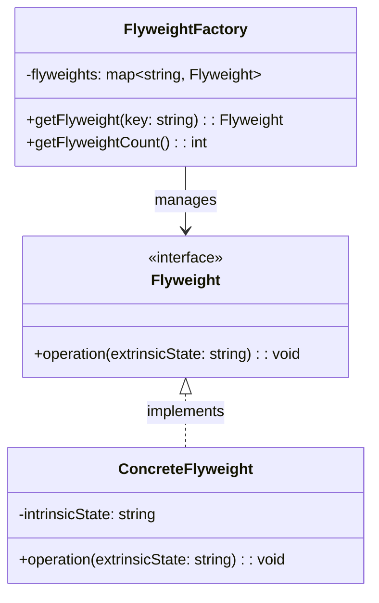

# 享元模式（Flyweight Pattern）

## 模式定义

享元模式运用共享技术有效地支持大量细粒度的对象。

## 原理详解

### 核心思想

享元模式的核心在于：
1. **共享细粒度对象**：大量相似对象共享内部状态
2. **分离状态**：将对象分为内部状态（可共享）和外部状态（不可共享）
3. **对象池**：使用对象池管理共享对象
4. **节省内存**：减少对象数量，节省内存

### UML 类图



### 结构

```
FlyweightFactory (享元工厂)
  - flyweights: Map
  + getFlyweight(key): Flyweight

Flyweight (抽象享元)
  + operation(extrinsicState): void

ConcreteFlyweight (具体享元)
  - intrinsicState: String
  + operation(extrinsicState): void
```

### 内部状态 vs 外部状态

| 类型 | 特点 | 存储位置 |
|------|------|----------|
| 内部状态 | 可共享，不变 | 享元对象内部 |
| 外部状态 | 不可共享，随场景变化 | 客户端传入 |

---

## Java 实现

### 基础实现

```java
interface Flyweight {
    void operation(String extrinsicState);
}

class ConcreteFlyweight implements Flyweight {
    private String intrinsicState;

    public ConcreteFlyweight(String intrinsicState) {
        this.intrinsicState = intrinsicState;
    }

    @Override
    public void operation(String extrinsicState) {
        System.out.println("Flyweight: intrinsic=" + intrinsicState +
                          ", extrinsic=" + extrinsicState);
    }
}

class FlyweightFactory {
    private Map<String, Flyweight> flyweights = new HashMap<>();

    public Flyweight getFlyweight(String key) {
        if (!flyweights.containsKey(key)) {
            flyweights.put(key, new ConcreteFlyweight(key));
        }
        return flyweights.get(key);
    }

    public int getFlyweightCount() {
        return flyweights.size();
    }
}

public class FlyweightDemo {
    public static void main(String[] args) {
        FlyweightFactory factory = new FlyweightFactory();

        Flyweight fw1 = factory.getFlyweight("A");
        Flyweight fw2 = factory.getFlyweight("B");
        Flyweight fw3 = factory.getFlyweight("A");

        System.out.println("Flyweight count: " + factory.getFlyweightCount());

        fw1.operation("operation1");
        fw2.operation("operation2");
        fw3.operation("operation3");
    }
}
```

### 字符编辑器的文字处理

```java
class Character {
    private char symbol;
    private int fontSize;
    private String fontFamily;

    public Character(char symbol, int fontSize, String fontFamily) {
        this.symbol = symbol;
        this.fontSize = fontSize;
        this.fontFamily = fontFamily;
    }
}

class CharacterFactory {
    private Map<String, Character> characters = new HashMap<>();

    public Character getCharacter(char symbol, int fontSize, String fontFamily) {
        String key = symbol + "-" + fontSize + "-" + fontFamily;
        if (!characters.containsKey(key)) {
            characters.put(key, new Character(symbol, fontSize, fontFamily));
        }
        return characters.get(key);
    }

    public int getCharacterCount() {
        return characters.size();
    }
}

class Document {
    private List<Character> characters = new ArrayList<>();
    private CharacterFactory factory;

    public Document(CharacterFactory factory) {
        this.factory = factory;
    }

    public void addCharacter(char symbol, int fontSize, String fontFamily) {
        Character character = factory.getCharacter(symbol, fontSize, fontFamily);
        characters.add(character);
    }

    public int getUniqueCharacterCount() {
        return factory.getCharacterCount();
    }

    public int getTotalCharacterCount() {
        return characters.size();
    }
}
```

---

## Python 实现

### 基础实现

```python
class Flyweight:
    def operation(self, extrinsic_state):
        pass

class ConcreteFlyweight(Flyweight):
    def __init__(self, intrinsic_state):
        self._intrinsic_state = intrinsic_state

    def operation(self, extrinsic_state):
        print(f"Flyweight: intrinsic={self._intrinsic_state}, extrinsic={extrinsic_state}")

class FlyweightFactory:
    def __init__(self):
        self._flyweights = {}

    def get_flyweight(self, key):
        if key not in self._flyweights:
            self._flyweights[key] = ConcreteFlyweight(key)
        return self._flyweights[key]

    def get_flyweight_count(self):
        return len(self._flyweights)

if __name__ == "__main__":
    factory = FlyweightFactory()

    fw1 = factory.get_flyweight("A")
    fw2 = factory.get_flyweight("B")
    fw3 = factory.get_flyweight("A")

    print(f"Flyweight count: {factory.get_flyweight_count()}")

    fw1.operation("operation1")
    fw2.operation("operation2")
    fw3.operation("operation3")
```

---

## C++ 实现

### 基础实现

```cpp
#include <iostream>
#include <unordered_map>
#include <string>

class Flyweight {
public:
    virtual ~Flyweight() = default;
    virtual void operation(const std::string& extrinsicState) = 0;
};

class ConcreteFlyweight : public Flyweight {
private:
    std::string intrinsicState;

public:
    ConcreteFlyweight(const std::string& intrinsicState)
        : intrinsicState(intrinsicState) {}

    void operation(const std::string& extrinsicState) override {
        std::cout << "Flyweight: intrinsic=" << intrinsicState
                  << ", extrinsic=" << extrinsicState << std::endl;
    }
};

class FlyweightFactory {
private:
    std::unordered_map<std::string, std::shared_ptr<Flyweight>> flyweights;

public:
    std::shared_ptr<Flyweight> getFlyweight(const std::string& key) {
        if (flyweights.find(key) == flyweights.end()) {
            flyweights[key] = std::make_shared<ConcreteFlyweight>(key);
        }
        return flyweights[key];
    }

    size_t getFlyweightCount() const {
        return flyweights.size();
    }
};

int main() {
    FlyweightFactory factory;

    auto fw1 = factory.getFlyweight("A");
    auto fw2 = factory.getFlyweight("B");
    auto fw3 = factory.getFlyweight("A");

    std::cout << "Flyweight count: " << factory.getFlyweightCount() << std::endl;

    fw1->operation("operation1");
    fw2->operation("operation2");
    fw3->operation("operation3");

    return 0;
}
```

---

## 应用场景

### 1. 文本编辑器
大量相同字符共享字形数据。

### 2. 游戏开发
大量相似的子弹、怪物等游戏对象。

### 3. 图形系统
大量相似的图标、线条等图形元素。

### 4. 字符串池
Java String Pool。

### 5. 连接池
数据库连接池、线程池。

---

## AI/机器学习/深度学习领域应用

### 1. 神经网络层参数共享（Neural Network Layer Sharing）
共享相同结构的神经网络层：

```python
class LayerConfig:
    def __init__(self, layer_type, units, activation):
        self.layer_type = layer_type
        self.units = units
        self.activation = activation

class LayerFlyweight:
    def __init__(self, config):
        self.config = config
    
    def build(self, input_shape):
        return f"Built {self.config.layer_type} layer with {self.config.units} units"

class LayerFactory:
    def __init__(self):
        self._layers = {}
    
    def get_layer(self, layer_type, units, activation):
        key = f"{layer_type}-{units}-{activation}"
        if key not in self._layers:
            config = LayerConfig(layer_type, units, activation)
            self._layers[key] = LayerFlyweight(config)
        return self._layers[key]
    
    def get_unique_count(self):
        return len(self._layers)

# 创建层工厂
factory = LayerFactory()

# 创建多个相同配置的层
layer1 = factory.get_layer("Dense", 128, "relu")
layer2 = factory.get_layer("Dense", 128, "relu")
layer3 = factory.get_layer("Dense", 64, "sigmoid")

print(f"Unique layers: {factory.get_unique_count()}")  # 输出: 2
print(layer1 is layer2)  # 输出: True
```

### 2. 数据增强配置共享（Data Augmentation Config Sharing）
共享数据增强配置：

```python
class AugmentationConfig:
    def __init__(self, flip, rotation, zoom):
        self.flip = flip
        self.rotation = rotation
        self.zoom = zoom

class AugmentationFlyweight:
    def __init__(self, config):
        self.config = config
    
    def apply(self, image):
        transforms = []
        if self.config.flip:
            transforms.append("flip")
        if self.config.rotation > 0:
            transforms.append(f"rotate({self.config.rotation})")
        if self.config.zoom != 1.0:
            transforms.append(f"zoom({self.config.zoom})")
        return f"Applied transforms: {transforms} to {image}"

class AugmentationFactory:
    def __init__(self):
        self._configs = {}
    
    def get_augmentation(self, flip=False, rotation=0, zoom=1.0):
        key = f"{flip}-{rotation}-{zoom}"
        if key not in self._configs:
            config = AugmentationConfig(flip, rotation, zoom)
            self._configs[key] = AugmentationFlyweight(config)
        return self._configs[key]

# 创建增强工厂
aug_factory = AugmentationFactory()

# 获取相同配置的增强器
aug1 = aug_factory.get_augmentation(flip=True, rotation=45, zoom=1.2)
aug2 = aug_factory.get_augmentation(flip=True, rotation=45, zoom=1.2)
aug3 = aug_factory.get_augmentation(flip=False, rotation=0, zoom=1.0)

print(f"Unique configs: {len(aug_factory._configs)}")  # 输出: 2
```

### 3. 预训练模型权重共享（Pretrained Model Sharing）
共享预训练模型权重：

```python
class ModelSpec:
    def __init__(self, model_name, weights, input_shape):
        self.model_name = model_name
        self.weights = weights
        self.input_shape = input_shape

class PretrainedModel:
    def __init__(self, spec):
        self.spec = spec
        self._load_weights()
    
    def _load_weights(self):
        print(f"Loading {self.spec.weights} weights for {self.spec.model_name}")
    
    def predict(self, input_data):
        return f"Prediction from {self.spec.model_name}"

class ModelFactory:
    def __init__(self):
        self._models = {}
    
    def get_model(self, model_name, weights="imagenet", input_shape=(224, 224, 3)):
        key = f"{model_name}-{weights}-{input_shape}"
        if key not in self._models:
            spec = ModelSpec(model_name, weights, input_shape)
            self._models[key] = PretrainedModel(spec)
        return self._models[key]

# 创建模型工厂
model_factory = ModelFactory()

# 获取预训练模型
model1 = model_factory.get_model("ResNet50")
model2 = model_factory.get_model("ResNet50")  # 共享同一个实例
model3 = model_factory.get_model("VGG16")     # 不同模型

print(f"Unique models: {len(model_factory._models)}")  # 输出: 2
```

### 4. 特征提取器共享（Feature Extractor Sharing）
共享特征提取器实例：

```python
class ExtractorSpec:
    def __init__(self, extractor_type, output_dim, pretrained):
        self.extractor_type = extractor_type
        self.output_dim = output_dim
        self.pretrained = pretrained

class FeatureExtractor:
    def __init__(self, spec):
        self.spec = spec
    
    def extract(self, data):
        return f"Extracted features using {self.spec.extractor_type}"

class ExtractorFactory:
    def __init__(self):
        self._extractors = {}
    
    def get_extractor(self, extractor_type, output_dim=256, pretrained=True):
        key = f"{extractor_type}-{output_dim}-{pretrained}"
        if key not in self._extractors:
            spec = ExtractorSpec(extractor_type, output_dim, pretrained)
            self._extractors[key] = FeatureExtractor(spec)
        return self._extractors[key]

# 创建提取器工厂
extractor_factory = ExtractorFactory()

# 获取特征提取器
extractor1 = extractor_factory.get_extractor("CNN", 256)
extractor2 = extractor_factory.get_extractor("CNN", 256)  # 共享
extractor3 = extractor_factory.get_extractor("Transformer", 512)

print(f"Unique extractors: {len(extractor_factory._extractors)}")  # 输出: 2
```

### 应用场景总结

| 应用场景 | AI/ML领域具体应用 | 技术要点 |
|----------|-------------------|----------|
| 神经网络层 | 相同配置的层共享 | 层配置作为内部状态 |
| 数据增强 | 增强配置共享 | 变换参数作为内部状态 |
| 预训练模型 | 模型权重共享 | 模型规格作为内部状态 |
| 特征提取器 | 提取器实例共享 | 提取器配置作为内部状态 |

---

## 优缺点分析

### 优点

1. **节省内存**：大量相似对象共享内部状态
2. **提高性能**：减少对象创建开销
3. **对象池化**：可复用的对象被有效管理

### 缺点

1. **复杂性增加**：需要分离内部状态和外部状态
2. **线程安全**：共享对象需要注意线程安全
3. **调试困难**：对象状态分散在多处

---

## 模式对比

| 模式 | 特点 | 目的 |
|------|------|------|
| 享元模式 | 共享细粒度对象 | 节省内存 |
| 组合模式 | 整体-部分结构 | 构建对象树 |
| 装饰器模式 | 动态增加职责 | 扩展功能 |
| 代理模式 | 间接访问 | 控制访问 |
