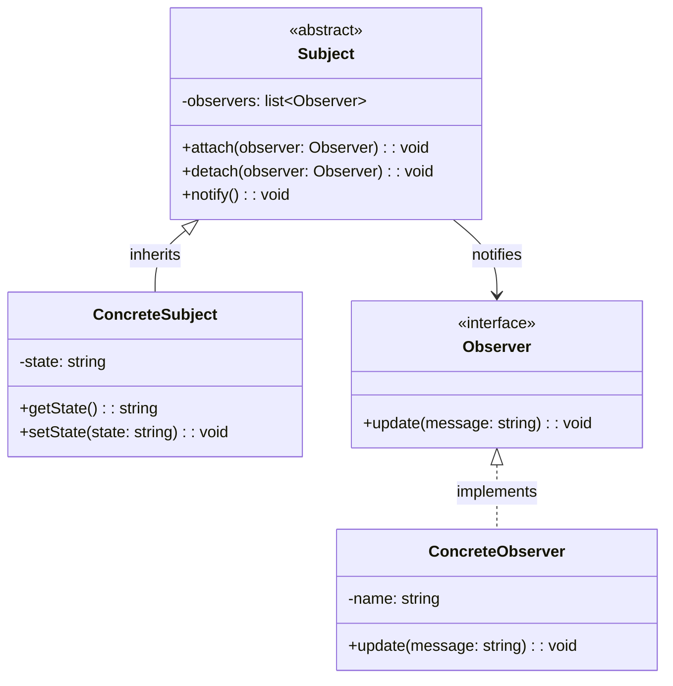

# 观察者模式（Observer Pattern）

## 模式定义

观察者模式定义对象间的一种一对多的依赖关系，当一个对象的状态发生改变时，所有依赖于它的对象都得到通知并被自动更新。

## 原理详解

### 核心思想

观察者模式的核心在于：
1. **发布-订阅**：发布者发布消息，订阅者接收通知
2. **一对多依赖**：一个对象变化，多个对象得到通知
3. **自动通知**：状态变化自动触发通知
4. **解耦**：发布者和订阅者解耦

### UML 类图



### 结构

```
Subject (主题/发布者)
  - observers: List<Observer>
  + attach(Observer): void
  + detach(Observer): void
  + notify(): void

Observer (观察者/订阅者)
  + update(state): void

ConcreteSubject (具体主题)
  - state: State
  + getState(): State
  + setState(State): void

ConcreteObserver (具体观察者)
  - state: State
  + update(state): void
```

### 推模型 vs 拉模型

| 模型 | 特点 | 说明 |
|------|------|------|
| 推模型 | 主题主动推送数据 | 推送全部或部分状态 |
| 拉模型 | 观察者主动拉取 | 观察者按需获取 |

---

## Java 实现

### 基础实现

```java
import java.util.ArrayList;
import java.util.List;

interface Observer {
    void update(String message);
}

class Subject {
    private List<Observer> observers = new ArrayList<>();
    private String state;

    public void attach(Observer observer) {
        observers.add(observer);
    }

    public void detach(Observer observer) {
        observers.remove(observer);
    }

    public void notifyAllObservers() {
        for (Observer observer : observers) {
            observer.update(state);
        }
    }

    public void setState(String state) {
        this.state = state;
        notifyAllObservers();
    }

    public String getState() {
        return state;
    }
}

class ConcreteObserver implements Observer {
    private String name;

    public ConcreteObserver(String name) {
        this.name = name;
    }

    @Override
    public void update(String message) {
        System.out.println(name + " received: " + message);
    }
}

public class ObserverDemo {
    public static void main(String[] args) {
        Subject subject = new Subject();

        Observer observer1 = new ConcreteObserver("Observer1");
        Observer observer2 = new ConcreteObserver("Observer2");

        subject.attach(observer1);
        subject.attach(observer2);

        subject.setState("State changed!");
    }
}
```

### 气象站监测系统

```java
interface DisplayElement {
    void display();
}

class WeatherData {
    private List<Observer> observers = new ArrayList<>();
    private float temperature;
    private float humidity;
    private float pressure;

    public void registerObserver(Observer o) {
        observers.add(o);
    }

    public void removeObserver(Observer o) {
        observers.remove(o);
    }

    public void notifyObservers() {
        for (Observer o : observers) {
            o.update(temperature, humidity, pressure);
        }
    }

    public void setMeasurements(float temp, float humidity, float pressure) {
        this.temperature = temp;
        this.humidity = humidity;
        this.pressure = pressure;
        notifyObservers();
    }
}

interface Observer {
    void update(float temp, float humidity, float pressure);
}

class CurrentConditionsDisplay implements Observer, DisplayElement {
    private float temperature;
    private float humidity;
    private WeatherData weatherData;

    public CurrentConditionsDisplay(WeatherData weatherData) {
        this.weatherData = weatherData;
        weatherData.registerObserver(this);
    }

    @Override
    public void update(float temp, float humidity, float pressure) {
        this.temperature = temp;
        this.humidity = humidity;
        display();
    }

    @Override
    public void display() {
        System.out.println("Current conditions: " + temperature
            + "F degrees and " + humidity + "% humidity");
    }
}
```

---

## Python 实现

### 基础实现

```python
from abc import ABC, abstractmethod

class Observer(ABC):
    @abstractmethod
    def update(self, message):
        pass

class Subject:
    def __init__(self):
        self._observers = []
        self._state = None

    def attach(self, observer):
        self._observers.append(observer)

    def detach(self, observer):
        self._observers.remove(observer)

    def notify(self):
        for observer in self._observers:
            observer.update(self._state)

    @property
    def state(self):
        return self._state

    @state.setter
    def state(self, value):
        self._state = value
        self.notify()

class ConcreteObserver(Observer):
    def __init__(self, name):
        self.name = name

    def update(self, message):
        print(f"{self.name} received: {message}")

if __name__ == "__main__":
    subject = Subject()

    observer1 = ConcreteObserver("Observer1")
    observer2 = ConcreteObserver("Observer2")

    subject.attach(observer1)
    subject.attach(observer2)

    subject.state = "State changed!"
```

---

## C++ 实现

### 基础实现

```cpp
#include <iostream>
#include <vector>
#include <string>

class Observer {
public:
    virtual ~Observer() = default;
    virtual void update(const std::string& message) = 0;
};

class Subject {
private:
    std::vector<Observer*> observers;
    std::string state;

public:
    void attach(Observer* observer) {
        observers.push_back(observer);
    }

    void detach(Observer* observer) {
        observers.erase(
            std::remove(observers.begin(), observers.end(), observer),
            observers.end()
        );
    }

    void notify() {
        for (auto* observer : observers) {
            observer->update(state);
        }
    }

    void setState(const std::string& state) {
        this->state = state;
        notify();
    }

    std::string getState() const {
        return state;
    }
};

class ConcreteObserver : public Observer {
private:
    std::string name;

public:
    ConcreteObserver(const std::string& name) : name(name) {}

    void update(const std::string& message) override {
        std::cout << name << " received: " << message << std::endl;
    }
};

int main() {
    Subject subject;

    ConcreteObserver observer1("Observer1");
    ConcreteObserver observer2("Observer2");

    subject.attach(&observer1);
    subject.attach(&observer2);

    subject.setState("State changed!");

    return 0;
}
```

---

## 应用场景

### 1. GUI 事件处理
按钮点击、输入框变化的事件监听。

### 2. 消息推送
新闻订阅、通知推送系统。

### 3. 数据绑定
模型变化自动更新视图。

### 4. 股票行情
股价变化实时更新所有订阅者。

### 5. 社交媒体
关注、粉丝的消息推送。

---

## AI/机器学习/深度学习领域应用

### 1. 训练进度监控（Training Progress Monitor）
监控训练过程中的指标变化：

```python
from abc import ABC, abstractmethod

class TrainingObserver(ABC):
    @abstractmethod
    def on_epoch_end(self, epoch, metrics):
        pass

class TrainingSubject:
    def __init__(self):
        self._observers = []
    
    def attach(self, observer):
        self._observers.append(observer)
    
    def detach(self, observer):
        self._observers.remove(observer)
    
    def notify_epoch_end(self, epoch, metrics):
        for observer in self._observers:
            observer.on_epoch_end(epoch, metrics)

class ConsoleLogger(TrainingObserver):
    def on_epoch_end(self, epoch, metrics):
        print(f"Epoch {epoch}: {metrics}")

class EarlyStopping(TrainingObserver):
    def __init__(self, patience=5):
        self.patience = patience
        self.best_loss = float('inf')
        self.counter = 0
    
    def on_epoch_end(self, epoch, metrics):
        loss = metrics.get('loss', float('inf'))
        if loss < self.best_loss:
            self.best_loss = loss
            self.counter = 0
        else:
            self.counter += 1
            if self.counter >= self.patience:
                print(f"Early stopping at epoch {epoch}")

class ModelSaver(TrainingObserver):
    def on_epoch_end(self, epoch, metrics):
        if metrics.get('val_accuracy', 0) > 0.9:
            print(f"Saving model at epoch {epoch}")

# 创建训练主题
trainer = TrainingSubject()

# 注册观察者
trainer.attach(ConsoleLogger())
trainer.attach(EarlyStopping(patience=3))
trainer.attach(ModelSaver())

# 模拟训练过程
for epoch in range(10):
    metrics = {'loss': 1.0 - epoch * 0.05, 'val_accuracy': 0.8 + epoch * 0.02}
    trainer.notify_epoch_end(epoch, metrics)
```

### 2. 数据管道事件（Data Pipeline Events）
监控数据处理管道中的事件：

```python
class DataObserver(ABC):
    @abstractmethod
    def on_data_ready(self, data_type, data):
        pass

class DataPipeline:
    def __init__(self):
        self._observers = []
    
    def attach(self, observer):
        self._observers.append(observer)
    
    def notify_data_ready(self, data_type, data):
        for observer in self._observers:
            observer.on_data_ready(data_type, data)
    
    def process_data(self):
        self.notify_data_ready("raw", "raw_data")
        self.notify_data_ready("processed", "processed_data")
        self.notify_data_ready("augmented", "augmented_data")

class DataValidator(DataObserver):
    def on_data_ready(self, data_type, data):
        print(f"Validating {data_type} data: {data}")

class DataAnalyzer(DataObserver):
    def on_data_ready(self, data_type, data):
        print(f"Analyzing {data_type} data: {data}")

# 创建数据管道
pipeline = DataPipeline()
pipeline.attach(DataValidator())
pipeline.attach(DataAnalyzer())
pipeline.process_data()
```

### 3. 模型部署监控（Model Deployment Monitor）
监控模型部署状态变化：

```python
class DeploymentObserver(ABC):
    @abstractmethod
    def on_status_change(self, status):
        pass

class ModelDeployment:
    def __init__(self):
        self._observers = []
        self._status = "idle"
    
    def attach(self, observer):
        self._observers.append(observer)
    
    def _notify(self):
        for observer in self._observers:
            observer.on_status_change(self._status)
    
    @property
    def status(self):
        return self._status
    
    @status.setter
    def status(self, value):
        self._status = value
        self._notify()

class DeploymentLogger(DeploymentObserver):
    def on_status_change(self, status):
        print(f"Deployment status changed to: {status}")

class AlertService(DeploymentObserver):
    def on_status_change(self, status):
        if status == "failed":
            print("ALERT: Deployment failed!")

# 创建部署服务
deployment = ModelDeployment()
deployment.attach(DeploymentLogger())
deployment.attach(AlertService())

# 模拟部署过程
deployment.status = "deploying"
deployment.status = "deployed"
deployment.status = "failed"
```

### 4. 超参数搜索监控（Hyperparameter Search Monitor）
监控超参数搜索过程：

```python
class SearchObserver(ABC):
    @abstractmethod
    def on_trial_complete(self, trial_id, params, score):
        pass

class HyperparameterSearch:
    def __init__(self):
        self._observers = []
    
    def attach(self, observer):
        self._observers.append(observer)
    
    def notify_trial_complete(self, trial_id, params, score):
        for observer in self._observers:
            observer.on_trial_complete(trial_id, params, score)
    
    def run_search(self, n_trials):
        for i in range(n_trials):
            params = {'lr': 0.001 * (i + 1), 'batch_size': 32 + i * 8}
            score = 0.7 + i * 0.05
            self.notify_trial_complete(i, params, score)

class BestTracker(SearchObserver):
    def __init__(self):
        self.best_score = float('-inf')
        self.best_params = None
    
    def on_trial_complete(self, trial_id, params, score):
        if score > self.best_score:
            self.best_score = score
            self.best_params = params
            print(f"New best: trial {trial_id}, score={score}")

class TrialLogger(SearchObserver):
    def on_trial_complete(self, trial_id, params, score):
        print(f"Trial {trial_id}: params={params}, score={score}")

# 创建搜索服务
search = HyperparameterSearch()
search.attach(BestTracker())
search.attach(TrialLogger())
search.run_search(5)
```

### 应用场景总结

| 应用场景 | AI/ML领域具体应用 | 技术要点 |
|----------|-------------------|----------|
| 训练监控 | epoch结束通知、早停、模型保存 | 训练事件监听 |
| 数据管道 | 数据就绪通知、验证、分析 | 数据处理事件 |
| 模型部署 | 部署状态变化、告警 | 部署状态监控 |
| 超参数搜索 | trial完成通知、最佳跟踪 | 搜索过程监控 |

---

## 优缺点分析

### 优点

1. **松耦合**：发布者和订阅者解耦
2. **一对多通知**：一个对象变化，多个对象得到通知
3. **动态关系**：可以动态建立和解除关系
4. **符合开闭原则**：新增订阅者无需修改发布者

### 缺点

1. **通知顺序**：通知顺序不确定
2. **内存泄漏**：订阅者忘记取消订阅可能导致问题
3. **循环依赖**：可能导致循环引用
4. **性能问题**：大量订阅者时通知可能影响性能

---

## 模式对比

| 模式 | 特点 | 目的 |
|------|------|------|
| 观察者模式 | 一对多依赖 | 发布-订阅 |
| 中介者模式 | 间接通信 | 集中控制 |
| 责任链模式 | 链式处理 | 请求传递 |
