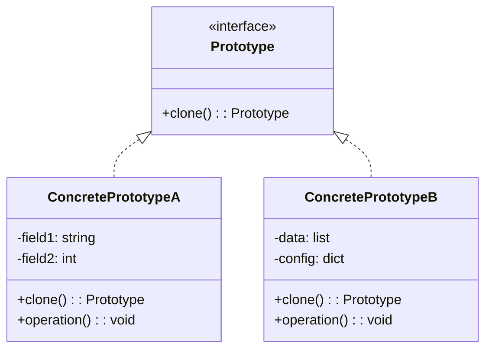

# 原型模式（Prototype Pattern）

## 模式定义

原型模式用原型实例指定创建对象的种类，并且通过拷贝这些原型创建新的对象。

## 原理详解

### 核心思想

原型模式的核心在于：
1. **克隆复制**：通过克隆已有对象来创建新对象
2. **隐藏创建细节**：客户端不需要知道对象创建的具体类型
3. **性能优化**：避免重复创建复杂对象的开销
4. **深拷贝/浅拷贝**：根据需求选择拷贝方式

### UML 类图



### 结构

```
Prototype (抽象原型)
  + clone(): Prototype

ConcretePrototype (具体原型)
  + clone(): Prototype
```

### 拷贝方式

| 类型 | 特点 | 风险 |
|------|------|------|
| 浅拷贝 | 只拷贝值类型和引用地址 | 可能产生共享引用问题 |
| 深拷贝 | 递归拷贝所有引用类型 | 更安全但开销大 |

---

## Java 实现

### 浅拷贝

```java
public class Prototype implements Cloneable {
    private String name;
    private int value;
    private ArrayList<String> list;

    public Prototype(String name, int value) {
        this.name = name;
        this.value = value;
        this.list = new ArrayList<>();
    }

    public void addItem(String item) {
        list.add(item);
    }

    @Override
    protected Prototype clone() throws CloneNotSupportedException {
        return (Prototype) super.clone();
    }

    @Override
    public String toString() {
        return "Prototype{name='" + name + "', value=" + value + ", list=" + list + '}';
    }
}

public class PrototypeDemo {
    public static void main(String[] args) throws CloneNotSupportedException {
        Prototype original = new Prototype("original", 1);
        original.addItem("item1");

        Prototype cloned = original.clone();
        cloned.addItem("item2");

        System.out.println("Original: " + original);
        System.out.println("Cloned: " + cloned);
    }
}
```

### 深拷贝

```java
public class DeepPrototype implements Cloneable {
    private String name;
    private ArrayList<String> list;

    public DeepPrototype(String name) {
        this.name = name;
        this.list = new ArrayList<>();
    }

    public void addItem(String item) {
        list.add(item);
    }

    @Override
    protected DeepPrototype clone() throws CloneNotSupportedException {
        DeepPrototype cloned = (DeepPrototype) super.clone();
        cloned.list = new ArrayList<>(this.list);
        return cloned;
    }

    @Override
    public String toString() {
        return "DeepPrototype{name='" + name + "', list=" + list + '}';
    }
}
```

### 拷贝构造函数

```java
public class CopyConstructor {
    private String name;
    private int value;

    public CopyConstructor(String name, int value) {
        this.name = name;
        this.value = value;
    }

    public CopyConstructor(CopyConstructor other) {
        this.name = other.name;
        this.value = other.value;
    }
}
```

---

## Python 实现

### 使用 copy 模块

```python
import copy

class Prototype:
    def __init__(self, name, value):
        self.name = name
        self.value = value
        self.items = []

    def add_item(self, item):
        self.items.append(item)

    def __str__(self):
        return f"Prototype(name={self.name}, value={self.value}, items={self.items})"

# 浅拷贝
original = Prototype("original", 1)
original.add_item("item1")

shallow_copy = copy.copy(original)
shallow_copy.add_item("item2")

print("Original:", original)
print("Shallow Copy:", shallow_copy)
print("Same items list?", original.items is shallow_copy.items)
```

```python
import copy

class DeepPrototype:
    def __init__(self, name, value):
        self.name = name
        self.value = value
        self.items = []

    def add_item(self, item):
        self.items.append(item)

    def __str__(self):
        return f"DeepPrototype(name={self.name}, value={self.value}, items={self.items})"

# 深拷贝
original = DeepPrototype("original", 1)
original.add_item("item1")

deep_copy = copy.deepcopy(original)
deep_copy.add_item("item2")

print("Original:", original)
print("Deep Copy:", deep_copy)
print("Same items list?", original.items is deep_copy.items)
```

### 自定义克隆方法

```python
class Prototype:
    def __init__(self, name, value):
        self.name = name
        self.value = value

    def clone(self):
        new_instance = Prototype(self.name, self.value)
        return new_instance

original = Prototype("original", 1)
cloned = original.clone()
cloned.value = 2

print(f"Original: {original.value}")
print(f"Cloned: {cloned.value}")
```

---

## C++ 实现

### 浅拷贝（默认拷贝构造函数）

```cpp
#include <iostream>
#include <string>
#include <memory>

class Prototype {
public:
    std::string name;
    int value;

    Prototype(const std::string& name, int value)
        : name(name), value(value) {}

    virtual ~Prototype() = default;

    virtual Prototype* clone() const {
        return new Prototype(*this);
    }

    void print() const {
        std::cout << "Prototype{name=" << name << ", value=" << value << "}" << std::endl;
    }
};

int main() {
    Prototype original("original", 1);
    Prototype* cloned = original.clone();
    cloned->value = 2;

    original.print();
    cloned->print();

    delete cloned;
    return 0;
}
```

### 深拷贝

```cpp
#include <iostream>
#include <string>
#include <vector>
#include <memory>

class DeepPrototype {
public:
    std::string name;
    int value;
    std::vector<std::string> items;

    DeepPrototype(const std::string& name, int value)
        : name(name), value(value) {}

    void addItem(const std::string& item) {
        items.push_back(item);
    }

    DeepPrototype* clone() const {
        DeepPrototype* newPrototype = new DeepPrototype(name, value);
        newPrototype->items = items;
        newPrototype->value = value;
        return newPrototype;
    }

    void print() const {
        std::cout << "DeepPrototype{name=" << name
                  << ", value=" << value
                  << ", items=[";
        for (size_t i = 0; i < items.size(); ++i) {
            std::cout << items[i];
            if (i < items.size() - 1) std::cout << ", ";
        }
        std::cout << "]}" << std::endl;
    }
};

int main() {
    DeepPrototype original("original", 1);
    original.addItem("item1");

    DeepPrototype* cloned = original.clone();
    cloned->addItem("item2");

    original.print();
    cloned->print();

    delete cloned;
    return 0;
}
```

### 虚拟拷贝构造函数

```cpp
#include <iostream>
#include <string>
#include <memory>

class Prototype {
public:
    virtual ~Prototype() = default;
    virtual std::unique_ptr<Prototype> clone() const = 0;
    virtual void print() const = 0;
};

class ConcretePrototype : public Prototype {
public:
    std::string name;
    int value;

    ConcretePrototype(const std::string& name, int value)
        : name(name), value(value) {}

    std::unique_ptr<Prototype> clone() const override {
        return std::make_unique<ConcretePrototype>(*this);
    }

    void print() const override {
        std::cout << "ConcretePrototype{name=" << name << ", value=" << value << "}" << std::endl;
    }
};

int main() {
    auto original = std::make_unique<ConcretePrototype>("original", 1);
    auto cloned = original->clone();

    original->print();
    cloned->print();

    return 0;
}
```

---

## 应用场景

### 1. 数据库记录
复制数据库中的记录。

### 2. 游戏对象
复制游戏中的角色、道具等。

### 3. 文档模板
基于模板创建新文档。

### 4. 复杂对象创建
创建成本较高的对象时，通过克隆减少开销。

### 5. 配置对象
复制并修改配置对象。

---

## AI/机器学习/深度学习领域应用

### 1. 模型参数共享（Model Parameter Sharing）
在集成学习中克隆基础模型并进行微调：

```python
import copy
from sklearn.ensemble import RandomForestClassifier

class ModelPrototype:
    def __init__(self, model):
        self.model = model
    
    def clone(self):
        return ModelPrototype(copy.deepcopy(self.model))
    
    def fit(self, X, y):
        self.model.fit(X, y)
        return self
    
    def predict(self, X):
        return self.model.predict(X)

# 创建基础模型原型
base_model = RandomForestClassifier(n_estimators=100)
prototype = ModelPrototype(base_model)

# 克隆多个模型进行集成学习
ensemble_models = []
for i in range(5):
    model_copy = prototype.clone()
    # 每个模型使用不同的参数或数据
    model_copy.model.n_estimators = 50 + i * 20
    ensemble_models.append(model_copy)
```

### 2. 数据样本增强（Data Sample Augmentation）
通过克隆并修改样本创建增强数据集：

```python
import copy
import numpy as np

class DataSample:
    def __init__(self, features, label):
        self.features = features
        self.label = label
    
    def clone_with_noise(self, noise_std=0.1):
        cloned = copy.deepcopy(self)
        noise = np.random.normal(0, noise_std, self.features.shape)
        cloned.features = self.features + noise
        return cloned
    
    def clone_with_shift(self, shift=0.1):
        cloned = copy.deepcopy(self)
        cloned.features = self.features + shift
        return cloned

# 创建原始样本
original_sample = DataSample(np.array([1.0, 2.0, 3.0]), label=1)

# 通过克隆创建增强样本
augmented_samples = [
    original_sample.clone_with_noise(0.1),
    original_sample.clone_with_noise(0.2),
    original_sample.clone_with_shift(0.1),
    original_sample.clone_with_shift(-0.1)
]
```

### 3. 实验配置复制（Experiment Configuration Replication）
克隆实验配置进行参数微调：

```python
import copy

class ExperimentConfig:
    def __init__(self):
        self.learning_rate = 0.001
        self.batch_size = 32
        self.epochs = 10
        self.optimizer = 'adam'
        self.loss = 'crossentropy'
    
    def clone(self):
        return copy.deepcopy(self)
    
    def __str__(self):
        return f"Config(lr={self.learning_rate}, batch={self.batch_size}, epochs={self.epochs})"

# 创建基础配置
base_config = ExperimentConfig()

# 克隆并修改参数进行对比实验
configs = []
for lr in [0.0001, 0.001, 0.01]:
    config = base_config.clone()
    config.learning_rate = lr
    configs.append(config)

for batch_size in [16, 32, 64]:
    config = base_config.clone()
    config.batch_size = batch_size
    configs.append(config)
```

### 4. 神经网络层克隆（Neural Network Layer Cloning）
克隆预训练层用于迁移学习：

```python
import copy
import torch
import torch.nn as nn

class LayerPrototype:
    def __init__(self, layer):
        self.layer = layer
    
    def clone(self):
        cloned_layer = copy.deepcopy(self.layer)
        return LayerPrototype(cloned_layer)
    
    def freeze(self):
        for param in self.layer.parameters():
            param.requires_grad = False
    
    def unfreeze(self):
        for param in self.layer.parameters():
            param.requires_grad = True

# 创建预训练层原型
pretrained_conv = nn.Conv2d(3, 64, kernel_size=3)
prototype = LayerPrototype(pretrained_conv)

# 克隆多个相同的卷积层
layers = []
for _ in range(5):
    layer_copy = prototype.clone()
    layer_copy.freeze()  # 冻结预训练参数
    layers.append(layer_copy.layer)
```

### 5. 粒子群优化中的粒子克隆（Particle Swarm Optimization）
克隆粒子进行群体优化：

```python
import copy
import numpy as np

class Particle:
    def __init__(self, position, velocity):
        self.position = position
        self.velocity = velocity
        self.best_position = position.copy()
        self.best_score = float('-inf')
    
    def clone(self):
        return Particle(
            position=self.position.copy(),
            velocity=self.velocity.copy()
        )
    
    def update_velocity(self, global_best, w=0.5, c1=1.5, c2=1.5):
        r1, r2 = np.random.rand(2)
        cognitive = c1 * r1 * (self.best_position - self.position)
        social = c2 * r2 * (global_best - self.position)
        self.velocity = w * self.velocity + cognitive + social
    
    def update_position(self):
        self.position += self.velocity

# 创建初始粒子
initial_particle = Particle(
    position=np.array([0.5, 0.5, 0.5]),
    velocity=np.array([0.1, 0.1, 0.1])
)

# 克隆粒子群
swarm = []
for _ in range(30):
    particle = initial_particle.clone()
    # 随机化初始位置
    particle.position = np.random.rand(3)
    swarm.append(particle)
```

### 6. 遗传算法中的染色体克隆（Genetic Algorithm）
克隆染色体进行遗传操作：

```python
import copy
import numpy as np

class Chromosome:
    def __init__(self, genes):
        self.genes = genes
        self.fitness = 0
    
    def clone(self):
        return Chromosome(self.genes.copy())
    
    def mutate(self, mutation_rate=0.01):
        mutated = self.clone()
        for i in range(len(mutated.genes)):
            if np.random.random() < mutation_rate:
                mutated.genes[i] = np.random.uniform(-1, 1)
        return mutated
    
    def crossover(self, other):
        child1 = self.clone()
        child2 = other.clone()
        crossover_point = np.random.randint(1, len(self.genes))
        child1.genes[crossover_point:] = other.genes[crossover_point:]
        child2.genes[crossover_point:] = self.genes[crossover_point:]
        return child1, child2

# 创建初始染色体
parent1 = Chromosome(np.array([0.1, 0.2, 0.3, 0.4]))
parent2 = Chromosome(np.array([0.9, 0.8, 0.7, 0.6]))

# 克隆并进行遗传操作
child1, child2 = parent1.crossover(parent2)
mutated_child = child1.mutate()
```

### 应用场景总结

| 应用场景 | AI/ML领域具体应用 | 技术要点 |
|----------|-------------------|----------|
| 模型集成 | 克隆基础模型进行集成学习 | 深拷贝确保模型独立 |
| 数据增强 | 克隆样本并添加噪声/变换 | 创建多样化训练数据 |
| 实验配置 | 克隆配置进行参数扫描 | 保持基础配置不变 |
| 迁移学习 | 克隆预训练层 | 冻结/解冻参数 |
| 优化算法 | PSO粒子、GA染色体克隆 | 群体进化操作 |

---

## 优缺点分析

### 优点

1. **性能优化**：避免重复创建复杂对象的开销
2. **简化创建过程**：隐藏对象创建的具体类型
3. **动态配置**：运行时动态指定要克隆的对象
4. **保持状态**：可以保存对象状态进行复制

### 缺点

1. **深拷贝复杂**：需要处理深层引用对象的拷贝
2. **循环引用**：处理循环引用时需要特别小心
3. **类型约束**：需要所有被克隆对象实现 Cloneable 接口
4. **隐藏依赖**：克隆可能隐藏对象间的依赖关系

---

## 模式对比

| 模式 | 特点 | 适用场景 |
|------|------|----------|
| 原型模式 | 克隆复制 | 已存在对象的复制 |
| 工厂方法 | 抽象创建 | 灵活创建不同类型 |
| 建造者模式 | 分步构建 | 复杂对象的构建 |
| 单例模式 | 全局唯一 | 只需一个实例 |
