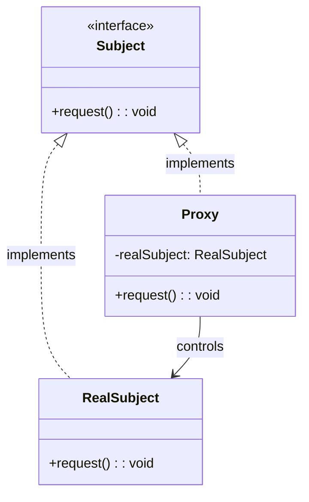

# 代理模式（Proxy Pattern）

## 模式定义

代理模式为其他对象提供一种代理以控制对这个对象的访问。

## 原理详解

### 核心思想

代理模式的核心在于：
1. **间接访问**：通过代理对象访问真实对象
2. **访问控制**：控制对原对象的访问权限
3. **延迟加载**：延迟加载真实对象，提高性能
4. **增强功能**：在访问前后添加额外功能

### UML 类图



### 结构

```
Subject (抽象主题)
  + request(): void

RealSubject (真实主题)
  + request(): void

Proxy (代理)
  - realSubject: RealSubject
  + request(): void
```

### 代理类型

| 类型 | 特点 | 用途 |
|------|------|------|
| 远程代理 | 访问远程对象 | 隐藏网络访问细节 |
| 虚拟代理 | 延迟加载 | 减少资源占用 |
| 保护代理 | 访问控制 | 权限验证 |
| 智能引用 | 引用计数 | 自动资源管理 |
| 缓存代理 | 缓存结果 | 提高性能 |
| 日志代理 | 记录日志 | 调试和监控 |

---

## Java 实现

### 基础实现

```java
interface Subject {
    void request();
}

class RealSubject implements Subject {
    @Override
    public void request() {
        System.out.println("RealSubject request");
    }
}

class Proxy implements Subject {
    private RealSubject realSubject;

    public Proxy() {
        this.realSubject = new RealSubject();
    }

    @Override
    public void request() {
        System.out.println("Proxy before request");
        realSubject.request();
        System.out.println("Proxy after request");
    }
}

public class ProxyDemo {
    public static void main(String[] args) {
        Subject subject = new Proxy();
        subject.request();
    }
}
```

### 虚拟代理（延迟加载）

```java
interface Image {
    void display();
}

class RealImage implements Image {
    private String filename;

    public RealImage(String filename) {
        this.filename = filename;
        loadFromDisk();
    }

    private void loadFromDisk() {
        System.out.println("Loading image: " + filename);
    }

    @Override
    public void display() {
        System.out.println("Displaying image: " + filename);
    }
}

class VirtualProxy implements Image {
    private String filename;
    private RealImage realImage;

    public VirtualProxy(String filename) {
        this.filename = filename;
    }

    @Override
    public void display() {
        if (realImage == null) {
            realImage = new RealImage(filename);
        }
        realImage.display();
    }
}

public class VirtualProxyDemo {
    public static void main(String[] args) {
        System.out.println("Creating proxy...");
        Image image = new VirtualProxy("test.jpg");

        System.out.println("First display:");
        image.display();

        System.out.println("\nSecond display:");
        image.display();
    }
}
```

### 保护代理

```java
interface ResourceAccess {
    void read();
    void write();
}

class RealResource implements ResourceAccess {
    @Override
    public void read() {
        System.out.println("Reading resource...");
    }

    @Override
    public void write() {
        System.out.println("Writing resource...");
    }
}

class ProtectionProxy implements ResourceAccess {
    private RealResource realResource;
    private String userRole;

    public ProtectionProxy(String userRole) {
        this.userRole = userRole;
        this.realResource = new RealResource();
    }

    @Override
    public void read() {
        System.out.println("Proxy: Checking read permission for " + userRole);
        realResource.read();
    }

    @Override
    public void write() {
        if ("admin".equals(userRole)) {
            System.out.println("Proxy: Checking write permission for " + userRole);
            realResource.write();
        } else {
            System.out.println("Access denied: insufficient permissions");
        }
    }
}

public class ProtectionProxyDemo {
    public static void main(String[] args) {
        ResourceAccess userAccess = new ProtectionProxy("user");
        userAccess.read();
        userAccess.write();

        System.out.println();

        ResourceAccess adminAccess = new ProtectionProxy("admin");
        adminAccess.read();
        adminAccess.write();
    }
}
```

---

## Python 实现

### 基础实现

```python
from abc import ABC, abstractmethod

class Subject(ABC):
    @abstractmethod
    def request(self):
        pass

class RealSubject(Subject):
    def request(self):
        print("RealSubject request")

class Proxy(Subject):
    def __init__(self):
        self._real_subject = None

    def request(self):
        if self._real_subject is None:
            self._real_subject = RealSubject()
        print("Proxy before request")
        self._real_subject.request()
        print("Proxy after request")

if __name__ == "__main__":
    proxy = Proxy()
    proxy.request()
```

### 虚拟代理

```python
from abc import ABC, abstractmethod

class Image(ABC):
    @abstractmethod
    def display(self):
        pass

class RealImage(Image):
    def __init__(self, filename):
        self.filename = filename
        self.load_from_disk()

    def load_from_disk(self):
        print(f"Loading image: {self.filename}")

    def display(self):
        print(f"Displaying image: {self.filename}")

class VirtualProxy(Image):
    def __init__(self, filename):
        self.filename = filename
        self._real_image = None

    def display(self):
        if self._real_image is None:
            self._real_image = RealImage(self.filename)
        self._real_image.display()

if __name__ == "__main__":
    print("Creating proxy...")
    image = VirtualProxy("test.jpg")

    print("First display:")
    image.display()

    print("\nSecond display:")
    image.display()
```

---

## C++ 实现

### 基础实现

```cpp
#include <iostream>
#include <memory>

class Subject {
public:
    virtual ~Subject() = default;
    virtual void request() = 0;
};

class RealSubject : public Subject {
public:
    void request() override {
        std::cout << "RealSubject request" << std::endl;
    }
};

class Proxy : public Subject {
private:
    std::shared_ptr<RealSubject> realSubject;

public:
    Proxy() : realSubject(nullptr) {}

    void request() override {
        if (!realSubject) {
            realSubject = std::make_shared<RealSubject>();
        }
        std::cout << "Proxy before request" << std::endl;
        realSubject->request();
        std::cout << "Proxy after request" << std::endl;
    }
};

int main() {
    std::shared_ptr<Subject> proxy = std::make_shared<Proxy>();
    proxy->request();
    return 0;
}
```

### 虚拟代理

```cpp
#include <iostream>
#include <memory>
#include <string>

class Image {
public:
    virtual ~Image() = default;
    virtual void display() = 0;
};

class RealImage : public Image {
private:
    std::string filename;

public:
    RealImage(const std::string& filename) : filename(filename) {
        loadFromDisk();
    }

    void loadFromDisk() {
        std::cout << "Loading image: " << filename << std::endl;
    }

    void display() override {
        std::cout << "Displaying image: " << filename << std::endl;
    }
};

class VirtualProxy : public Image {
private:
    std::string filename;
    std::shared_ptr<RealImage> realImage;

public:
    VirtualProxy(const std::string& filename) : filename(filename), realImage(nullptr) {}

    void display() override {
        if (!realImage) {
            realImage = std::make_shared<RealImage>(filename);
        }
        realImage->display();
    }
};

int main() {
    std::cout << "Creating proxy..." << std::endl;
    auto image = std::make_shared<VirtualProxy>("test.jpg");

    std::cout << "First display:" << std::endl;
    image->display();

    std::cout << "\nSecond display:" << std::endl;
    image->display();

    return 0;
}
```

---

## 应用场景

### 1. 远程服务调用
Web Service、REST API 的本地代理。

### 2. 延迟加载
大图片、视频的延迟加载。

### 3. 访问控制
用户权限验证。

### 4. 日志记录
方法调用的日志记录。

### 5. 缓存
查询结果的缓存。

### 6. 事务管理
数据库事务的代理。

---

## AI/机器学习/深度学习领域应用

### 1. 模型缓存代理（Model Cache Proxy）
缓存模型预测结果：

```python
from abc import ABC, abstractmethod
import hashlib

class Model(ABC):
    @abstractmethod
    def predict(self, data):
        pass

class RealModel(Model):
    def predict(self, data):
        print(f"Computing prediction for {data}")
        return f"Prediction result for {data}"

class CacheProxy(Model):
    def __init__(self, model):
        self.model = model
        self.cache = {}
    
    def predict(self, data):
        key = hashlib.md5(str(data).encode()).hexdigest()
        if key in self.cache:
            print(f"Cache hit for {data}")
            return self.cache[key]
        print(f"Cache miss for {data}")
        result = self.model.predict(data)
        self.cache[key] = result
        return result

# 使用缓存代理
model = CacheProxy(RealModel())
model.predict("input1")  # Cache miss
model.predict("input1")  # Cache hit
model.predict("input2")  # Cache miss
```

### 2. 分布式模型代理（Distributed Model Proxy）
代理分布式模型服务：

```python
class RemoteModel(ABC):
    @abstractmethod
    def infer(self, data):
        pass

class LocalModel(RemoteModel):
    def infer(self, data):
        return f"Local inference: {data}"

class RemoteProxy(RemoteModel):
    def __init__(self, model, server_url):
        self.model = model
        self.server_url = server_url
        self.connected = False
    
    def _connect(self):
        if not self.connected:
            print(f"Connecting to {self.server_url}")
            self.connected = True
    
    def _disconnect(self):
        if self.connected:
            print(f"Disconnecting from {self.server_url}")
            self.connected = False
    
    def infer(self, data):
        self._connect()
        print(f"Sending data to remote server: {self.server_url}")
        result = self.model.infer(data)
        print(f"Received result from remote server")
        return f"Remote[{self.server_url}]: {result}"

# 使用远程代理
local_model = LocalModel()
remote_proxy = RemoteProxy(local_model, "http://model-server:8080")
result = remote_proxy.infer("test_data")
```

### 3. 模型加载代理（Model Loading Proxy）
延迟加载大型模型：

```python
class MLModel(ABC):
    @abstractmethod
    def predict(self, x):
        pass

class LargeModel(MLModel):
    def __init__(self):
        print("Loading large model (this may take minutes)...")
        self.weights = "model_weights"
    
    def predict(self, x):
        return f"Large model prediction for {x}"

class LazyLoadingProxy(MLModel):
    def __init__(self):
        self.model = None
    
    def _ensure_loaded(self):
        if self.model is None:
            self.model = LargeModel()
    
    def predict(self, x):
        self._ensure_loaded()
        return self.model.predict(x)

# 使用延迟加载代理
model = LazyLoadingProxy()
print("Model created but not loaded yet")
model.predict("input1")  # 第一次调用时加载
model.predict("input2")  # 已加载，直接使用
```

### 4. 权限控制代理（Access Control Proxy）
控制模型访问权限：

```python
class SecureModel(ABC):
    @abstractmethod
    def predict(self, data, user_id):
        pass

class RealSecureModel(SecureModel):
    def predict(self, data, user_id):
        return f"Prediction for user {user_id}: {data}"

class AccessControlProxy(SecureModel):
    def __init__(self, model):
        self.model = model
        self.allowed_users = {"admin", "user1", "user2"}
    
    def predict(self, data, user_id):
        if user_id in self.allowed_users:
            print(f"Access granted for user {user_id}")
            return self.model.predict(data, user_id)
        else:
            raise PermissionError(f"Access denied for user {user_id}")

# 使用权限控制代理
model = AccessControlProxy(RealSecureModel())
model.predict("data", "admin")   # 允许访问
try:
    model.predict("data", "hacker")  # 拒绝访问
except PermissionError as e:
    print(e)
```

### 5. GPU资源代理（GPU Resource Proxy）
管理GPU资源访问：

```python
class GPUMemoryManager(ABC):
    @abstractmethod
    def allocate(self, size):
        pass
    
    def free(self):
        pass

class RealGPUManager(GPUMemoryManager):
    def allocate(self, size):
        print(f"Allocating {size} MB on GPU")
        return "gpu_memory_handle"
    
    def free(self):
        print("Freeing GPU memory")

class GPUProxy(GPUMemoryManager):
    def __init__(self, manager):
        self.manager = manager
        self.allocated = False
        self.handle = None
    
    def allocate(self, size):
        if not self.allocated:
            self.handle = self.manager.allocate(size)
            self.allocated = True
            print("GPU resource acquired")
        return self.handle
    
    def free(self):
        if self.allocated:
            self.manager.free()
            self.allocated = False
            self.handle = None
            print("GPU resource released")

# 使用GPU代理
gpu = GPUProxy(RealGPUManager())
gpu.allocate(1024)  # 首次分配
gpu.allocate(512)   # 已分配，复用
gpu.free()          # 释放资源
```

### 应用场景总结

| 应用场景 | AI/ML领域具体应用 | 技术要点 |
|----------|-------------------|----------|
| 缓存代理 | 预测结果缓存、特征缓存 | 减少重复计算 |
| 远程代理 | 分布式推理服务、模型API | 网络透明访问 |
| 延迟加载 | 大型模型加载、预训练模型 | 按需加载 |
| 权限控制 | 模型访问权限、API密钥验证 | 安全访问控制 |
| 资源管理 | GPU资源管理、内存分配 | 资源复用 |

---

## 优缺点分析

### 优点

1. **解耦**：客户端与真实对象解耦
2. **延迟加载**：提高系统性能
3. **访问控制**：实现权限控制
4. **增强功能**：在访问前后添加额外逻辑
5. **符合开闭原则**：无需修改真实对象

### 缺点

1. **复杂性增加**：引入代理增加系统复杂度
2. **响应延迟**：每次访问都经过代理
3. **实现成本**：需要为每个真实对象创建代理

---

## 模式对比

| 模式 | 特点 | 目的 |
|------|------|------|
| 代理模式 | 间接访问 | 控制对对象的访问 |
| 适配器模式 | 接口转换 | 使不兼容的接口能协同 |
| 装饰器模式 | 动态增加职责 | 扩展对象功能 |
| 外观模式 | 简化接口 | 提供统一的高层接口 |
