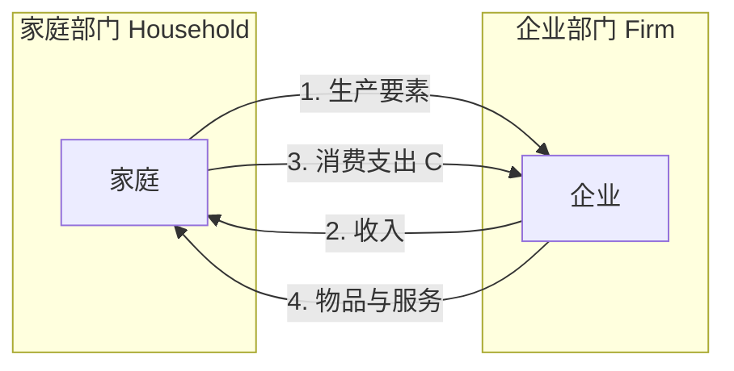
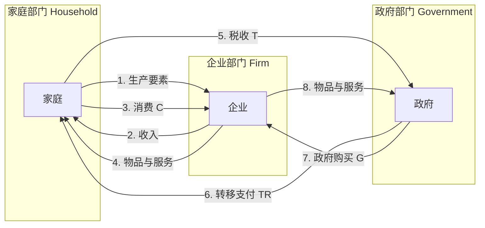
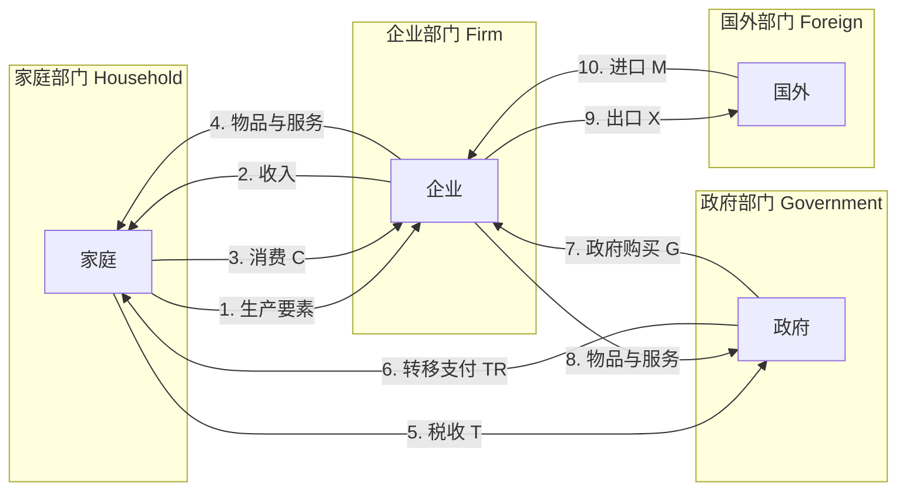

# 宏观经济学概述

宏观经济学研究整体经济运行，关注经济增长、通货膨胀、失业率、国际贸易等问题。

# 一国收入的衡量

## GDP定义

**国内生产总值（GDP）**：某一既定时期内，一个国家或地区生产的所有最终物品与服务的市场价值。

## 流量与存量

### 基本概念

**流量(Flow)**：在一定时期内发生的经济变量，具有时间维度。

**存量(Stock)**：在某一时点上存在的经济变量，不具有时间维度。

### 流量与存量的关系

流量是存量变化的原因，存量是流量积累的结果。

$$\text{期末存量} = \text{期初存量} + \text{期间流入} - \text{期间流出}$$

### 常见的流量与存量

| 类别 | 流量 | 存量 |
|-----|------|------|
| 收入与财富 | 收入、消费、储蓄 | 财富、资产 |
| 投资与资本 | 投资支出 | 资本存量 |
| 货币与债务 | 货币供给变动 | 货币存量、债务余额 |
| 人口与劳动力 | 出生、死亡、移民 | 人口数量、劳动力数量 |

## 宏观经济流量图

### 两部门经济流量图

**两部门经济**：家庭部门和企业部门。

**流量说明**：
1. 家庭向企业提供生产要素（劳动、资本、土地）
2. 企业向家庭支付收入（工资、利息、租金、利润）
3. 家庭用收入购买企业生产的物品与服务（消费C）
4. 企业向家庭提供物品与服务

### 三部门经济流量图

**三部门经济**：家庭部门、企业部门和政府部门。

**政府部门的作用**：
- **税收(T)**：政府向家庭和企业征税
- **转移支付(TR)**：政府向家庭提供社会保障、失业救济等
- **政府购买(G)**：政府向企业购买物品与服务

### 四部门经济流量图

**四部门经济**：家庭部门、企业部门、政府部门和国外部门。

**国外部门的作用**：
- **出口(X)**：国内企业向国外销售物品与服务
- **进口(M)**：国内居民和企业从国外购买物品与服务
- **净出口(NX)**：NX = X - M

### 流量图的意义

宏观经济流量图展示了经济中各部门之间的相互联系和资金流动，帮助理解：
- 收入的循环流动
- 各部门的经济角色
- 宏观经济变量之间的关系
- 政策如何影响经济运行

## GDP核算方法

### 支出法

$$GDP = C + I + G + NX$$

其中：
- $C$ = 消费支出
  - 除了购买新住房，家庭用于物品和劳务的支出。

- $I$ = 投资支出
  - 指用于资本设备、存货和建筑物的支出，包括家庭用于购买新住房的支出
    - 重置投资
    - 自发投资
    - 引致投资

- $G$ = 政府购买
  - 地方、州和联邦政府用于物品与服务的支出
  - 不包括转移支付（如社会保障、失业保险等）

- $NX$ = 净出口（出口 - 进口）
  - 出口：外国人对国内生产的物品与服务的支出
  - 进口：国内居民对外国生产的物品与服务的支出
  - $NX > 0$ 表示贸易顺差，$NX < 0$ 表示贸易逆差

### 收入法

$$GDP = 工资 + 利息 + 租金 + 利润 + 间接税 + 折旧$$

### 生产法

$$GDP = \sum (各部门增加值)$$

## GDP的局限性

- 未包括非市场活动
- 未考虑环境成本
- 未反映收入分配
- 未衡量幸福程度

### 名义GDP和真实GDP

**名义GDP**：按当年价格计算的GDP，未剔除价格变动影响。

**真实GDP**：按基年价格计算的GDP，剔除价格变动影响，反映实际产出水平。

$$\text{真实GDP} = \frac{\text{名义GDP}}{\text{GDP平减指数}} \times 100$$

#### GDP平减指数

**GDP平减指数**：衡量经济中生产的所有物品与服务价格水平的指标。

$$\text{GDP平减指数} = \frac{\text{名义GDP}}{\text{真实GDP}} \times 100$$

**GDP平减指数与CPI的区别**：
- GDP平减指数反映所有国内生产的物品与服务价格
- CPI只反映消费者购买的物品与服务价格
- CPI使用固定的一篮子物品，GDP平减指数允许物品组合变化

## 其他指标

### 国内净生产值

**国内净生产值(NDP)**：GDP扣除折旧后的净值。

$$NDP = GDP - \text{折旧}$$

### 国民收入

**国民收入(NI)**：一国居民在物品与服务生产中赚到的总收入。

$$NI = NDP - \text{间接税} + \text{企业补贴}$$

### 个人收入

**个人收入(PI)**：家庭和非营利机构获得的收入。

$$PI = NI - \text{公司未分配利润} - \text{公司所得税} - \text{社会保险税} + \text{转移支付}$$

### 个人可支配收入

**个人可支配收入(DPI)**：个人收入扣除个人所得税后的收入。

$$DPI = PI - \text{个人所得税}$$

这是家庭可用于消费和储蓄的收入。

# 通货膨胀

## 定义与衡量

**通货膨胀**：经济中物价总水平的持续上升。

**消费者价格指数（CPI）**：衡量一篮子消费品和服务的价格水平。

$$CPI = \frac{当年一篮子物品的成本}{基年一篮子物品的成本} \times 100$$

**通货膨胀率**：

$$\text{通货膨胀率} = \frac{CPI_{t} - CPI_{t-1}}{CPI_{t-1}} \times 100\%$$

## 通货膨胀的类型

| 类型 | 通货膨胀率 | 说明 |
|-----|-----------|------|
| 温和通货膨胀 | < 10% | 价格缓慢上升 |
| 奔腾通货膨胀 | 10%-100% | 价格急剧上升 |
| 恶性通货膨胀 | > 100% | 价格失控 |

## 通货膨胀的成因

- **需求拉动型**：总需求超过总供给
- **成本推动型**：生产成本上升
- **结构性通货膨胀**：经济结构变化

## 通货膨胀的影响

### 通货膨胀的成本

- **皮鞋成本**：频繁往返银行的成本
- **菜单成本**：调整价格的成本
- **收入再分配**：损害固定收入者
- **不确定性增加**：影响投资决策
- **相对价格变动**：导致资源配置扭曲
- **税收扭曲**：名义收入增加导致税负增加

### 通货膨胀的预期

**预期通货膨胀**：人们预期的通货膨胀率。

**未预期通货膨胀**：实际通货膨胀率与预期通货膨胀率的差异。

未预期通货膨胀会导致更大的收入再分配效应。

### 指数化

**指数化**：根据价格水平自动调整合同条款，减少通货膨胀的影响。

例如：工资指数化、养老金指数化、利率指数化。

# 失业率

## 失业的衡量

### 劳动力定义

**劳动力**：就业者与失业者的总和。

**就业者**：有工作的人（包括兼职、临时工作）。

**失业者**：没有工作但正在寻找工作的人。

**非劳动力**：不在劳动力中的人（如退休者、学生、家庭主妇）。

**失业率**：

$$\text{失业率} = \frac{\text{失业人数}}{\text{劳动力人数}} \times 100\%$$

**劳动力参与率**：

$$\text{劳动力参与率} = \frac{\text{劳动力人数}}{\text{成年人口}} \times 100\%$$

## 失业的类型

- **摩擦性失业**：正常的职业转换，与工人寻找最适合自己技能和偏好的工作有关
- **结构性失业**：技能不匹配，工资高于均衡水平导致
- **周期性失业**：经济周期导致，与经济衰退有关

## 自然失业率

**自然失业率**：经济处于潜在产出水平时的失业率，等于摩擦性失业率与结构性失业率之和。

**潜在产出**：经济在自然失业率水平下生产的产出水平。

## 奥肯定律

**奥肯定律**：描述失业率与GDP增长率之间关系的经验规律。

$$\text{失业率变动} = -0.5 \times (\text{实际GDP增长率} - \text{正常GDP增长率})$$

失业率每上升1%，GDP相对于潜在GDP下降约2%。

## 失业的影响

- **经济成本**：产出损失、资源浪费
- **社会成本**：贫困增加、社会不稳定
- **个人成本**：收入损失、心理压力

# 经济增长

## 增长核算

**生产函数**：

$$Y = A \times F(K, L)$$

其中：
- $Y$ = 产出
- $A$ = 全要素生产率（技术进步）
- $K$ = 资本存量
- $L$ = 劳动投入

**增长方程**：

$$\frac{\Delta Y}{Y} = \frac{\Delta A}{A} + \alpha \frac{\Delta K}{K} + (1-\alpha) \frac{\Delta L}{L}$$

其中 $\alpha$ 为资本产出弹性，$(1-\alpha)$ 为劳动产出弹性。

**增长源泉**：
- 资本积累
- 劳动增长
- 技术进步（全要素生产率提高）

## 索洛增长模型

### 基本假设

- 生产函数：$Y = F(K, L)$
- 储蓄率：$s$（固定）
- 人口增长率：$n$
- 技术进步率：$g$

### 稳态

**稳态**：资本存量保持不变的状态，人均产出和人均资本不再增长。

$$s \times f(k^*) = (n + g + \delta) k^*$$

其中：
- $k^*$ = 稳态人均资本
- $\delta$ = 折旧率

### 黄金律水平

**黄金律水平**：使人均消费最大化的稳态资本水平。

$$f'(k_{gold}) = n + g + \delta$$

## 内生增长理论

**内生增长理论**：将技术进步视为内生变量，强调知识积累、人力资本、研发投入对经济增长的作用。

**AK模型**：$Y = AK$，产出与资本成正比，不存在边际报酬递减。

**人力资本**：教育、培训、健康等投资形成的生产能力。

## 趋同理论

- **绝对趋同**：穷国增长更快，最终赶上富国
- **条件趋同**：只有在相似条件下才会趋同（储蓄率、人口增长率等）

## 促进经济增长的政策

- 鼓励储蓄和投资
- 促进教育和技术进步
- 保护产权和维护法治
- 促进自由贸易
- 控制人口增长

# 总供给与总需求

## 总需求曲线

**总需求(AD)**：在一定价格水平下，经济中所有部门对物品与服务的需求总量。

$$AD = C + I + G + NX$$

**总需求曲线**：向右下方倾斜，表示价格水平与总需求量的反向关系。

**总需求曲线向下倾斜的原因**：
- **财富效应**：价格下降，实际财富增加，消费增加
- **利率效应**：价格下降，货币需求减少，利率下降，投资增加
- **汇率效应**：价格下降，利率下降，汇率贬值，出口增加

**影响总需求的因素**：
- 消费政策（税收、转移支付）
- 投资政策（利率、税收优惠）
- 政府购买
- 货币政策
- 国际因素

## 总供给曲线

**总供给(AS)**：在一定价格水平下，经济中所有企业愿意生产的物品与服务总量。

### 短期总供给曲线

**短期总供给曲线(SAS)**：向右上方倾斜，表示价格水平与总供给量的正向关系。

**短期总供给曲线向上倾斜的原因**：
- **黏性工资理论**：工资调整缓慢，价格上升时实际工资下降，企业增加雇佣
- **黏性价格理论**：价格调整缓慢，价格上升时企业利润增加，增加产出
- **错觉理论**：价格上升时企业误以为是相对价格上升，增加产出

### 长期总供给曲线

**长期总供给曲线(LAS)**：垂直线，表示价格水平不影响长期产出。

**长期产出**：由生产要素和技术决定，等于潜在产出。

$$Y = F(K, L)$$

**影响总供给的因素**：
- 劳动数量和质量
- 资本存量
- 技术水平
- 自然资源

## 宏观经济均衡

### 短期均衡

**短期均衡**：总需求曲线与短期总供给曲线的交点。

$$AD = SAS$$

**经济波动**：总需求或总供给变动导致产出偏离潜在产出。

### 长期均衡

**长期均衡**：总需求曲线、短期总供给曲线和长期总供给曲线三线相交。

$$AD = SAS = LAS$$

此时产出等于潜在产出，失业率等于自然失业率。

## 经济波动分析

### 总需求冲击

**总需求增加**：AD曲线右移 → 短期产出增加、价格上升 → 长期回归潜在产出

**总需求减少**：AD曲线左移 → 短期产出减少、价格下降 → 长期回归潜在产出

### 总供给冲击

**总供给增加**：AS曲线右移 → 产出增加、价格下降

**总供给减少**：AS曲线左移 → 产出减少、价格上升（滞胀）

**滞胀**：产出减少与通货膨胀同时发生的现象。

# 货币政策

## 货币的定义与职能

**货币**：被普遍接受的交易媒介。

**货币的职能**：
- **交易媒介**：用于购买物品和服务
- **计价单位**：衡量经济价值的标准
- **价值储藏**：将购买力转移到未来

## 货币的种类

- **商品货币**：具有内在价值的货币（如黄金）
- **法定货币**：没有内在价值，由政府法令规定为货币

## 货币供给

**货币供给**：经济中可获得的货币数量。

**货币层次**：
- **M1**：通货 + 活期存款
- **M2**：M1 + 定期存款 + 储蓄存款

## 中央银行工具

1. **公开市场操作**：买卖政府债券，影响货币供给
2. **法定准备金率**：调整银行准备金要求，影响货币乘数
3. **贴现率**：调整央行贷款利率，影响银行借贷成本

## 银行体系与货币创造

### 准备金制度

**准备金**：银行持有的存款中不贷出的部分。

**法定准备金率**：央行规定的最低准备金比例。

### 货币乘数

**货币乘数**：基础货币变动引起的货币供给变动的倍数。

$$\text{货币乘数} = \frac{1}{\text{法定准备金率}}$$

**基础货币**：通货 + 银行准备金。

## 货币政策传导机制

$$\text{货币政策} \rightarrow \text{货币供给} \rightarrow \text{利率} \rightarrow \text{投资} \rightarrow \text{总需求} \rightarrow \text{产出}$$

## 货币政策规则

- **泰勒规则**：根据通胀和产出缺口调整利率

$$i = r^* + \pi + 0.5(\pi - \pi^*) + 0.5(y - y^*)$$

其中：
- $i$ = 名义利率
- $r^*$ = 自然利率
- $\pi$ = 通货膨胀率
- $\pi^*$ = 目标通胀率
- $y - y^*$ = 产出缺口

## 货币数量论

**货币数量论**：货币供给决定物价水平。

**交易方程**：$MV = PY$

其中：
- $M$ = 货币供给
- $V$ = 货币流通速度
- $P$ = 物价水平
- $Y$ = 实际产出

# 财政政策

## 财政政策工具

- **政府购买**：直接支出，直接影响总需求
- **税收政策**：改变税率，影响消费和投资
- **转移支付**：社会保障、失业救济等，影响可支配收入

## 乘数效应

### 政府支出乘数

**政府支出乘数**：政府支出变动引起的产出变动的倍数。

$$\text{乘数} = \frac{1}{1 - MPC} = \frac{1}{MPS}$$

其中：
- $MPC$ = 边际消费倾向
- $MPS$ = 边际储蓄倾向

### 税收乘数

**税收乘数**：税收变动引起的产出变动的倍数。

$$\text{税收乘数} = -\frac{MPC}{1 - MPC}$$

税收乘数小于政府支出乘数，因为税收变动首先影响可支配收入。

## 挤出效应

**挤出效应**：政府支出增加导致利率上升，从而减少私人投资。

$$\text{政府支出增加} \rightarrow \text{货币需求增加} \rightarrow \text{利率上升} \rightarrow \text{私人投资减少}$$

挤出效应的大小取决于：
- 货币需求对利率的敏感程度
- 投资对利率的敏感程度

## 自动稳定器

**自动稳定器**：经济波动时自动调整的政策机制。

- **累进税制**：收入下降时税负自动减少
- **失业救济金**：失业增加时转移支付自动增加

## 相机抉择的财政政策

**相机抉择**：政府根据经济状况主动调整财政政策。

- **扩张性财政政策**：增加支出、减少税收，刺激经济
- **紧缩性财政政策**：减少支出、增加税收，抑制通胀

## 财政政策的局限性

- **时滞**：认识时滞、决策时滞、执行时滞
- **政治约束**：政策制定受政治因素影响
- **债务问题**：长期赤字导致政府债务累积

## 政府债务

**政府债务**：政府累计的未偿还借款。

**债务-GDP比率**：衡量债务负担的指标。

$$\text{债务-GDP比率} = \frac{\text{政府债务}}{\text{GDP}}$$

**债务的影响**：
- 挤出私人投资
- 增加未来税收负担
- 可能引发债务危机

# 国际经济学

## 汇率

### 汇率定义

**名义汇率**：两种货币的兑换比率。

**实际汇率**：两国物品的相对价格。

$$\text{实际汇率} = \text{名义汇率} \times \frac{\text{国内价格}}{\text{国外价格}}$$

### 汇率制度

- **固定汇率制**：汇率由政府固定
- **浮动汇率制**：汇率由市场决定
- **管理浮动汇率制**：汇率主要由市场决定，政府适时干预

### 汇率决定理论

**购买力平价理论**：汇率调整使同一商品在不同国家的价格相等。

$$e = \frac{P_{国内}}{P_{国外}}$$

## 国际收支

**国际收支平衡表**：记录一国与其他国家经济交易的账户。

### 经常账户

**经常账户**：记录商品和服务贸易、收入转移。

- 商品贸易（出口、进口）
- 服务贸易（旅游、运输、金融）
- 收入（工资、利息、利润）
- 转移支付（援助、汇款）

### 资本账户

**资本账户**：记录资本流入流出。

- 直接投资
- 证券投资
- 其他投资

### 国际收支平衡

$$\text{经常账户余额} + \text{资本账户余额} = 0$$

## 蒙代尔-弗莱明模型

**蒙代尔-弗莱明模型**：分析开放经济下货币政策和财政政策的效果。

### 固定汇率制下

- **货币政策无效**：货币政策影响汇率，央行必须干预维持固定汇率
- **财政政策有效**：政府支出增加，央行配合增加货币供给

### 浮动汇率制下

- **货币政策有效**：货币供给增加 → 利率下降 → 汇率贬值 → 出口增加
- **财政政策效果减弱**：政府支出增加 → 利率上升 → 汇率升值 → 出口减少

## 开放经济的影响

### 贸易对经济的影响

- 扩大市场范围，提高资源配置效率
- 促进竞争，提高生产效率
- 传播技术和管理经验

### 资本流动的影响

- 促进国际投资
- 分散风险
- 可能引发金融危机

# 经济周期

## 经济周期定义

**经济周期**：经济活动围绕长期趋势的波动，表现为产出、就业、价格的周期性变化。

## 周期阶段

1. **扩张期**：经济增长，产出增加，失业率下降
2. **峰值**：经济最高点，产出达到峰值
3. **收缩期**：经济衰退，产出减少，失业率上升
4. **谷底**：经济最低点，产出达到谷底

## 经济周期指标

### 领先指标

**领先指标**：预测经济走势的指标。

- 股票价格
- 消费者信心指数
- 制造业PMI
- 新订单数量
- 建筑许可

### 同步指标

**同步指标**：反映当前经济状况的指标。

- GDP
- 工业生产
- 就业人数
- 销售额

### 滞后指标

**滞后指标**：确认经济走势的指标。

- 失业率
- 通货膨胀率
- 利率
- 企业利润

## 经济周期理论

### 凯恩斯主义观点

**凯恩斯主义**：经济周期由总需求波动引起，政府应通过财政政策和货币政策稳定经济。

### 古典主义观点

**古典主义**：市场自动调节，经济波动是暂时的，政府不应干预。

### 真实经济周期理论

**真实经济周期理论**：经济周期由技术冲击等真实因素引起，货币政策无效。

## 经济周期的影响

- **产出波动**：影响经济增长
- **就业波动**：影响失业率
- **价格波动**：影响通货膨胀
- **收入波动**：影响消费和投资

# 宏观经济政策争论

## 相机抉择 vs 规则

### 相机抉择

**相机抉择**：政策制定者根据经济状况灵活调整政策。

**优点**：
- 灵活应对经济变化
- 可以处理意外冲击

**缺点**：
- 时间不一致性问题
- 政治压力影响决策
- 可能加剧经济波动

### 政策规则

**政策规则**：政策制定者遵循固定的决策规则。

**优点**：
- 提高政策可信度
- 减少不确定性
- 避免政治干预

**缺点**：
- 缺乏灵活性
- 无法应对意外冲击

**常见的政策规则**：
- 货币增长规则（弗里德曼）
- 泰勒规则
- 预算平衡规则

## 货币政策 vs 财政政策

### 货币政策

**货币政策**：央行通过控制货币供给和利率影响经济。

**优点**：
- 决策迅速
- 政治独立性较强
- 可逆性强

**缺点**：
- 效果有滞后性
- 传导机制复杂
- 对投资影响有限

### 财政政策

**财政政策**：政府通过税收和支出影响经济。

**优点**：
- 直接影响总需求
- 可以定向支持特定部门
- 效果明显

**缺点**：
- 决策过程缓慢
- 政治影响大
- 可能导致债务累积

## 政策协调

**政策协调**：货币政策和财政政策配合使用。

- **扩张性组合**：扩张性货币政策 + 扩张性财政政策
- **紧缩性组合**：紧缩性货币政策 + 紧缩性财政政策
- **混合组合**：一种扩张、一种紧缩

## 宏观经济政策目标

**政策目标**：
- 经济增长
- 价格稳定
- 充分就业
- 国际收支平衡

**目标冲突**：
- 短期内，通货膨胀与失业存在权衡取舍
- 经济增长与价格稳定可能冲突